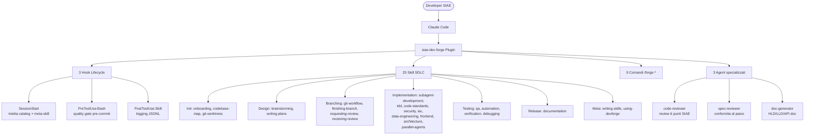
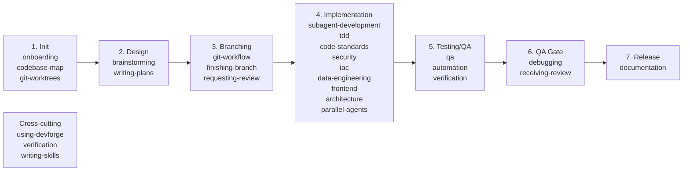
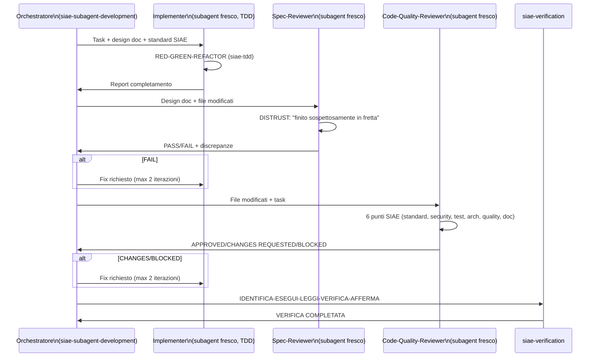
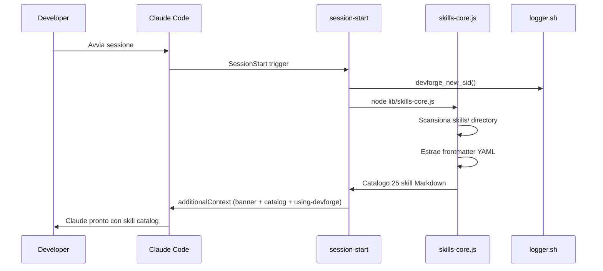
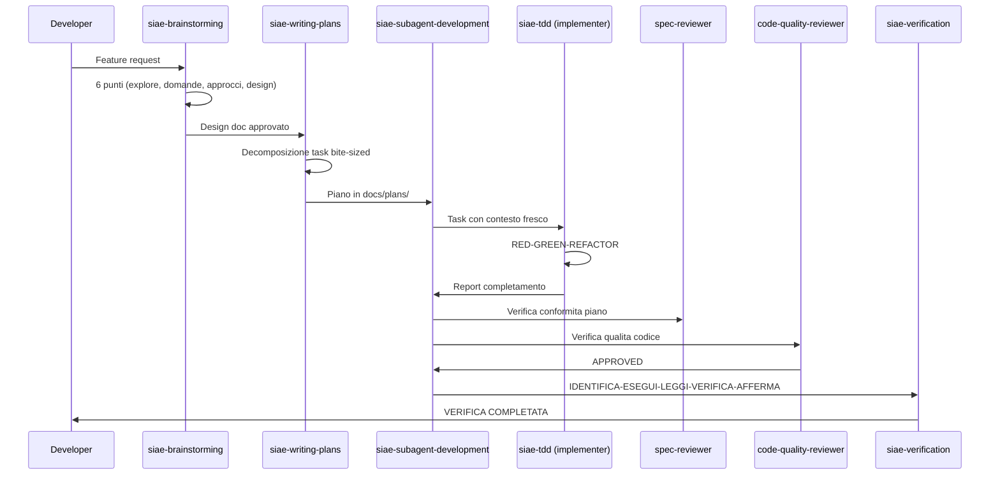

# Codebase Map — siae-dev-forge

> Auto-generato da DevForge siae-codebase-map. Ultimo aggiornamento: 2026-03-06

## Panoramica Sistema

Plugin Claude Code che standardizza il ciclo di vita software SIAE su ~816 repository, 4 factory, ~20 developer. Composto da 25 skill + 9 comandi + 3 agent + 3 hook lifecycle.



## Struttura Directory

```
siae-dev-forge/
├── .claude-plugin/
│   ├── plugin.json              # Manifest plugin (versione, metadata)
│   └── marketplace.json         # Descrittore marketplace privato SIAE
├── agents/
│   ├── code-reviewer.md         # Agent review 6 punti SIAE
│   ├── spec-reviewer.md         # Agent conformita al piano
│   └── doc-generator.md         # Agent generazione HLD/LLD/API
├── commands/
│   ├── forge-map.md             # /forge-map → siae-codebase-map
│   ├── forge-plan.md            # /forge-plan → siae-brainstorming
│   ├── forge-implement.md       # /forge-implement → siae-subagent-development
│   ├── forge-review.md          # /forge-review → code-reviewer agent
│   ├── forge-doc.md             # /forge-doc → siae-documentation
│   ├── forge-qa.md              # /forge-qa → siae-qa
│   ├── forge-test.md            # /forge-test → siae-tdd
│   ├── forge-automate.md        # /forge-automate → siae-automation
│   └── forge-rca.md             # /forge-rca → siae-debugging (RCA)
├── design-system/
│   └── devforge-visual.md       # Visual Design System obbligatorio
├── docs/
│   ├── CODEBASE_MAP.md          # Questo file
│   ├── plans/                   # Design doc + piano implementativi
│   └── managed-settings-example.json
├── hooks/
│   ├── hooks.json               # Registro hook (SessionStart, PreToolUse, PostToolUse)
│   ├── session-start            # Inietta catalog + meta-skill nel system prompt
│   ├── pre-commit               # Quality gate pre-commit (5 check)
│   ├── post-skill               # Logging JSONL attivita skill
│   └── run-hook.cmd             # Wrapper polyglot bash/batch
├── lib/
│   ├── logger.sh                # Logging JSONL strutturato con session correlation
│   └── skills-core.js           # Dynamic skill discovery + catalog generation (Node.js)
├── skills/
│   ├── using-devforge/          # Meta-skill: orchestratore, catena SDLC, catalogo
│   ├── siae-onboarding/         # Auto-detect factory, stack, regole progetto
│   ├── siae-codebase-map/       # Mappa codebase via subagent Sonnet paralleli
│   ├── siae-git-worktrees/      # Worktree isolato prima implementazione
│   ├── siae-brainstorming/      # Idea → design validato (6 punti)
│   ├── siae-writing-plans/      # Design → piano bite-sized (5 step)
│   ├── siae-git-workflow/       # Governance branch, merge, tag, hotfix
│   ├── siae-finishing-branch/   # Pre-PR verification (test, diff, history)
│   ├── siae-requesting-review/  # Context + reviewer assignment post-PR
│   ├── siae-receiving-review/   # Categorizzazione + fix feedback review
│   ├── siae-subagent-development/ # Orchestrazione implementer + 2 reviewer
│   ├── siae-tdd/                # RED-GREEN-REFACTOR, framework configs
│   ├── siae-code-standards/     # Naming, struttura, logging multi-stack
│   ├── siae-security/           # OWASP Top 10, AWS security, PII copyright
│   ├── siae-iac/                # Terraform + Terragrunt pattern SIAE
│   ├── siae-data-engineering/   # Medallion, Glue, PySpark, Step Functions
│   ├── siae-frontend/           # Vue.js 3, Angular, React, deploy S3+CloudFront
│   ├── siae-architecture/       # C4 model, AWS service map, pattern reali
│   ├── siae-parallel-agents/    # Dispatch parallelo agent indipendenti
│   ├── siae-debugging/          # Root cause investigation (HARD-GATE)
│   ├── siae-qa/                 # Test plan + test case Xray
│   ├── siae-automation/         # E2E automation (Cypress, Appium, BrowserStack)
│   ├── siae-verification/       # 5-step protocol pre-completamento
│   ├── siae-documentation/      # HLD, LLD, API doc (template + Mermaid)
│   └── siae-writing-skills/     # Meta: creare/migliorare skill DevForge
├── tests/
│   ├── run-all.sh               # Entry point suite test (35 check)
│   ├── skill-triggering/        # CSO test: skill si attivano con prompt giusti
│   └── analyze-token-usage.py   # Analisi token per ottimizzazione budget
├── install.sh                   # Installazione cross-platform via claude CLI + gh
└── mcp.json                     # MCP servers: Atlassian, GitHub, Playwright
```

## Guida Moduli

### Core Infrastruttura

#### .claude-plugin/plugin.json
**Scopo**: Manifest ufficiale per Claude Code marketplace
**Campi chiave**: `name`, `version` (1.2.0-mvp), `description`, `license` (PROPRIETARY)
**Gotcha**: Versione hardcoded — aggiornare manualmente a ogni release. Attualmente in sync con il codice; marketplace.json ha ancora 1.1.0-mvp.

#### hooks/hooks.json
**Scopo**: Registro dichiarativo dei lifecycle hook
**Tre hook registrati**:
- `SessionStart` (matcher: `startup|resume|clear|compact`, async: false) → `session-start`
- `PreToolUse` (matcher: `Bash`, timeout: 10s) → `pre-commit`
- `PostToolUse` (matcher: `Skill`, timeout: 5s) → `post-skill`

**Gotcha**: Pre-commit ha timeout 10s — check lenti vengono cancellati silenziosamente.

#### hooks/session-start
**Scopo**: Inietta meta-skill `using-devforge` + catalogo dinamico skill nel system prompt
**Flusso**:
1. Genera session ID (`devforge_new_sid`)
2. Chiama `node lib/skills-core.js` → catalogo Markdown
3. Legge `skills/using-devforge/SKILL.md`
4. Output JSON `additionalContext` → Claude vede banner + catalog a ogni sessione

#### hooks/pre-commit
**Scopo**: Quality gate prima di ogni `git commit` via Bash tool
**5 check iniettati come istruzioni**: Secret scan, Naming convention, Test coverage, File size (>1MB), Lint
**Gotcha**: Non blocca automaticamente — inietta istruzioni che Claude DEVE seguire. Compliance = disciplina di Claude, non enforcement tecnico.

#### hooks/post-skill
**Scopo**: Logging JSONL di ogni invocazione Skill tool
**Output**: `~/.claude/devforge-activity.jsonl` — queryable con `jq`

#### lib/logger.sh
**Scopo**: Utility bash per logging strutturato JSONL con session correlation
**API principali**: `devforge_log()`, `devforge_log_timed()`, `devforge_get_git_context()`, `devforge_get_sdlc_phase()`
**Gotcha**: `date +%s%N` (nanoseconds) è GNU date only — su macOS (BSD date) fallback a 0.

#### lib/skills-core.js
**Scopo**: Dynamic skill discovery + generazione catalogo Markdown da frontmatter YAML
**API principali**: `findSkillsInDir()`, `buildCatalog()`, `inferSkillMeta()`, `extractFrontmatter()`
**Gotcha**: Parser YAML regex-based — fragile con colon nel testo. Phase/type mapping hardcoded nel source.

#### mcp.json
**Scopo**: MCP server configuration
**Server configurati**:
- `atlassian` (http): Jira, Confluence, Compass
- `github` (http): GitHub Copilot API
- `playwright` (stdio): Browser automation via npx

---

### Skill SDLC — Catalogo Completo

#### Catena SDLC (7 fasi)



#### Skill per fase

| Skill | Tipo | Fase SDLC | Trigger principale |
|-------|------|-----------|-------------------|
| using-devforge | Rigid | Meta/Cross | Ogni conversazione |
| siae-onboarding | Auto | 1. Init | Inizio sessione |
| siae-codebase-map | Flexible | 1. Init | /forge-map, codebase > 50 file |
| siae-git-worktrees | Rigid | 1. Init | Prima di piano implementativo |
| siae-brainstorming | Rigid | 2. Design | Feature nuova, design, modifiche |
| siae-writing-plans | Rigid | 2. Design | Design approvato |
| siae-architecture | Flexible | 2. Design | Design sistema, HLD, C4 |
| siae-git-workflow | Rigid | 3. Branching | Branch, merge, release, tag |
| siae-finishing-branch | Rigid | 3. Branching | "pronto per PR", "finisco il branch" |
| siae-requesting-review | Rigid | 3. Branching | "ho aperto la PR", PR senza reviewer |
| siae-receiving-review | Rigid | 4. Implementation | Feedback PR ricevuto, CHANGES REQUESTED |
| siae-subagent-development | Rigid | 4. Implementation | Piano in docs/plans/, task indipendenti |
| siae-tdd | Rigid | 4. Implementation | Qualsiasi scrittura di codice |
| siae-code-standards | Flexible | 4. Implementation | Codice Java, TS, Python, HCL |
| siae-security | Flexible | 4. Implementation | Security-sensitive, IAM, PII, ISWC/ISRC |
| siae-iac | Flexible | 4. Implementation | File .tf, .hcl, terragrunt.hcl |
| siae-data-engineering | Flexible | 4. Implementation | ETL, Glue, pipeline, data lake |
| siae-frontend | Flexible | 4. Implementation | Vue/Angular/React, deploy S3+CloudFront |
| siae-parallel-agents | Flexible | 4. Implementation | 2+ failure indipendenti, task paralleli |
| siae-qa | Rigid | 5. Testing | Test plan, test case Xray |
| siae-automation | Rigid | 5. Testing | E2E test, /forge-automate |
| siae-verification | Rigid | Cross-cutting | Prima di "fatto", "funziona", commit, PR |
| siae-debugging | Rigid | 6. QA Gate | Bug, errore, test che fallisce |
| siae-documentation | Flexible | 7. Release | /forge-doc, design review, pre-release |
| siae-writing-skills | Flexible | Meta | Creare/migliorare skill |

---

### Pattern Chiave

#### Controller-Subagent (Distrust Architecture)

Il pattern centrale di implementazione usa subagent freschi per evitare bias:



#### Catena REQUIRED SUB-SKILL

Le skill si concatenano obbligatoriamente tramite marker `REQUIRED SUB-SKILL`:

```
siae-brainstorming (Step 6)
    └── REQUIRED SUB-SKILL: siae-writing-plans
        └── REQUIRED SUB-SKILL: siae-subagent-development
            ├── REQUIRED SUB-SKILL: siae-tdd (implementer)
            └── REQUIRED SUB-SKILL: siae-verification (mark complete)
```

#### Hook Lifecycle

```
Session avviata
  └─ SessionStart hook (async: false)
      ├─ node lib/skills-core.js → catalogo 25 skill
      ├─ Read skills/using-devforge/SKILL.md
      └─ additionalContext → system prompt Claude

Claude usa Bash tool con "git commit"
  └─ PreToolUse:Bash hook (timeout: 10s)
      └─ pre-commit script → inietta quality gate (5 check):
          1. Secret scan (CRITICO — blocca)
          2. Naming convention (MEDIO)
          3. Test coverage (MEDIO)
          4. File size >1MB (ALTO — blocca)
          5. Lint check (MEDIO)

Claude usa Skill tool
  └─ PostToolUse:Skill hook (timeout: 5s)
      └─ post-skill script → JSONL append:
          { ts, sid, skill_name, sdlc_phase, branch, jira_id }
```

#### HARD-GATE Skill (Rigid — ordine sacro)

Le skill Rigid non ammettono eccezioni:

| Skill | HARD-GATE |
|-------|-----------|
| siae-brainstorming | NON invocare skill implementazione senza design approvato |
| siae-writing-plans | NON scrivere piano senza design doc validato |
| siae-tdd | NESSUN codice produzione senza test fallente prima |
| siae-verification | NESSUN claim completamento senza evidenza fresca |
| siae-debugging | NESSUN fix senza Fase 1 (Root Cause) completata |
| siae-finishing-branch | NESSUNA PR con test rossi |

---

### Stack SIAE Copertura

| Stack | Repository | Skill specializzate |
|-------|-----------|-------------------|
| Java/Spring Boot | ~60 repo | siae-code-standards, siae-security, siae-architecture |
| HCL/Terraform+Terragrunt | ~44 repo | siae-iac, siae-security, siae-architecture |
| Python/PySpark/Glue | ~23 repo | siae-data-engineering, siae-code-standards |
| TypeScript/Lambda | ~22 repo | siae-code-standards, siae-security, siae-architecture |
| Vue.js/Angular/React | frontend | siae-frontend, siae-security |

---

## Flusso Dati

### Session Initialization



### Piano Implementativo → Codice



---

## Convenzioni SIAE Osservate

### Naming
- Directory skill: `siae-{nome}` in kebab-case
- File principale skill: `SKILL.md` (UPPERCASE)
- File reference: `{topic}.md` in kebab-case dentro `reference/`
- File template: `{tipo}-template.md` dentro `template/`
- Script: kebab-case (es. `find-polluter.sh`, `run-hook.cmd`)

### Frontmatter YAML obbligatorio in ogni SKILL.md
```yaml
---
name: siae-{nome}
description: >
  [Trigger-only, max 3 righe — CSO compliant]
---
```

### Visual Design System (obbligatorio)
- Banner ASCII con box drawing Unicode in ogni skill
- Codifica rischio: 🟢 Sicuro / 🟡 Medio / 🔴 Alto / 🚨 Critico
- Pre-flight card obbligatoria per operazioni >= 🟡
- Anti-rationalization table in ogni skill Rigid

### Social Proof Pattern (Superpowers 4.3.1)
- Dati quantitativi nelle skill Rigid: "24 failure memories", "40% hallucination rate"
- Tabella impatto reale in siae-debugging e siae-verification
- Principi Cialdini in siae-writing-skills: Authority + Commitment + Scarcity

---

## Gotcha

1. **Version mismatch**: `plugin.json` (1.2.0-mvp) vs `marketplace.json` (1.1.0-mvp) vs `README.md` (1.1.0-mvp). Fonte di verità: `plugin.json`.

2. **Pre-commit hook = istruzioni, non enforcement**: Il hook inietta istruzioni a Claude ma non blocca tecnicamente l'esecuzione. Compliance dipende dalla disciplina di Claude Code.

3. **tiktoken network dependency**: `scan-codebase.py` richiede connessione per scaricare `cl100k_base` encoding. Fallisce offline — usare Glob come fallback.

4. **date nanoseconds macOS**: `date +%s%N` non funziona su macOS con BSD date. `logger.sh` ha fallback a 0 per duration_ms.

5. **YAML parser regex**: `skills-core.js` usa regex semplice, non un vero parser YAML. Colon nel testo della description causano parsing errato.

6. **Worktree .worktrees/**: La directory `.worktrees/` contiene worktree git creati da `siae-git-worktrees`. Non fanno parte del codebase principale — ignorare in scan e ricerche.

7. **SessionStart async: false**: Il hook blocca l'avvio della sessione. Se `session-start` script fallisce o è lento, la sessione si blocca.

8. **Skill count in plugin.json**: Deve essere aggiornata manualmente quando si aggiunge una skill (non auto-generata).

9. **Signal phrase "Situazione insolita al Circle K"**: Appare in `siae-requesting-review` e `siae-receiving-review`. Segnala disagio interpersonale al tech lead — NON per evitare pushback legittimo.

10. **Regola 3 tentativi (siae-debugging)**: Dopo 3 fix falliti, stop. È un problema architetturale, non di bug fix. Non tentare Fix #4 senza discussione team.

---

## Navigation Guide

**Per aggiungere una nuova skill:**
1. Crea `skills/siae-{nome}/SKILL.md` con frontmatter YAML
2. Segui template in `skills/siae-writing-skills/reference/skill-template.md`
3. Aggiorna count in `.claude-plugin/plugin.json` (description: "N skill")
4. Verifica con `bash tests/run-all.sh`

**Per modificare un hook:**
1. Modifica lo script concreto in `hooks/`
2. Non modificare `hooks.json` a meno che non cambia il tipo/matcher hook
3. Testa con una sessione Claude Code (SessionStart) o commit (pre-commit)

**Per aggiungere un comando /forge-*:**
1. Crea `commands/forge-{nome}.md` con frontmatter YAML
2. Il comando mappa a una skill esistente — documentare il mapping
3. `tests/run-all.sh` verifica automaticamente la presenza del frontmatter

**Per debuggare un test che fallisce in ordini diversi:**
```bash
./skills/siae-debugging/find-polluter.sh '<pattern_test>' '<glob_test>'
```

**Per analizzare le attivita SDLC di una sessione:**
```bash
jq '.[] | select(.event=="skill_invoked") | {skill_name, sdlc_phase, ts}' \
  ~/.claude/devforge-activity.jsonl
```

**Per verificare il catalogo skill generato:**
```bash
cd siae-dev-forge && node lib/skills-core.js
```

**Per eseguire la suite di test completa:**
```bash
cd siae-dev-forge && bash tests/run-all.sh
```
