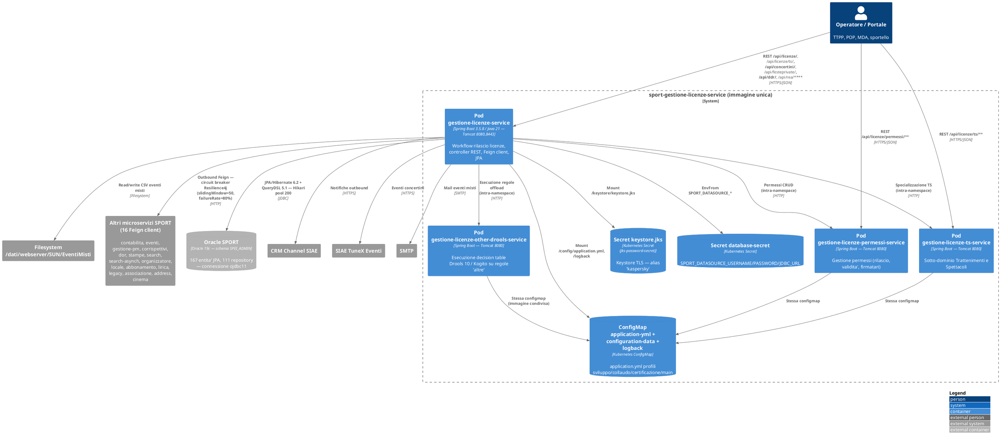

# HLD — sport-gestione-licenze-service

> **Versione**: 1.0
> **Data**: 2026-05-03
> **Autore**: DevForge Doc Generator (analisi statica)
> **Stato**: Draft
> **Versione applicativa documentata**: 3.25.0 (da `pom.xml` e `chart/Chart.yaml`)

---

## Nota sulla fonte dati

Questo HLD e' generato a partire **esclusivamente dall'analisi statica del codice
sorgente** del repository `sport-gestione-licenze-service` (branch locale
`main`, commit corrente). I tool MCP `sport-kg` (`describe_service`,
`service_full_context`) hanno risposto con errore `-32602 Invalid request
parameters` su entrambe le invocazioni: la **topology runtime non e' disponibile**
(caller reali, error rate ES, volumi di traffico, schema Oracle live). Tutte
le relazioni descritte sono dichiarate nel codice (Feign client, configurazione
Spring) ma **non verificate empiricamente sui log di produzione**.

---

## 1. Contesto e Obiettivi

`sport-gestione-licenze-service` e' il microservizio del programma SPORT (re-engineering del sistema legacy SUN) responsabile della **gestione end-to-end del ciclo di vita delle licenze SIAE** per spettacoli, trattenimenti, concertini, feste private, opere liriche e altri eventi assoggettati al diritto d'autore.

Il servizio orchestra:

- **Rilascio licenze** per piu' tipologie di evento: Trattenimenti e Spettacoli (TTSS), TTSS-POP, Feste Private (FP), Diritto Demaniale Riproduzione (DDR), Concertini, Lirica, REA.
- **Calcolo competenze e proventi** tramite motore regole **Drools 10 / Kogito** con decision table Excel (`dtables`, `dtables-costi`, `dtables-costi2`, `dtables-functions`).
- **Generazione documenti** (modelli 340, modelli 97, quietanze) via JasperReports + flying-saucer-pdf.
- **Workflow di rilascio** stateful con macchina a stati (`LicWFRilascio`) e gestione permessi (`LicPermesso`).
- **Integrazione contabile** verso `contabilita-service` (anteprima proposta, evadi light, trasforma in richiesta di pagamento).
- **Parsing fatturazione** ed eventi misti per estrazione/rendicontazione periodica.

Il servizio sostituisce il vecchio modulo "Gestione Licenze" del sistema SUN, esposto via JBoss/SOAP, con un'architettura Spring Boot 3.5.8 / Java 21 cloud-native deployata su OpenShift (OCP).

## 2. Stakeholder

| Ruolo | Nome/Team | Interesse |
|-------|-----------|-----------|
| Product Owner SPORT | Direzione SIAE — Programma SPORT | Continuita' funzionale rispetto a SUN, conformita' regolatoria diritto d'autore |
| Operatori di sportello | Filiali SIAE (utenti finali via `sourceSystem=TTPP`) | Rilascio licenze in tempo reale a operatori e organizzatori |
| Portali esterni autoservizio | TTPP, POP, MDA (canali `sourceSystem` whitelistati in config) | Rilascio licenze self-service con workflow semplificato (skip di alcuni step) |
| Team Contabilita' SIAE | Owner di `sport-contabilita-service` | Generazione corretta proposte di pagamento e quietanze |
| Team Eventi SIAE | Owner di `sport-eventi-service`, `sport-gestione-pm-service` | Coerenza dati eventi/programmi musicali → licenza |
| Team Drools/Regole | Funzione Tariffe SIAE | Manutenzione decision table Excel (regole tariffarie e di rilascio) |
| Helpdesk SIAE | `concerti.musica@siae.it`, `mailToHelpDesk` | Notifiche eventi misti, errori parsing, comunicazioni operative |
| SRE / Platform Team | DevOps OpenShift SIAE | Deploy Helm, configmap, secret, autoscaling |

## 3. Architettura — C4 Livello 1 (Context)

```plantuml
@startuml C4_Context_GestioneLicenze
!include <C4/C4_Context>

LAYOUT_WITH_LEGEND()

Person(operatoreSportello, "Operatore Sportello SIAE", "Rilascia licenze da TTPP / SiaeWeb")
Person(organizzatoreSelfService, "Organizzatore", "Self-service via portali POP/MDA")

System_Boundary(sportSystem, "Sistema SPORT") {
  System(gestLic, "sport-gestione-licenze-service", "Microservizio gestione ciclo di vita licenze, calcolo competenze, generazione documenti")

  System_Ext(contabilita, "sport-contabilita-service", "Anteprima proposta, evadi, richiesta pagamento")
  System_Ext(eventi, "sport-eventi-service", "Anagrafica eventi e programmi")
  System_Ext(gestionePm, "sport-gestione-pm-service", "Programmi musicali")
  System_Ext(corrispettivi, "sport-corrispettivi-service", "Corrispettivi e modelli C1")
  System_Ext(dor, "sport-dor-service", "Dati Organizzatori")
  System_Ext(stampe, "sport-stampe-service", "Generazione stampe centralizzata")
  System_Ext(search, "sport-search-service", "Ricerca sincrona")
  System_Ext(searchAsync, "sport-search-service-asynch", "Ricerca asincrona")
  System_Ext(organizzatore, "sport-organizzatore-service", "Anagrafica organizzatori")
  System_Ext(locale, "sport-locale-service", "Anagrafica locali")
  System_Ext(abbonamento, "sport-gestione-abbonamento-service", "Accordi e abbonamenti")
  System_Ext(lirica, "sport-lirica-service", "Specializzazioni lirica")
  System_Ext(legacy, "sport-legacy-service", "Adapter verso SUN legacy")
  System_Ext(associazione, "sport-associazione-service", "Associazioni e firmatari")
  System_Ext(address, "sport-address-service", "Stradario indirizzi")
  System_Ext(cinema, "sport-cinema-service", "Specializzazioni cinema")
}

System_Ext(crm, "CRM Channel", "Comunicazioni outbound (email/PEC) verso clienti")
System_Ext(siaetunex, "SIAE TuneX Eventi", "Importazione eventi/concertini da piattaforma TuneX")
SystemDb_Ext(oracleSport, "Oracle SPORT", "Schema SPEI_ADMIN — DB primario di SPORT")
System_Ext(filesystem, "Filesystem condiviso /dati/webserver/SUN", "Spool eventi misti (working/archive/rejected/create/scarico)")
System_Ext(smtp, "Mail server SMTP", "Notifiche concerti.musica@siae.it, helpdesk, organizzatori")

Rel(operatoreSportello, gestLic, "REST /api/* (header transactionID, sourceSystem, token, userId, seprag)", "HTTPS/JSON")
Rel(organizzatoreSelfService, gestLic, "REST /api/* via portali (TTPP/POP/MDA)", "HTTPS/JSON")

Rel(gestLic, contabilita, "Anteprima proposta / evadi light / richiesta pagamento", "Feign HTTP")
Rel(gestLic, eventi, "CRUD eventi", "Feign HTTP")
Rel(gestLic, gestionePm, "Programmi musicali", "Feign HTTP")
Rel(gestLic, corrispettivi, "Corrispettivi", "Feign HTTP")
Rel(gestLic, dor, "Dati organizzatori e referenti", "Feign HTTP")
Rel(gestLic, stampe, "Generazione stampe", "Feign HTTP")
Rel(gestLic, search, "Ricerca sincrona", "Feign HTTP")
Rel(gestLic, searchAsync, "Ricerca asincrona", "Feign HTTP")
Rel(gestLic, organizzatore, "Anagrafica organizzatori", "Feign HTTP")
Rel(gestLic, locale, "Anagrafica locali", "Feign HTTP")
Rel(gestLic, abbonamento, "Accordi e abbonamenti", "Feign HTTP")
Rel(gestLic, lirica, "Specializzazioni lirica", "Feign HTTP")
Rel(gestLic, legacy, "Adapter SUN legacy", "Feign HTTP")
Rel(gestLic, associazione, "Associazioni / firmatari", "Feign HTTP")
Rel(gestLic, address, "Stradario indirizzi", "Feign HTTP")
Rel(gestLic, cinema, "Cinema-specific calls", "Feign HTTP")

Rel(gestLic, crm, "Comunicazioni outbound (verbose=true)", "HTTPS/JSON")
Rel(gestLic, siaetunex, "Eventi/concertini import", "HTTP")
Rel(gestLic, oracleSport, "JPA / QueryDSL su schema SPEI_ADMIN", "JDBC ojdbc11 — pool HikariCP max 200")
Rel(gestLic, filesystem, "Read/write file_eventi_misti_PM_*.csv", "Filesystem")
Rel(gestLic, smtp, "Email notifiche e allegati", "SMTP")
@enduml
```

**Note sul diagramma di Contesto:**
- I nomi dei sistemi esterni (host pattern `*-service-sport-coll.apps.ocp-noprod.openshift.siae`) sono ricavati dalle 16 dichiarazioni `@FeignClient` in `it.siae.gestionelicenza.integration.client.*` e dalla configurazione `spring.cloud.openfeign.client.config.*` in `config/application.yml`.
- L'ambito dei sistemi a monte (chi chiama il servizio) e' inferito dagli header obbligatori dei controller (`sourceSystem`, `transactionID`, `token`, `userId`, `seprag`) e dalla whitelist `sourceSystemPortali: "TTPP,POP,MDA"`. **La lista reale dei caller non e' verificata** in assenza di MCP sport-kg.
- Sistemi inbound non identificabili da codice statico (es. job batch SAP/PI, bus ESB, scheduler esterni): non rappresentati. Per arricchirli, eseguire `refresh_external_systems` quando MCP sport-kg torna disponibile.

## 4. Architettura — C4 Livello 2 (Container)

Il repository produce **una singola immagine Docker** (`ghcr.io/itsiae/sport-gestione-licenze-service`) ma e' deployata in OpenShift come **quattro Deployment Helm distinti** (vedi `chart/`):

1. `gestione-licenze-service` — istanza primaria (workflow rilascio licenze TTSS/DDR/REA/FP/Concertini, integrazioni Feign).
2. `gestione-licenze-other-drools-service` — istanza dedicata all'esecuzione di regole Drools "altre" (offload del motore regole pesante).
3. `gestione-licenze-permessi-service` — istanza dedicata alla gestione permessi (rappresentanza, firmatari, periodi di validita').
4. `gestione-licenze-ts-service` — istanza dedicata al sotto-dominio Trattenimenti e Spettacoli (TS).

Lo split fisico permette tuning indipendente di risorse e replica count per i flussi piu' onerosi (Drools/Kogito) o piu' chiamati (TS) rispetto al servizio core.

**Container e responsabilita' (dal codice e dai chart Helm):**

| Container | Ruolo | Helm chart | Controller principali |
|-----------|-------|------------|----------------------|
| `gestione-licenze-service` | Servizio core: workflow rilascio, integrazioni Feign, motore regole | `chart/deployment-gestione-licenze-service` | `LicenzeController`, `WorkflowTTSSController`, `WFConcertiniController`, `WFPopController`, `DdrController`, `FestePrivateController`, `FatturazioneController`, `SiaeGestioneLicenzeController`, `TipologicheController`, `HealthCheckController`, `AbbonamentoController`, `ArtistiController`, `CommentoController`, `DocumentiController`, `DocumentiTtssController`, `RegolaPermessiController`, `REAController`, `SiaeCommentoController`, `SiaeEventoController`, `SiaeTipologicheController`, `SiaeTrattenimentoSpettacoloController`, `SiaeTuneXEventiConcertiniController`, `TrattenimentiSpettacoliController` |
| `gestione-licenze-other-drools-service` | Drools/Kogito offload | `chart/deployment-gestione-licenze-other-drools-service` | Stessa immagine, profilo che attiva esclusivamente `DroolsComponent`, `RuleManager`, `KogitoRuleManager` |
| `gestione-licenze-permessi-service` | Gestione permessi | `chart/deployment-gestione-licenze-permessi-service` | `PermessoService` + `RegolaPermessiController` come superficie principale |
| `gestione-licenze-ts-service` | Sotto-dominio Trattenimenti e Spettacoli | `chart/deployment-gestione-licenze-ts-service` | `WorkflowTTSSController`, `SiaeTrattenimentoSpettacoloController`, `TrattenimentiSpettacoliController` |

**Layering applicativo (single-image, package `it.siae.gestionelicenza`):**

- **Web layer** (`web/`) — 30+ `@RestController`. Header pattern obbligatorio: `transactionID`, `sourceSystem`, `token`, `userId`, `seprag`, `maskUserId` (opzionale).
- **Service layer** (`service/`) — ~50 service interfaces + impl. Sotto-pacchetti per dominio: `ddr/`, `rea/`, `festeprivate/`, `commenti/`, `abbonamento/`, `rimborso/`. Service workflow chiave: `RilascioLicenzaTTSS`, `RilascioLicenzaTTSSPOP`, `RilascioLicenzaDDR`, `RilascioLicenzaFP`, `WorkflowManager`.
- **Drools layer** (`it.siae.drools.service`) — `RuleManager`, `KogitoRuleManager`, `IRuleManagerExecutor`. Decision table caricate da `/conf-drools/dtables/`, `/conf-drools/dtables-costi/`, `/conf-drools/dtables-costi2/`, `/conf-drools/dtables-functions/` e parametri da `/conf-drools-parameters/parametersmap.json`.
- **Integration layer** (`integration/client/`) — 16 `@FeignClient`. Ogni client e' configurato con timeout default 50s connect / 60s read; eccezione `crm-channel` con 300s/120s. Circuit breaker Resilience4j configurato con sliding window 50 chiamate, soglia failure 80%.
- **Persistence layer** (`model/dao/`, `model/repository/`) — 167 `@Entity` JPA + 111 `Repository`. Schema Oracle `SPEI_ADMIN`. Dialect `OracleDialect`, ddl-auto `none` (no auto-migration). QueryDSL Jakarta 5.1 per query type-safe; MapStruct 1.5.5 e Dozer 7.0 per mapping DTO ↔ entity.
- **Cross-cutting** — Lombok 1.18.38, Spring Boot Cache + Caffeine, Spring Cloud OpenFeign + circuit-breaker-resilience4j, Micrometer Tracing + Brave bridge, Logstash Logback Encoder, AspectJ proxy abilitato (`@EnableAspectJAutoProxy`).

## 5. Decisioni Architetturali

| # | Decisione | Motivazione (dal codice) | Alternative scartate (osservabili) |
|---|-----------|--------------------------|------------------------------------|
| 1 | Single-image, multi-deployment Helm (4 chart) | Specializzazione del workload (TS, permessi, Drools "altre", core) senza duplicare il codice; permette tuning di replica count e risorse per dominio | Quattro repository separati (visti in `pom.xml` come `gestione-licenze-service-drools` artifact a parte) |
| 2 | Motore regole **Drools 10 + Kogito 10.1** con decision table Excel | Le regole tariffarie SIAE cambiano frequentemente e sono mantenute da business; `.xlsx → .drl` via plugin `exec-maven-plugin` (target `convert-xlsx-to-drl`) | Hard-coded if/else (incompatibile con cadenza di revisione tariffe) |
| 3 | Spring Cloud OpenFeign + Resilience4j | Comunicazione sincrona inter-service; resilience-as-code con circuit breaker per gestire degradi a cascata su 16 dipendenze | RestTemplate (deprecato), WebClient (richiede stack reattivo non adottato) |
| 4 | Java 21 + Spring Boot 3.5.8 + Hibernate 6.2 | Allineamento allo stack target SPORT 2025; jakarta.* namespace (post-javax migration) | Java 17 (LTS precedente — non adottato) |
| 5 | Oracle 19c via `ojdbc11` con HikariCP | Coerenza con DB enterprise SIAE (schema `SPEI_ADMIN` condiviso con altri servizi SPORT) | DB per-servizio (non praticabile per integrita' referenziale storica con SUN) |
| 6 | DTO/Entity mapping con MapStruct + Dozer | MapStruct per nuovi flussi (compile-time), Dozer per legacy (runtime); coabitazione tracciata in `pom.xml` | Solo MapStruct (refactor non concluso) |
| 7 | OptaPlanner 10.1 dichiarato in `pom.xml` | Ottimizzazione combinatoria (non identificato l'use case esatto da codice — probabilmente assignment di compensi o ottimizzazione fasce orarie) | Algoritmi greedy (insufficienti per vincoli complessi tariffari) |
| 8 | Whitelist `sourceSystemPortali: TTPP,POP,MDA` | Salto di step di rilascio per chiamate da portali self-service vs sportello | Stesso flusso per tutti (overhead per portali) |
| 9 | JasperReports 7.0 + flying-saucer-pdf 9.13 | Generazione modello 340, modello 97, quietanze in PDF | Solo Thymeleaf+wkhtmltopdf (Jasper offre layout pixel-perfect richiesto da modulistica SIAE) |
| 10 | GraalVM native-maven-plugin configurato | Possibile compilazione nativa (locale `it,en`) — non e' chiaro se attivata in CI | JVM tradizionale only |
| 11 | `spring.transaction.default-timeout: 300s` | Workflow di rilascio licenza TTSS-POP coinvolge multiple chiamate Feign + Drools + scrittura DB; richiede transazioni lunghe | Timeout default 30s (insufficiente) |
| 12 | Hikari `maximum-pool-size: 200` | Carico previsto elevato e parallelo (sportelli + portali) | Pool default 10 (insufficiente) |

## 6. Requisiti Non Funzionali

I valori target nella tabella sotto **sono ricavati dalla configurazione applicativa** (`config/application.yml`, chart Helm), non da SLO contrattuali (non rilevati nel repo).

| NFR | Target / Valore osservato | Fonte nel codice |
|-----|---------------------------|------------------|
| Timeout chiamate Feign default | connect 50s / read 60s | `spring.cloud.openfeign.client.config.default` |
| Timeout chiamate CRM | connect 300s / read 120s | `spring.cloud.openfeign.client.config.crm-channel` |
| Timeout transazione DB | 300s default | `spring.transaction.default-timeout: 300` |
| Tomcat thread pool | max-threads 25, max-connections 50, accept-count 50, min-spare-threads 15 | `server.tomcat.*` |
| Hikari connection pool | max 200, min idle 0, connection-timeout 60s, idle-timeout 60s, max-lifetime 900s | `spring.datasource.hikari.*` |
| Multipart upload | max-file-size 50 MB, max-request-size 50 MB | `spring.servlet.multipart.*` |
| Documento allegato licenza | max 50 MB per file, max 10 file "altri documenti", max 100 MB allegato email | `application.config.documenti.*` |
| Resilience4j circuit breaker | slidingWindowSize 50, minimumNumberOfCalls 50, failureRateThreshold 80%, slowCallRateThreshold 90%, slowCallDurationThreshold 30s, waitDurationInOpenState 10s | `resilience4j.circuitbreaker.configs.default` |
| Risorse pod (request/limit) | CPU req 100m / lim 500m — Memory req 250Mi / lim 500Mi | `chart/deployment-*/values-main.yaml` `resources.*` |
| Autoscaling (chart) | `enabled: false` su `values-main.yaml` (HPA non attivo by default) | `autoscaling.enabled: false` |
| Strategia rolling | maxSurge 25%, maxUnavailable 25%, progressDeadlineSeconds 600 | `chart/.../updateStrategy` |
| Probe liveness | TCP socket port 8080 | `chart/.../probes.liveness` |
| Probe readiness | HTTP GET `/ready:8080` | `chart/.../probes.readiness` |
| Logging tracing | Micrometer Tracing + bridge Brave + feign-micrometer + Logstash JSON encoder | `pom.xml` + `SiaeGestioneLicenzeApplication.java` (`MicrometerCapability`) |
| Tolleranza eventi (config dominio) | `minutesTolerance: 15`, `intervalloMinimoTraEventi: 15` | `application.config.minutesTolerance`, `application.config.ttss.intervalloMinimoTraEventi` |

**NFR non ricavabili da codice (richiedono SLO operativi):** RTO/RPO, latency p95/p99 di endpoint, target throughput req/s, availability SLA, RPO disaster recovery. Lasciato esplicitamente fuori dal documento.

## 7. Sicurezza

**Autenticazione e autorizzazione:**
- Header obbligatori sui controller: `transactionID`, `sourceSystem`, `token`, `userId`, `seprag` (codice ufficio SIAE), `maskUserId` (opzionale per impersonation).
- La validazione del `token` non e' eseguita all'interno di questo servizio (nessuna `WebSecurityConfig` o `SecurityFilterChain` rilevata in `config/`). Si presume autenticazione delegata all'API gateway / portali a monte (TTPP, POP, MDA).
- Dipendenza `spring-security-jwt:1.0.9.RELEASE` presente in `pom.xml` ma **non rilevati bean di configurazione JWT** nei file scansionati: probabile uso passivo (parsing token, non enforcement).

**Trasporto e crittografia:**
- TLS configurato via keystore JKS (`keystore.jks` con alias `kaspersky`, password da env `KEYSTORE_JKS_PASSWORD` o secret K8s `jks-password-secret`).
- Protocolli ammessi: `SSLv3,TLSv1,TLSv1.2` (configurazione legacy; **SSLv3 e TLSv1 sono insicuri** — valutare hardening, vedi sezione Rischi).
- `hostNameVerificationEnabled: "false"` (disabilitata) — **rischio MITM su chiamate HTTPS outbound**.

**Gestione segreti:**
- Tutti i segreti (DB credentials, JKS password) sono iniettati via Kubernetes Secret (`database-secret`, `jks-password-secret`) e mai presenti in `application.yml`. OK.

**PII e dati sensibili:**
- Il servizio gestisce dati personali di organizzatori, firmatari, artisti (`LicFirmatario`, `LicCoorganizzatore`, `ArtistiService`) e dati fiscali (regime IVA `LicRegimeIVA`, fatturazione). Non sono rilevati nel codice meccanismi espliciti di mascheramento o pseudonimizzazione.
- `maskUserId` come header suggerisce un pattern di impersonation tracciata, gia' adottato in altri servizi SPORT.
- Il logging e' a livello DEBUG su `it.siae.gestionelicenza` di default e include `feign: DEBUG`: **rischio leak di payload contenenti PII nei log**.

**Hardening recommended (non ancora applicato):**
- Rimozione protocolli TLS 1.0/SSLv3 (PCI-DSS / NIST baseline).
- Riabilitazione hostname verification.
- Riduzione livello logging Feign a `BASIC` o `HEADERS` in produzione (configurabile via `FEIGN_LOG_LEVEL`).

## 8. Infrastruttura

**Piattaforma di deploy:**
- OpenShift Container Platform (OCP) cluster SIAE: `apps.ocp-noprod.openshift.siae` (collaudo) e cluster di produzione (host non rilevato nel `values-main.yaml` standard).
- Namespace: `sport-coll` (collaudo), `sportello-dev` (sviluppo), pattern `*-sport-coll.apps.ocp-noprod.openshift.siae`.

**Ambienti:**

| Profilo Spring | Helm values | Cluster / namespace | Note |
|----------------|-------------|---------------------|------|
| `dev` | `values-sviluppo.yaml` | `sportello-dev.coll-servizi.siae.it` | DB `dbora.sviluppo.siae:1521/SPORTSVI.NET.SIAE` |
| `dev-collaudo` / `default` | `values-collaudo.yaml` | `apps.ocp-noprod.openshift.siae` (sport-coll) | Hosting su OCP non-prod |
| `certificazione` | `values-certificazione.yaml` | OCP non-prod (cert) | Pre-produzione |
| `main` (prod) | `values-main.yaml` | OCP prod (non rilevato) | Tag immagine `main` |

**Build & immagine:**
- Base image: `amazoncorretto:21-alpine-jdk` (`Dockerfile`).
- Registry: `ghcr.io/itsiae/sport-gestione-licenze-service` (GitHub Container Registry org `itsiae`).
- ImagePullSecret: `ghdr-credentials`.
- Porte esposte: `8080` (HTTP), `8443` (HTTPS), `8090` (management/actuator + jolokia).

**Volumes mount nel pod:**
- `/logback` → ConfigMap `logback`.
- `/config` → ConfigMap `gestione-licenze-service-application-yml`.
- `/keystore` → Secret `keystore`.
- (Implicito) `/conf-drools/`, `/conf-drools-parameters/` per le decision table — non visibili in `values-main.yaml`, probabilmente montati via configmap aggiuntiva o sidecar non deducibile dal solo chart Helm.

**Osservabilita':**
- Spring Boot Actuator esposto su `8090` (management) con tutti gli endpoint web abilitati e Jolokia su `/jolokia`.
- Logging strutturato JSON (Logstash encoder) → presumibilmente Filebeat → Elasticsearch SIAE (pattern standard SPORT).
- Tracing distribuito via Micrometer + Brave; `feign-micrometer` per metriche outbound HTTP.

**CI/CD:**
- `.github/` presente (workflow GitHub Actions non ispezionati in questa generazione).
- Build Maven: `mvn clean install -Djacoco.skip=true -Dmaven.test.skip=true` (da `README.md`).
- Conversione decision table: target Maven `convert-xlsx-to-drl` (commentato nel `pom.xml`, eseguito manualmente in fase di update regole).

## 9. Rischi e Mitigazioni

| Rischio | Probabilita' | Impatto | Mitigazione (rilevata o suggerita) |
|---------|-------------|---------|-----------------------------------|
| Cascata di degradi su 16 dipendenze Feign sincrone | Media | Alto (rilascio licenza fallisce a catena) | **Rilevato**: Resilience4j circuit breaker + timeout esplicito; **Suggerito**: bulkhead / fallback graceful per dipendenze non critiche (lirica, address) |
| Pool DB esaurito (200 connection vs 25 thread Tomcat) | Bassa | Medio | **Rilevato**: rapporto pool>>thread riduce contesa; monitorare `hikaricp.connections.active` |
| Logging livello DEBUG con leak PII (feign: DEBUG, hibernate.SQL: DEBUG) | Alta in dev/coll | Alto (compliance GDPR) | **Suggerito**: ridurre `FEIGN_LOG_LEVEL` e `SERVICE_LOG_LEVEL` a INFO/WARN in produzione, attivare scrubbing payload |
| Protocolli TLS deboli ammessi (`SSLv3, TLSv1`) e hostname verification disabilitata | Alta | Alto (MITM su chiamate outbound) | **Suggerito**: rimuovere SSLv3/TLSv1; abilitare `hostNameVerificationEnabled: true` |
| Decision table Drools con sintassi invalida non rilevata in CI | Media | Alto (NoClassDefFoundError o regola che non matcha → competenze errate) | **Rilevato**: build Maven include compilazione DRL; **Suggerito**: smoke test su scenario reale post-deploy |
| Drift tra schema Oracle e 167 entita' JPA (ddl-auto: none) | Media | Alto (errori a runtime su colonne mancanti) | **Suggerito**: verifica pre-deploy con `pre_migration_check` MCP sport-kg + Liquibase/Flyway (non rilevato nel repo) |
| Filesystem condiviso `/dati/webserver/SUN/EventiMisti` come path POSIX in pod K8s | Alta in cloud-native | Medio (se non montato → batch eventi misti non gira) | **Suggerito**: PVC dedicato o migrazione a S3-compatible object storage |
| Multi-deploy con configmap unica (4 pod stessa config) | Bassa | Medio (cambio config impatta tutti) | **Rilevato**: `applicationConfigMap.name: gestione-licenze-service-application-yml` condivisa; **Suggerito**: profili Spring per pod-specific tuning |
| Replica count 0 di default (`replicaCount: 0` in `values-main.yaml`) | N/A | N/A | **Rilevato**: probabilmente sovrascritto in env-specific values; verificare in produzione |
| Single image deployata con bytecode che include codice di tutti i sotto-domini → blast radius alto in caso di vulnerabilita' di una dipendenza | Media | Alto | **Suggerito**: SCA scanning (Qodana gia' configurata via `qodana.yaml`) + dipendency-check periodico |
| Caller reali non verificati empiricamente | Alta | Medio (HLD documenta solo "chi puo' chiamare" non "chi chiama") | **Suggerito**: ri-eseguire questo HLD con MCP sport-kg + `who_calls` quando il KG e' disponibile |

## 10. Dipendenze

**Dipendenze runtime su altri servizi SPORT (16 — da `@FeignClient` + `application.yml`):**

| Feign client | Servizio target | Path/Note |
|--------------|-----------------|-----------|
| `licenze-associazione-client` | `sport-associazione-service` | `/api` |
| `licenze-legacy-client` | `sport-legacy-service` | `/api` — adapter SUN |
| `licenze-contabilita-client` | `sport-contabilita-service` | `/api` — anteprima/evadi/saveProposta/trasformaInRichiesta |
| `licenze-corrispettivi-client` | `sport-corrispettivi-service` | `/api` |
| `licenze-dor-client` | `sport-dor-service` | `/api` |
| `licenze-gestione-eventi-client` | `sport-eventi-service` | `/api` |
| `licenze-accordo-client` | `sport-gestione-abbonamento-service` | `/api` |
| `licenze-gestione-pm-client` | `sport-gestione-pm-service` | `/api` |
| `licenze-lirica-client` | `sport-lirica-service` | `/api` |
| `licenze-locale-client` | `sport-locale-service` | `/api` |
| `licenze-organizzatore-client` | `sport-organizzatore-service` | `/api` |
| `licenze-stampe-client` | `sport-stampe-service` | `/api` |
| `licenze-search-client` | `sport-search-service` | `/api` |
| `licenze-stampa-client` | `sport-stampe-service` (alias `stampa`) | `/api` — alias secondario |
| `address-client` | `sport-address-service` | `/api` |
| `crm-channel` | CRM Channel SIAE (sistema esterno) | timeout esteso 300s/120s |

**Dipendenze runtime infra:**
- Oracle 19c (schema `SPEI_ADMIN`) — DB primario.
- Kubernetes Secret/ConfigMap — configurazione runtime.
- Registry GHCR (`ghcr.io/itsiae`) — distribuzione immagini.
- SMTP server SIAE — notifiche eventi misti.
- Filesystem condiviso `/dati/webserver/SUN/EventiMisti` — spool batch.

**Dipendenze build (estratte da `pom.xml`):**
- Spring Boot 3.5.8 / Spring Cloud 2025.0.0 / Spring Security JWT 1.0.9.
- Drools/Kogito 10.1.0, OptaPlanner 10.1.0, Kogito API + Drools extension.
- Hibernate 6.2.2.Final, QueryDSL 5.1.0 (Jakarta), MapStruct 1.5.5, Dozer 7.0.0, Lombok 1.18.38.
- Apache POI 5.4.1 (lettura xlsx decision table), Jasper 7.0.3 + fonts 7.0.3 + flying-saucer-pdf 9.13.1, iText 2.1.7.
- Caffeine cache, Resilience4j circuit-breaker, Feign + feign-form 3.8.0 + feign-micrometer.
- Micrometer Tracing 1.5.5 + bridge Brave, Logstash Logback 8.1.
- `gestione-licenze-service-drools:3.8.0` (modulo regole interno SIAE).
- `eventi-service:3.20.0` con classifier `app-to-import` (libreria gestione eventi inglobata).

**Team owner:**
- Owner del repository: org GitHub `itsiae`.
- Owner del codice: team SPORT — Programma SIAE (informazione non strutturata in `CODEOWNERS` rilevato).

**Timeline e versione:**
- Versione corrente applicativa: `3.25.0` (`pom.xml` e `chart/Chart.yaml` allineati).
- Drools companion library: `gestione-licenze-service-drools:3.8.0`.
- Eventi shared library: `eventi-service:3.20.0`.

---

## Appendice A — Mappa controller → endpoint base

I path radice rilevati dai `@RequestMapping` sui controller (verifica statica, non esaustiva sui sotto-path):

| Controller | Base path | Tag/Dominio |
|-----------|-----------|-------------|
| `LicenzeController` | `/api/licenze` | Core licenze |
| `WorkflowTTSSController` | `/api/licenze/ts` | Trattenimenti e Spettacoli |
| `WFConcertiniController` | `/api/concertini` (presumibilmente) | Concertini |
| `WFPopController` | `/api/licenze/pop` (presumibilmente) | TTSS-POP |
| `DdrController` | `/api/ddr` | Diritto Demaniale Riproduzione |
| `REAController` | `/api/rea` | REA |
| `FestePrivateController` | `/api/festeprivate` | Feste Private |
| `FatturazioneController` | `/api/fatturazione` | Fatturazione |
| `AbbonamentoController` | `/api/abbonamento` | Abbonamenti |
| `ArtistiController` | `/api/artisti` | Anagrafica artisti |
| `CommentoController` | `/api/commenti` | Commenti |
| `DocumentiController` | `/api/documenti` | Documenti generici |
| `DocumentiTtssController` | `/api/documenti/ts` | Documenti TS |
| `RegolaPermessiController` | `/api/permessi/regole` | Regole permessi |
| `SiaeEventoController` | `/api/eventi` | Eventi |
| `SiaeTipologicheController` | `/api/tipologiche` | Tipologiche |
| `SiaeTuneXEventiConcertiniController` | `/api/tunex/concertini` | Import TuneX |
| `TipologicheController` | `/api/tipologiche` | Tipologiche legacy |
| `HealthCheckController` | `/` | Health (`/health`, `/ready` — usato da probe K8s) |

I `@RequestMapping` esatti sono nei file controller; per una specifica completa endpoint→DTO usare un API doc dedicato (`/forge-doc api`).

## Appendice B — Persistenza: principali entita'

Le 167 entita' JPA includono (estratto):

- **Licenza/Permesso**: `LicPermesso`, `LicPermessoCoorgDati`, `LicWFRilascio`, `LicArchivioAllegato`, `LicFasciaOrariaPermesso`, `LicStoricoPermesso`.
- **Documenti modello**: `LicStatoDocumentoModello97`, `LicDocumentoRepository` (modelli 97/340/quietanze).
- **Anagrafica**: `LicOrganizzatore`, `LicAccentramento`, `LicAccentramentoNew`, `LicUtente`.
- **Operativi**: `LicEventoObserver`, `LicCompensoPermesso`, `LicDepositoEvento`, `LicMessaggioGratuito`.
- **Tipologiche**: `LicClasseEvento`, `LicRegimeIVA`, `LicVersioneLocale`, `LicOrdinePosto`, `LicVGruppoParametroDecode`.
- **Lirica**: `LicLiricaRichiestaIstruzione`.
- **Garanzie**: `LicFondoGaranzia`.
- **Cross-context**: pacchetti `it.siae.gestioneeventi.model.dao` e `.views` inclusi via `@EntityScan` (libreria condivisa `eventi-service:3.20.0`).

Per ER completo: estrarre `@Entity` + `@JoinColumn` con script di analisi statica (non incluso in questo HLD).

---

## Riepilogo generazione

| Voce | Valore |
|------|--------|
| Documento | HLD — sport-gestione-licenze-service |
| Sezioni compilate | 10 obbligatorie + 2 appendici (12 totali) |
| Diagrammi PlantUML | 2 (C4 Context, C4 Container) |
| Output | `docs/hld/sport-gestione-licenze-service.md` |
| Topology runtime (MCP sport-kg) | NON DISPONIBILE — `-32602` su `describe_service` e `service_full_context` |
| Confluence | Non richiesto |
