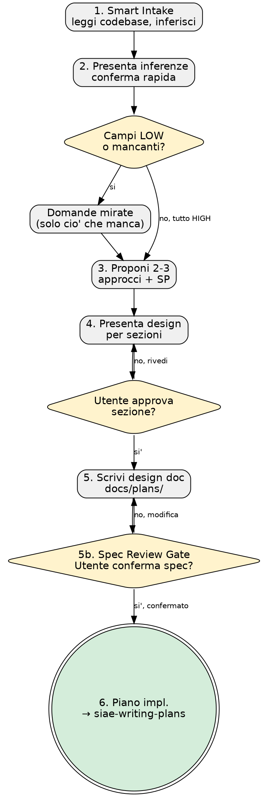

# Smart Intake Brainstorming — Piano Implementativo

> **Per Claude:** REQUIRED SUB-SKILL: Usa `siae-subagent-development`
> per implementare questo piano task per task.

**Goal:** Il brainstorming inferisce il contesto dal codebase prima di chiedere, presentando inferenze con confidence level per conferma rapida.
**Architettura:** Edit a 1 file: siae-brainstorming/SKILL.md — riscrittura Step 1 e Step 2, aggiornamento flowchart
**Stack:** Markdown
**SP:** 2

---

## Task 1: siae-brainstorming — Riscrittura Step 1 (Smart Intake) [DONE]

**File coinvolti:**
- Modifica: `skills/siae-brainstorming/SKILL.md`

**Step 1: Sostituisci Step 1 "Esplora contesto progetto"**

Trova:
```
### 1. Esplora contesto progetto

- Controlla file, doc, commit recenti
- Se MCP Atlassian e' disponibile: cerca ticket JIRA correlati con `searchJiraIssuesUsingJql`
- Identifica vincoli tecnici, dipendenze, e decisioni architetturali esistenti
- Leggi eventuali design doc precedenti in `docs/plans/`
```

Sostituisci con:
```markdown
### 1. Smart Intake — Inferisci il contesto dal codebase

**NON chiedere cio' che il codice sa gia'.** Leggi prima, chiedi dopo.

**Fonti da leggere (in ordine):**

| # | Fonte | Tool | Cosa cercare |
|---|-------|------|-------------|
| 1 | `CLAUDE.md` del progetto | Read | Stack, factory, regole operative |
| 2 | Package manifest (`pom.xml`, `package.json`, `requirements.txt`, `terragrunt.hcl`) | Read | Dipendenze, framework, versioni |
| 3 | Struttura directory (`src/`, `lib/`, `skills/`, `commands/`) | Glob | Pattern architetturale, moduli |
| 4 | `git log --oneline -10` | Bash | Lavoro recente, contesto attuale |
| 5 | `docs/plans/` | Glob + Read | Design doc precedenti, decisioni |
| 6 | JIRA (se MCP disponibile) | MCP Atlassian | Ticket correlati |

**Campi da inferire:**

| Campo | Esempio |
|-------|---------|
| Stack | Java/Spring Boot, Vue.js 3, Python/PySpark, HCL/Terraform |
| Pattern architetturale | Microservizio REST, Lambda serverless, ETL Medallion |
| Test framework | JUnit 5, Vitest, pytest |
| Build tool | Maven, Vite, esbuild |
| Naming convention | camelCase, snake_case, PascalCase |
| Dipendenze chiave | MapStruct, Drizzle ORM, PySpark |

**Ogni inferenza ha:**
- **Confidence:** HIGH (>= 90%), MEDIUM (60-89%), LOW (< 60%)
- **Fonte:** `file:riga` (citation rule)

Esempio:
```
Stack:     Java/Spring Boot  [HIGH]  pom.xml:5 — spring-boot-starter-parent
Pattern:   REST microservice [HIGH]  src/main/java/it/siae/catalogo/controller/:* — 3 controller
Test fw:   JUnit 5           [HIGH]  pom.xml:42 — junit-jupiter 5.9.3
Deploy:    ECS               [MEDIUM] .github/workflows/deploy.yml:15 — ecs-deploy action
```
```

**Step 2: Verifica**
```bash
grep "Smart Intake" skills/siae-brainstorming/SKILL.md
grep "Confidence" skills/siae-brainstorming/SKILL.md
```

**Step 3: Commit**
```bash
git add skills/siae-brainstorming/SKILL.md
git commit -m "feat(brainstorming): replace Step 1 with Smart Intake — infer before asking"
```

---

## Task 2: siae-brainstorming — Riscrittura Step 2 (Conferma inferenze) [DONE]

**File coinvolti:**
- Modifica: `skills/siae-brainstorming/SKILL.md`

**Step 1: Sostituisci Step 2 "Domande chiarificatrici"**

Trova:
```
### 2. Domande chiarificatrici

- Una domanda alla volta — non sovraccaricare l'utente
- Preferisci domande a scelta multipla quando possibile
- Se un argomento richiede approfondimento, spezzalo in piu' domande
- Focus su: scopo, vincoli, criteri di successo, utenti target
```

Sostituisci con:
```markdown
### 2. Presenta inferenze + domande mirate

**Presenta le inferenze in tabella compatta per conferma rapida:**

```
CONTESTO INFERITO:
──────────────────
Stack:       Java/Spring Boot      [HIGH]   pom.xml:5
Pattern:     REST microservice     [HIGH]   src/.../controller/:*
Test fw:     JUnit 5               [HIGH]   pom.xml:42
Deploy:      ECS                   [MEDIUM] .github/workflows/deploy.yml:15
Naming:      camelCase             [HIGH]   src/.../CatalogoService.java

Confermi? (si / correggi specifici)
```

**Regole:**
- L'utente conferma in blocco o corregge singoli campi
- Domande esplicite SOLO per: confidence LOW, campi non inferiti, scopo del task
- Una domanda alla volta per i campi mancanti
- Preferisci domande a scelta multipla quando possibile
- Focus residuo su: **scopo del task**, vincoli, criteri di successo

**Se tutto e' HIGH e l'utente conferma**, procedi direttamente a Step 3 (Approcci).
Questo elimina le 5-10 domande ripetitive sui dati gia' nel codice.
```

**Step 2: Verifica**
```bash
grep "CONTESTO INFERITO" skills/siae-brainstorming/SKILL.md
grep "confidence LOW" skills/siae-brainstorming/SKILL.md
```

**Step 3: Commit**
```bash
git add skills/siae-brainstorming/SKILL.md
git commit -m "feat(brainstorming): replace Step 2 with inference confirmation — ask only what's missing"
```

---

## Task 3: siae-brainstorming — Aggiorna flowchart [DONE]

**File coinvolti:**
- Modifica: `skills/siae-brainstorming/SKILL.md`

**Step 1: Sostituisci il flowchart graphviz**

Trova il blocco:
```dot
digraph brainstorming {
    rankdir=TB;
    ...
    spec_gate -> transition [label="si', confermato"];
}
```

Sostituisci con:


**Step 2: Verifica**
```bash
grep "Smart Intake" skills/siae-brainstorming/SKILL.md | head -3
grep "need_questions" skills/siae-brainstorming/SKILL.md
```

**Step 3: Commit**
```bash
git add skills/siae-brainstorming/SKILL.md
git commit -m "feat(brainstorming): update flowchart with Smart Intake pattern"
```

---

## Checklist Accettazione

- [ ] Step 1 include lista fonti da leggere e campi da inferire
- [ ] Ogni inferenza ha confidence level (HIGH/MEDIUM/LOW) e fonte (file:riga)
- [ ] Step 2 presenta tabella compatta per conferma rapida
- [ ] Domande esplicite solo per confidence LOW o campi mancanti
- [ ] Flowchart aggiornato con nodi Smart Intake e diamond "Campi LOW?"
