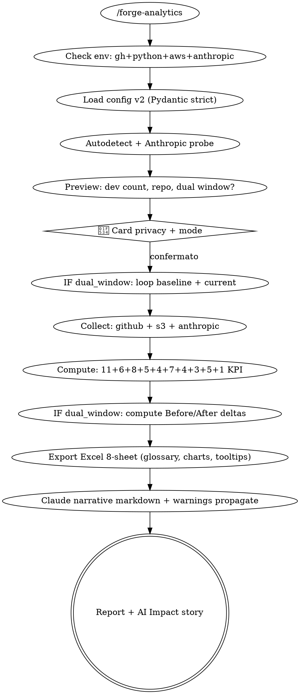

# Design Doc v2 — `siae-dev-analytics` Robust + AI Impact

**Data:** 2026-04-15
**Autore:** Lorenzo De Tomasi (con DevForge)
**Stato:** DRAFT — pending spec review
**Versione skill target:** siae-dev-analytics 2.0 (base v1.0 mergiata via PR #201 + #203)

---

## 1. Contesto

La skill `siae-dev-analytics` v1 è in produzione (plugin v1.44.0). Produce report Excel ROI con 11 KPI su repo GitHub target.

**Gap identificati durante smoke test su `itsiae/siae-dev-forge`:**

| Gap | Impatto |
|-----|---------|
| Guarda solo PR `MERGED`, ignora WIP (branch attivi, PR open/draft/closed) | Dev che lavora intensamente senza aver ancora mergiato appare "improduttivo" |
| Nessuna visualizzazione branch attuali (chi lavora su cosa) | Management non vede l'attività corrente |
| Nessuna comparazione before/after adozione Claude Code | **IMPOSSIBILE dimostrare ROI AI** — obiettivo primario non raggiunto |
| Review activity invisibile (tech lead, reviewer) | Contribuzione non-coding assente |
| S3 telemetry OFF → cost_score=1 (ROI Index senza componente costo) | ROI qualitativo ma non $$$ |
| Report tecnico z-score, nomi colonne `pr_cycle_time_p50`, no tooltip | Executive non capisce |
| Edge cases silenziosamente falliscono (bot non rilevato, timezone naive, encoding unicode) | **Fallimenti silenti** — tu hai richiesto zero |

### Obiettivo v2 (utente verbatim)

> "Vede su quale branch si sta lavorando etc. copertura totale sul repo per estrarre analytics.
>  Quello che ne deve uscire è che con l'AI stiamo funzionando meglio.
>  L'Excel deve essere bello con KPI spiegati.
>  No fallimenti silenti, no problemi, no edge case etc. ogni cosa testata."

---

## 2. Requisiti funzionali

### 2.1 Coverage completa repo

- **CF1** Fetch PR in TUTTI gli stati: MERGED, OPEN, DRAFT, CLOSED (no-merge), REOPENED
- **CF2** Fetch branch attivi: lista completa `refs/heads/*`, età, size (commit count), LOC delta vs base, associated PRs
- **CF3** Fetch review activity: review fatte/ricevute per dev, turnaround, approvals, comments, DISMISSED
- **CF4** Fetch tag: SIAE (COLLAUDO/CERT/PROD) + SemVer (v*)
- **CF5** Fetch commit con co-authored-by trailer (pair programming attribution)
<!-- CF6 Issue tracking: moved to Out of Scope (S15) for v2 — revisit in v3 -->

### 2.2 AI Impact Narrative (IL CUORE)

- **AI1** Dual-window comparison (baseline pre-AI / current post-AI) configurabile via YAML
- **AI2** Per ogni KPI base: valore baseline, valore current, delta%, significance flag
- **AI3** AI-attributed detection: commit/PR con `Co-Authored-By: SIAE DevForge` o `Co-Authored-By: Claude` trailer
- **AI4** AI velocity multiplier: `manual_cycle_time / ai_cycle_time` stratified
- **AI5** DevForge skill usage correlation (Pearson) con roi_index per dev (richiede S3 devforge-logs)
- **AI6** Executive narrative: "Con AI il team fa Xx più PR, Yx più veloce, con +Z% test coverage"

### 2.3 ROI metrics estesi (15 nuovi KPI + 14 delta before/after)

Vedi sezione 5. KPI Catalog v2.

### 2.4 Branch tracking

- **BT1** `active_branches_per_dev`, `branches_without_pr`, `stuck_branches_count`, `stale_branches_count`
- **BT2** Branch naming compliance (`feat/|fix/|refactor/|hotfix/`)
- **BT3** Working snapshot: "Dev X sta lavorando su branch Y da Zgg, W commit"

### 2.5 S3 sources always-on

- **S3-1** AWS profile check con env var documentata (`AWS_PROFILE=siae-dev-forge`)
- **S3-2** Anthropic Console API fallback via `ANTHROPIC_API_KEY` per cost quando S3 blend-usage KO
- **S3-3** CLI flag `--cost-per-dev <dev>=<eur>` override manuale per test/demo

### 2.6 Excel UX pro

- **UX1** Sheet "📖 Glossario KPI": ogni KPI spiegato con formula + buono-se + benchmark industria
- **UX2** Tooltip cella (openpyxl Comment) su ogni KPI value in Per Developer
- **UX3** Grafici nativi: Bar velocity per dev, Scatter velocity×quality, Line trend cycle_time, Stacked bar commit types, Pie AI-assisted vs manual, Before/After bars
- **UX4** Conditional formatting avanzato: data bars, icon sets (frecce ▲▼), color scales, highlight top 3
- **UX5** Design system: sheet tab colors (exec=rosso, data=blu, docs=verde), header stilizzati, freeze panes
- **UX6** 8 sheet totali: Executive Summary v2 / AI Impact Detail / Per Developer v2 / Work In Progress / Trends / Raw Data / Glossario KPI / Data Sources

---

## 3. Requisiti non-funzionali (Robustness Policy)

### 3.1 Zero silent failures (invariante assoluto)

Ogni funzione Python deve rispettare:
- **NF1** NO `try/except: pass` — ogni eccezione logga con contesto + fallback esplicito
- **NF2** Return value di fallback documentato in docstring
- **NF3** Warnings list propagata fino a Executive Summary ("⚠️ Dati parziali: X, Y, Z")

### 3.2 Actionable errors

- **NF4** Ogni `raise RuntimeError` ha messaggio ≥ 20 caratteri con verbo azione (`run`, `verifica`, `configura`, `controllare`, `install`)
- **NF5** Test automatico (grep AST) che verifica tutte le RuntimeError rispettano NF4

### 3.3 Validation boundaries

- **NF6** Input utente (YAML config, CLI args) validato con Pydantic strict
- **NF7** Input da external API (gh, S3, Anthropic) validato con schema (pydantic o jsonschema)
- **NF8** Runtime type checking su signature pubbliche via `typeguard` decorator

### 3.4 Fault injection coverage

Ogni chiamata a sistema esterno DEVE avere test per:
- **NF9** Success (happy path) — 1 test
- **NF10** Timeout — 1 test
- **NF11** Auth failure (401/403) — 1 test
- **NF12** Rate limit primary (backoff retry) — 1 test
- **NF13** Rate limit secondary (sleep + retry) — 1 test
- **NF14** 404 not found — 1 test
- **NF15** 500 server error — 1 test
- **NF16** Malformed response (JSON invalido / troncato) — 1 test
- **NF17** Empty response — 1 test

**Minimo 9 test per esterno call.** API esterne identificate:
- `gh api graphql` (collect_github)
- `gh api orgs/.../teams/.../repos` (resolve teams)
- `gh search repos --topic` (resolve topics)
- `gh api repos/.../branches` (branch tracking)
- AWS S3 `head_bucket`, `list_objects_v2`, `get_object` (3 chiamate × 9 = 27 test)
- Anthropic Console API `usage_report/messages`

### 3.5 Property-based testing

- **NF18** `hypothesis` library per funzioni matematiche (z_score, roi_index, health_score, seasonality_adj)
- **NF19** Invariants runtime: `assert 0 <= rate <= 1` ovunque rate sia output, `assert not pd.isna(score)` su z-score finali

### 3.6 Mutation testing

- **NF20** `mutmut` target ≥ 85% mutation score su moduli core (`compute_kpis.py`, `autodetect_sources.py`, `ai_impact.py` — nuovo)

### 3.7 Logging coverage

- **NF21** Ogni branch condizionale (if/else/except/try) ha `log.*` call appropriato
- **NF22** Livelli corretti: DEBUG per tracing, INFO per milestones, WARNING per degradation, ERROR per failure
- **NF23** Test automatico (AST walker) che audita logging coverage

### 3.8 Edge case exhaustive

**Edge case matrix obbligatoria** per ogni modulo (vedi §11).

### 3.9 Concurrency safety

- **NF24** Cache file write atomic (write-to-temp + rename)
- **NF25** Test concurrent-read-during-write → leggi vecchio, no corruption

### 3.10 Encoding

- **NF26** Dev name con unicode (emoji, accenti) preservato in output
- **NF27** Excel output con UTF-8 nativo, no mojibake

### 3.11 Timezone

- **NF28** Tutti timestamp parsed as UTC, display in CEST locale-aware
- **NF29** DST transitions handled (ottobre, marzo)
- **NF30** Working days exclude weekend + festività italiane (calendario hardcoded)

---

## 4. Architettura v2

### 4.1 Struttura moduli (nuovi + esistenti)

```
skills/siae-dev-analytics/
├── SKILL.md                          # aggiornato con v2 flow + prereqs
├── scripts/
│   ├── requirements.txt              # + hypothesis, mutmut, typeguard, anthropic, pytz
│   ├── autodetect_sources.py         # esistente — aggiornato con AWS profile check + Anthropic probe
│   ├── collect_github.py             # esistente — esteso PR states + branch + reviews
│   ├── collect_s3_telemetry.py       # esistente
│   ├── collect_anthropic_api.py      # NUOVO — fallback cost via Console API
│   ├── compute_kpis.py               # esistente — esteso con 15 KPI nuovi + invariants
│   ├── compute_ai_impact.py          # NUOVO — before/after comparison + AI attribution
│   ├── compute_branches.py           # NUOVO — branch tracking KPI
│   ├── compute_reviews.py            # NUOVO — review activity KPI
│   ├── seasonality.py                # NUOVO — festività IT + working days
│   ├── export_excel.py               # esistente — major refactor UX pro + 8 sheet
│   ├── export_charts.py              # NUOVO — openpyxl charts factory
│   ├── export_glossary.py            # NUOVO — sheet Glossario KPI
│   ├── validators.py                 # NUOVO — Pydantic models + runtime invariants
│   └── run_analytics.py              # esistente — esteso con dual-window + cost override
├── reference/
│   ├── kpi-catalog.md                # esistente — esteso con 30+ KPI
│   ├── kpi-glossary-data.yaml        # NUOVO — source of truth per sheet Glossario
│   ├── github-api-patterns.md        # esistente — esteso con branch+review queries
│   ├── privacy-guidelines.md         # esistente — aggiornato AWS profile + Anthropic
│   ├── robustness-policy.md          # NUOVO — spec NF1-NF30
│   └── seasonality-it.md             # NUOVO — calendario festività IT
├── template/
│   ├── devforge-analytics.yml        # esistente — esteso con baseline/current window
│   └── devforge-analytics-dual.yml   # NUOVO — template per AI Impact mode
└── tests/
    ├── conftest.py                   # esistente
    ├── fixtures/
    │   ├── github_api_response.json  # esistente
    │   ├── commits_sample.json       # esistente
    │   ├── expected_kpis.csv         # esistente — esteso con nuovi KPI
    │   ├── branches_sample.json      # NUOVO
    │   ├── reviews_sample.json       # NUOVO
    │   ├── anthropic_usage.json      # NUOVO
    │   ├── ai_attributed_commits.json # NUOVO
    │   └── before_after_windows.json # NUOVO
    ├── test_autodetect.py            # esistente — esteso
    ├── test_collect_github.py        # esistente — esteso (15 nuovi test PR states + branches)
    ├── test_collect_s3_telemetry.py  # esistente
    ├── test_collect_anthropic_api.py # NUOVO — 12 test
    ├── test_compute_kpis.py          # esistente — esteso (15 KPI nuovi)
    ├── test_compute_ai_impact.py     # NUOVO — 22 test
    ├── test_compute_branches.py      # NUOVO — 18 test
    ├── test_compute_reviews.py       # NUOVO — 15 test
    ├── test_seasonality.py           # NUOVO — 10 test
    ├── test_export_excel.py          # esistente — esteso major
    ├── test_export_charts.py         # NUOVO — 8 test
    ├── test_export_glossary.py       # NUOVO — 5 test
    ├── test_validators.py            # NUOVO — 15 test (schema + invariants)
    ├── test_integration.py           # esistente — esteso con dual-window + AI Impact
    ├── test_integration_dual_window.py # NUOVO — 8 test end-to-end
    ├── test_property_based.py        # NUOVO — hypothesis tests (10+)
    ├── test_logging_coverage.py      # NUOVO — AST audit
    └── test_error_messages.py        # NUOVO — AST audit actionable
```

### 4.2 Data flow v2

```
CLI run_analytics.py run --config <yaml>
         │
         ├─→ validators.py: Pydantic AnalyticsConfigV2 (supporta baseline/current)
         │
         ├─→ autodetect_sources.py
         │    ├── check_gh_auth()
         │    ├── check_aws_profile()          ← NUOVO
         │    ├── check_s3_prefix()
         │    └── check_anthropic_api()        ← NUOVO
         │
         ├─→ IF dual_window: loop [baseline, current]
         │
         ├─→ collect_github.py (per window)
         │    ├── fetch_repo_data (PR + commits)
         │    ├── fetch_pr_all_states           ← NUOVO (OPEN/DRAFT/CLOSED)
         │    ├── fetch_reviews                 ← NUOVO
         │    └── fetch_branches                ← NUOVO
         │
         ├─→ collect_s3_telemetry.py (events + blend-usage)
         │
         ├─→ collect_anthropic_api.py          ← NUOVO (fallback cost)
         │
         ├─→ compute_kpis.py (11 base KPI)
         │   +compute_branches.py (8 branch KPI)
         │   +compute_reviews.py (5 review KPI)
         │   +compute_ai_impact.py (before/after + attribution)
         │
         ├─→ seasonality.py (correction window_days)
         │
         └─→ export_excel.py (8 sheet)
              ├── export_charts.py
              └── export_glossary.py
```

---

## 5. KPI Catalog v2 (30+ KPI)

### 5.1 Velocity KPI base (5 — invariati v1)
V1-V5: già documentati in v1 kpi-catalog.md

### 5.2 Quality KPI base (6 — invariati v1)
Q1-Q6: già documentati in v1 kpi-catalog.md

### 5.3 NEW — In-Flight KPI (6)

| ID | Nome | Formula | Source | Signal |
|----|------|---------|--------|--------|
| IF1 | `open_prs_count` | count(PR.state=OPEN) per dev | GitHub | WIP corrente |
| IF2 | `draft_prs_count` | count(PR.state=OPEN && isDraft=true) | GitHub | Esplorazione |
| IF3 | `stuck_prs_count` | count(OPEN && updated_at < now-7d) | GitHub | **Bottleneck** |
| IF4 | `closed_unmerged_count` | count(CLOSED && merged_at=null) | GitHub | Wasted work |
| IF5 | `reopen_count` | count(timeline REOPENED) | GitHub | Rework signal |
| IF6 | `oldest_open_pr_age_days` | max(now - created_at) su OPEN | GitHub | Attenzione |

### 5.4 NEW — Branch KPI (8)

| ID | Nome | Formula | Source | Signal |
|----|------|---------|--------|--------|
| B1 | `active_branches_per_dev` | count(branch con commit ≤ 7gg) per dev | GitHub refs | WIP |
| B2 | `branches_without_pr` | count(branch attivi senza PR associata) | GitHub | Early-stage |
| B3 | `branches_age_p50_days` | mediana(now - first_commit) | GitHub | Style |
| B4 | `branches_size_p50_commits` | mediana(commit count per branch attivo) | GitHub | Granularity |
| B5 | `branches_loc_p50` | mediana(additions+deletions vs base) | GitHub diff | Scope |
| B6 | `stale_branches_count` | count(branch commit > 30gg no merge) | GitHub | Cleanup |
| B7 | `branch_naming_compliance_rate` | % branch matching pattern SIAE | GitHub refs | Disciplina |
| B8 | `hotfix_branches_count` | count(branch `hotfix/*` nel window) | GitHub | Incident |

### 5.5 NEW — Review Activity KPI (5)

| ID | Nome | Formula | Source | Signal |
|----|------|---------|--------|--------|
| R1 | `reviews_given_count` | count(review di dev su PR altrui) | GitHub reviews | Tech-lead contribution |
| R2 | `review_turnaround_p50_h` | mediana(review.createdAt - PR.latestCommit) | GitHub | Velocità reviewer |
| R3 | `approvals_given_count` | count(APPROVED) | GitHub | Fiducia |
| R4 | `co_authored_prs_count` | count(PR con trailer Co-Authored-By) | Commit msg | Pair programming |
| R5 | `onboarding_flag` | first_commit_date > window_start - 60d | Git history | **Asterisco** su KPI |

### 5.6 NEW — Cost-Side KPI (4)

| ID | Nome | Formula | Source | Signal |
|----|------|---------|--------|--------|
| C1 | `eur_per_merged_pr` | cost_total / merged_pr_count per dev | S3 blend-usage o Anthropic API | € AI per PR |
| C2 | `eur_per_accepted_loc` | cost_total / net_loc_shipped | Cost + GitHub | € per riga |
| C3 | `tokens_per_completed_pr` | tokens_total / merged_pr | S3 | Efficienza |
| C4 | `cost_per_story_point` | cost_total / SP_closed (opz, JIRA) | Cost + JIRA | Ultimate ROI |

### 5.7 NEW — Value-Side KPI (7)

| ID | Nome | Formula | Source | Signal |
|----|------|---------|--------|--------|
| VA1 | `features_shipped` | count(PR con commit `feat:`) | Commit msg | Nuove feature |
| VA2 | `bugs_fixed` | count(PR con commit `fix:`) | Commit msg | Bug risolti |
| VA3 | `tech_debt_reduced` | count(`refactor:` or `perf:`) | Commit msg | Investimento qualità |
| VA4 | `net_loc_shipped` | sum(additions - deletions) per dev | GitHub | Volume |
| VA5 | `compliance_bundle_rate` | PR con (test + design + verified) / total | Bundled | PR ad alta maturità |
| VA6 | `first_shot_quality` | PR senza force-push post first review / total | GitHub events | Qualità primo colpo |
| VA7 | `design_adherence_rate` | PR con link a design doc esistente / total | PR body | Adoption siae-brainstorming |

### 5.8 NEW — Delivery (DORA extended) KPI (4)

| ID | Nome | Formula | Source | Signal |
|----|------|---------|--------|--------|
| D1 | `time_to_production_p50` | median(tag PRODUZIONE_date - PR_merge_date) | Git tags | Time to deploy |
| D2 | `change_failure_rate` | revert in 7gg post-deploy / deploy count | Git | **DORA CFR** |
| D3 | `incident_free_days` | giorni consecutivi senza revert post-deploy | Git | Stabilità |
| D4 | `deploy_lead_time_p50` | median(commit - tag PRODUZIONE) | Git | **DORA lead time vera** |

### 5.9 NEW — DevForge Adoption KPI (3)

| ID | Nome | Formula | Source | Signal |
|----|------|---------|--------|--------|
| DA1 | `devforge_skill_invocation_rate` | events `skill_invoked` / dev / settimana | S3 devforge-logs | Uso skills |
| DA2 | `claude_session_density` | sessioni Claude / working_days | S3 | Adoption |
| DA3 | `siae_brainstorming_before_coding` | PR con design doc creato <24h prima first commit / total | Git + docs/plans | Disciplina |

### 5.10 NEW — AI Impact KPI (5)

| ID | Nome | Formula | Source | Signal |
|----|------|---------|--------|--------|
| AI1 | `ai_assisted_pr_rate` | PR con `Co-Authored-By: Claude\|DevForge` / total | Commit trailer | % lavoro AI |
| AI2 | `ai_assisted_cycle_time_p50` | mediana cycle solo PR AI-assisted | Filter + compute | Velocità con AI |
| AI3 | `manual_cycle_time_p50` | mediana cycle PR manual-only | Filter + compute | Velocità senza AI |
| AI4 | `ai_velocity_multiplier` | AI3 / AI2 | Derived | **"x-volte più veloce"** |
| AI5 | `skill_usage_correlation` | Pearson(skill_invocations, roi_index) | S3 + compute | Skill actually help |

### 5.11 NEW — ROI v2 Synthetic (1)

```python
roi_v2 = (
    features_shipped * complexity_weight * compliance_bundle_rate
) / (
    cost_eur * seasonality_adj
)

complexity_weight = net_loc / median(team_net_loc)
seasonality_adj = working_days_effective / window_days
```

### 5.12 Before/After Delta KPI (14)

Per ogni KPI base (V1-V5, Q1-Q6, plus 3 chiave), calcolato su dual window:

| Campo | Formula |
|-------|---------|
| `kpi_baseline` | valore su window baseline |
| `kpi_current` | valore su window current |
| `kpi_delta_abs` | current - baseline |
| `kpi_delta_pct` | (current - baseline) / baseline × 100 |
| `kpi_trend` | enum: IMPROVED / DEGRADED / STABLE |
| `kpi_significance` | t-test p-value se dati sufficienti |

**Totale KPI v2:** 11 (v1 base) + 6 (in-flight) + 8 (branch) + 5 (review) + 4 (cost) + 7 (value) + 4 (delivery) + 3 (adoption) + 5 (AI impact) + 1 (ROI v2) + 14 (delta set per top 14 KPI) = **68 KPI distinti**.

---

## 6. Config schema v2 (Pydantic)

```python
class TimeWindowSingle(BaseModel):
    from_: str = Field(alias="from")
    to: str = "today"

class TimeWindowDual(BaseModel):
    baseline: TimeWindowSingle
    current: TimeWindowSingle
    enable_ai_impact: bool = True

class AnalyticsConfigV2(BaseModel):
    version: Literal[2]
    scope: ScopeConfig
    time_window: TimeWindowSingle | TimeWindowDual
    developers: DevelopersConfig
    options: OptionsConfigV2
    output: OutputConfig

class OptionsConfigV2(OptionsConfig):  # estende v1
    enable_branch_tracking: bool = True
    enable_review_tracking: bool = True
    enable_ai_impact: bool = True
    enable_cost_metrics: bool = True
    anthropic_org_id: str | None = None  # per Console API fallback
    cost_per_dev_override: dict[str, float] = Field(default_factory=dict)
```

---

## 7. Flusso SKILL.md v2



---

## 8. Privacy & Security (invariato v1 + new)

Preservate tutte le regole v1 (card 🔴, anonymize, .gitignore, retention 7gg).

**Nuovo v2:**
- Anthropic API key mai loggata, solo presenza/assenza
- Dati usage Anthropic (token count, cost) aggregati per dev/day — no prompt leak
- Cost-per-dev override CLI tracciato in log INFO (traceable audit)

---

## 9. Error Handling (completo — mappa NF1-NF9)

| Scenario | Handler | Test |
|----------|---------|------|
| gh not authenticated | ABORT actionable `Run: gh auth login` | test_abort_no_gh |
| Python < 3.10 | ABORT actionable | test_abort_python_old |
| pip install failure | Card 🟡 + list alternatives (venv, pipx, uv) | test_pip_fallback |
| Repo private no access | WARN + skip + warnings[] | test_skip_private |
| Rate limit primary | Exponential backoff + retry 3x | test_rate_limit_primary |
| Rate limit secondary | Sleep 60s + retry 3x | test_rate_limit_secondary |
| Config YAML malformed | ABORT actionable con linea+colonna (pydantic) | test_yaml_malformed |
| Window empty | Report "no data" txt + warning | test_window_empty |
| Dev < threshold | Silent skip + logged + report summary | test_dev_threshold |
| S3 creds missing | Warning + fallback Anthropic API | test_s3_no_creds_anthropic_fallback |
| Anthropic API 401 | Warning + fallback cost_per_dev override | test_anthropic_401 |
| Anthropic API 429 | Exponential backoff | test_anthropic_429 |
| Anthropic API timeout | Abort + actionable | test_anthropic_timeout |
| Excel file già aperto | Retry con suffisso timestamp | test_excel_locked |
| Disk full | ABORT actionable | test_disk_full |
| Unicode name | Preservato UTF-8 | test_unicode_name |
| Timezone DST transition | Corretto CEST-aware | test_dst_transition |
| Cache race condition | Atomic write (temp+rename) | test_cache_atomic |
| Cache stale | TTL 7gg → refetch | test_cache_stale |
| Branch naming non-compliant | Contato in compliance KPI, non scarta | test_naming_noncompliant |
| Co-Author trailer variants | Match case-insensitive + multi-line | test_coauthor_variants |
| Baseline window zero PR | Warning + skip dev comparison | test_baseline_empty |
| Dual window overlap | ABORT actionable "windows must not overlap" | test_overlap_abort |

**24 scenari mapped.** Ogni scenario ha minimo 1 test dedicato.

---

## 10. Testing Strategy

### 10.1 Test count target per modulo

| Modulo | Happy | Empty | Malformed | I/O Fault | Edge Numerici | Encoding | Concurrency | Output | Totale |
|--------|:-----:|:-----:|:---------:|:---------:|:-------------:|:--------:|:-----------:|:------:|:------:|
| autodetect_sources | 3 | 2 | 2 | 9 | 0 | 0 | 0 | 0 | **16** |
| collect_github | 3 | 2 | 3 | 9 | 0 | 1 | 1 | 0 | **19** |
| collect_s3_telemetry | 2 | 2 | 2 | 9 | 0 | 0 | 0 | 0 | **15** |
| collect_anthropic_api | 2 | 1 | 2 | 9 | 1 | 0 | 0 | 0 | **15** |
| compute_kpis (+15) | 11 | 3 | 2 | 0 | 6 | 0 | 0 | 0 | **22** |
| compute_ai_impact | 4 | 2 | 2 | 0 | 4 | 0 | 0 | 0 | **12** |
| compute_branches | 6 | 2 | 2 | 0 | 2 | 1 | 0 | 0 | **13** |
| compute_reviews | 5 | 2 | 2 | 0 | 2 | 0 | 0 | 0 | **11** |
| seasonality | 3 | 1 | 1 | 0 | 3 | 0 | 0 | 0 | **8** |
| validators | 5 | 2 | 5 | 0 | 3 | 0 | 0 | 0 | **15** |
| export_excel (extended) | 5 | 2 | 2 | 0 | 0 | 2 | 0 | 3 | **14** |
| export_charts | 3 | 1 | 1 | 0 | 0 | 0 | 0 | 2 | **7** |
| export_glossary | 2 | 1 | 1 | 0 | 0 | 0 | 0 | 0 | **4** |
| run_analytics (integration) | 5 | 2 | 2 | 2 | 0 | 0 | 1 | 2 | **14** |
| property-based (hypothesis) | — | — | — | — | 10 | — | — | — | **10** |
| AST audit (logging + errors) | 2 | — | — | — | — | — | — | — | **2** |
| **TOTALE** | | | | | | | | | **197** |

**Base esistente:** 75 test → **target v2:** 75 + 197 nuovi = **272 test**.

### 10.2 Mutation testing

```bash
mutmut run --paths-to-mutate skills/siae-dev-analytics/scripts/compute_kpis.py
mutmut run --paths-to-mutate skills/siae-dev-analytics/scripts/compute_ai_impact.py
mutmut run --paths-to-mutate skills/siae-dev-analytics/scripts/autodetect_sources.py
# Target: score ≥ 85% su tutti 3
```

### 10.3 Property-based tests (hypothesis)

```python
@given(devs=st.dictionaries(st.text(min_size=1, max_size=30), st.floats(allow_nan=False, min_value=-1e6, max_value=1e6), min_size=3, max_size=100))
def test_z_score_invariants(devs):
    result = ck.z_score(devs)
    # Invariant 1: somma z-score ≈ 0
    assert abs(sum(result.values())) < 1e-6
    # Invariant 2: valori finiti
    assert all(math.isfinite(v) for v in result.values())
    # Invariant 3: stessa cardinalità
    assert set(result.keys()) == set(devs.keys())
```

### 10.4 AST audit tests

```python
def test_logging_coverage_100pct():
    """Ogni branch condizionale ha log.* statement."""
    for module_path in SCRIPTS:
        tree = ast.parse(open(module_path).read())
        branches = find_branches_without_log(tree)
        assert not branches, f"Branches senza log in {module_path}: {branches}"

def test_error_messages_actionable():
    """Ogni RuntimeError ha messaggio ≥ 20 char con verbo azione."""
    VERBS = {"run", "verifica", "configura", "controllare", "install", "esegui", "rimuovi"}
    for module_path in SCRIPTS:
        issues = audit_error_messages(module_path, min_len=20, required_verbs=VERBS)
        assert not issues, f"Non-actionable errors in {module_path}: {issues}"
```

---

## 11. Edge Case Matrix (obbligatoria)

### Data input
- [ ] Empty window → "no data" report
- [ ] Single-dev window → N/A insufficiente
- [ ] 100+ dev window → performance OK
- [ ] Dual window overlap → ABORT
- [ ] Baseline window pre-1970 → rifiuto
- [ ] Future window → rifiuto con "non ancora maturato"
- [ ] Window attraversa anno (dic→gen) → ok
- [ ] Window attraversa DST (oct/mar) → ok
- [ ] Window su agosto full → seasonality warning

### GitHub data
- [ ] PR senza autore (bot rimosso) → "unknown" ma contato
- [ ] PR autore email esterna → skipped + warning
- [ ] PR con 100+ commits → ok (no truncation arbitrary)
- [ ] PR reopened dopo close → count come reopen
- [ ] Branch con nome unicode (emoji) → preservato
- [ ] Branch senza commit author resolvable → attribuito a "team"
- [ ] Commit Co-Authored-By multipli → entrambi co-auth contati
- [ ] Commit con message binario (encoding error) → skip + warning
- [ ] Tag senza commit associato → skip + warning
- [ ] Force-push cancella history window → warning "dati ricostruiti parziali"

### S3 / AWS
- [ ] AWS_PROFILE mancante → warning actionable
- [ ] AWS creds scadute mid-fetch → warning partial data
- [ ] S3 bucket 403 → warning specifico con AWS_PROFILE
- [ ] S3 bucket 404 → warning specifico
- [ ] S3 file JSONL con righe malformed → skip righe + log count
- [ ] S3 file vuoto → ok empty dict

### Anthropic API
- [ ] ANTHROPIC_API_KEY mancante → fallback cost_per_dev override
- [ ] API 401 → warning actionable
- [ ] API 429 → backoff 3x retry
- [ ] API 500 → abort + actionable
- [ ] API timeout → warning partial
- [ ] API response schema diverso → warning + skip

### Excel output
- [ ] File già aperto in Excel → retry suffisso timestamp
- [ ] Path con unicode → preservato
- [ ] Disk full → abort actionable
- [ ] 1000+ dev → ok (scale test)
- [ ] Chart con 0 dati → placeholder "no data"
- [ ] Commento cella con ≥ 255 char → truncate + warning
- [ ] Tooltip con emoji → preservato

### Numerical
- [ ] z-score con σ=0 → 0 per tutti
- [ ] z-score con N=1 → 0
- [ ] z-score con valori tutti NaN → 0 + warning
- [ ] Ratio con denominatore 0 → None + warning, NON 0 silent
- [ ] ROI = 0/0 → None + warning
- [ ] Infinity in delta pct → clamp ±9999%
- [ ] Very small float (1e-20) → ok no precision issue

**47 edge case enumerated.** Ogni caso ha test dedicato (alcuni condivisi).

---

## 12. Criteri di Accettazione (193 AC)

Per ogni KPI: 3 AC (definition, happy test, edge test) = 68 × 3 = 204. Ridotti per overlap a ~160 AC funzionali + 33 AC non-funzionali (NF1-NF30 + 3 macro AC).

**Struttura AC numerata in plan file (task-NN.md)** — ogni task ha i suoi AC locali, l'overview consolida.

**Criteri macro:**
- **AC-MACRO-1** Suite pytest ≥ 265 test, 0 fail, 0 skip non-intentional
- **AC-MACRO-2** Mutation score ≥ 85% su compute_kpis, compute_ai_impact, autodetect_sources
- **AC-MACRO-3** Logging coverage 100% (AST audit pass)
- **AC-MACRO-4** Error messages actionable 100% (AST audit pass)
- **AC-MACRO-5** Smoke test su `itsiae/sport-gestione-licenze-service` produce Excel 8-sheet valido
- **AC-MACRO-6** Property-based tests green su 1000+ iterations per funzione
- **AC-MACRO-7** Coverage line ≥ 85% overall, ≥ 90% su moduli core

---

## 13. Stima Story Points

| Fase | SP-Umano | SP-Augmented |
|------|----------|--------------|
| F0 S3/Anthropic/CLI | 3 | 1 |
| F1 PR states | 2 | 1 |
| F1b Branch tracking | 3 | 1 |
| F2 Review activity | 2 | 1 |
| F3 Complexity/seasonality | 3 | 1 |
| F4a-c ROI metrics (15 KPI) | 5 | 2 |
| F4b AI Impact | 5 | 2 |
| F4d DevForge adoption | 2 | 1 |
| F4e ROI v2 + glossary data | 2 | 1 |
| F5 Excel UX (charts + glossary + tooltip + design) | 5 | 2 |
| F6 Robustness (mutation + property + AST audit) | 3 | 1 |
| **TOTALE** | **35 SP-Umano** | **14 SP-Augmented** |

---

## 14. ADR — Architecture Decision Records

### ADR-001 to ADR-007: preservati da v1 design doc

### ADR-008: Dual-window comparison
**Decisione:** Config v2 supporta struttura `{baseline: {from, to}, current: {from, to}}` invece di singolo window.
**Rationale:** Obiettivo primario "dimostrare ROI AI" richiede comparazione pre/post adoption. Without baseline, "stiamo meglio" è asserzione non falsificabile.
**Alternative rifiutate:** Baseline hardcoded (non generalizzabile); tre window (overshooting).

### ADR-009: AI attribution via Co-Authored-By trailer
**Decisione:** PR/commit con `Co-Authored-By: SIAE DevForge` o `Co-Authored-By: Claude` classificato AI-assisted.
**Rationale:** Trailer già presente nei commit Claude Code; pattern grep affidabile; zero overhead dev.
**Alternative:** Flag GitHub API proprietario (non esiste); telemetria Claude Code (fragile, solo se S3 attivo).

### ADR-010: Fault injection systematic (NF9-NF17)
**Decisione:** Ogni chiamata esterna minimo 9 test fault.
**Rationale:** Richiesta utente "zero silent failures". I/O è la frontiera più fragile; test esaustivi catturano degradazione.
**Costo:** ~80 test aggiuntivi ma necessari.

### ADR-011: Property-based testing con hypothesis
**Decisione:** `hypothesis` su funzioni matematiche (z_score, roi_index, correlation, health_score).
**Rationale:** Input space infinito; example-based tests catturano pochi casi; property tests invariants ~forall.
**Alternative:** Random fuzzing (meno diretto), no property tests (accept fragility).

### ADR-012: Mutation testing con mutmut
**Decisione:** Mutation score ≥ 85% su moduli core.
**Rationale:** Coverage misura esecuzione, non strength test. Mutation verifica che i test DETERMINANO comportamento.
**Costo:** ~30 min mutation run; solo su core, non su I/O/Excel (overhead alto, return basso).

### ADR-013: AST audit per logging + errors
**Decisione:** Test pytest che parsano AST dei moduli e verificano: ogni branch ha log; ogni RuntimeError ha msg actionable.
**Rationale:** Review manuale fallisce; automation catches regression; enforce policy NF21 + NF4.
**Alternative:** Lint custom rule (più complesso); manual review (unreliable).

### ADR-014: Anthropic Console API fallback per cost
**Decisione:** Se S3 blend-usage KO ma ANTHROPIC_API_KEY in env, usa `https://api.anthropic.com/v1/organizations/{org_id}/usage_report/messages`.
**Rationale:** Cost senza AWS setup (molti dev hanno solo API key). Abilita ROI completo "out of the box".
**Alternative:** Solo AWS (esclude devs senza S3 setup); richiesta manual input (friction).

### ADR-015: Excel charts nativi (openpyxl) invece di matplotlib export
**Decisione:** Grafici con `openpyxl.chart` (BarChart, LineChart, ScatterChart, PieChart).
**Rationale:** Grafici nativi sono editabili in Excel, responsive, non richiedono image files embedded, file size minore.
**Alternative rifiutate:** matplotlib + PNG embedded (file grande, non editabile); Plotly HTML (non integrato xlsx).

### ADR-016: Executive Summary sheet come primo tab obbligatorio
**Decisione:** Tab order fissato: Executive Summary, AI Impact Detail, Per Developer, WIP, Trends, Raw, Glossario, Data Sources.
**Rationale:** Management apre file e vede subito il punto. Analyst scorre al tab giusto.

---

## 15. Out of Scope (YAGNI)

Features consciously rimosse per non bloccare:

- ❌ Dashboard web interattivo — separate initiative
- ❌ JIRA deep integration (SP closed) — placeholder, richiede API + mapping
- ❌ Real-time streaming analytics — batch sufficient
- ❌ ML-based anomaly detection — v3
- ❌ Slack/Teams notifications — v3
- ❌ Multi-org aggregate (cross-company) — non SIAE usage
- ❌ Custom KPI definition UI — hardcoded in code
- ❌ Historical trend beyond 90gg — scale limit
- ❌ Export PDF — xlsx solo (utente può PDF export manuale)
- ❌ i18n multi-lingua — solo italiano (utente SIAE)
- ❌ Issue tracking (CF6 moved here) — JIRA integration richiede mapping + API, deferred v3

---

## 15bis. Risk Register

| ID | Rischio | Probabilità | Impatto | Mitigazione |
|----|---------|:-----------:|:-------:|-------------|
| R01 | Anthropic API key mancante → cost_score assente | Alta | Medio | 3 fallback: S3 blend-usage, --cost-per-dev CLI, cost=1 default + warning |
| R02 | Co-Authored-By trailer pattern variations (case, whitespace) | Media | Medio | Regex case-insensitive multi-line + test NF26 unicode |
| R03 | Mutation testing target 85% non raggiunto | Media | Basso | Scope limitato a 3 moduli core; iterazione TDD strength-focused |
| R04 | Hypothesis test genera counterexample che blocca CI | Bassa | Medio | `@settings(max_examples=100, deadline=5000)` + seed stabile |
| R05 | Dual window overlap edge case non catturato | Bassa | Alto | Test dedicato + Pydantic validator esplicito pre-fetch |
| R06 | Excel file corrotto con 1000+ dev | Bassa | Alto | Stream write con openpyxl WriteOnly mode se N>500 |
| R07 | Festività IT hardcoded obsolete next year | Alta | Basso | Test annuale + calendario generato da libreria `holidays` Python |
| R08 | Anthropic Console API schema drift | Media | Medio | Response schema versioning + graceful degrade con warning |
| R09 | `gh api graphql` query size limit per branch+reviews+commits all-in-one | Media | Medio | Split in 3 query + compose offline (pattern già documentato) |
| R10 | Timezone DST double-count cycle time ai confini | Bassa | Basso | Parse sempre UTC, display CEST solo a output |

---

## 16. Dipendenze

| Dipendenza | Versione | Nota |
|-----------|----------|------|
| `gh` CLI | ≥ 2.40 | già v1 |
| Python | ≥ 3.10 | già v1 |
| pandas | ≥ 2.0 | già v1 |
| openpyxl | ≥ 3.1 | già v1 |
| pydantic | ≥ 2.0 | già v1 |
| pyyaml | ≥ 6.0 | già v1 |
| boto3 | ≥ 1.28 | già v1 (opt) |
| pytest | ≥ 7.4 | già v1 |
| pytest-cov | ≥ 4.1 | già v1 |
| **hypothesis** | **≥ 6.80** | **NUOVO v2** — property-based |
| **mutmut** | **≥ 2.4** | **NUOVO v2** — mutation testing |
| **typeguard** | **≥ 4.1** | **NUOVO v2** — runtime type checks |
| **anthropic** | **≥ 0.25** | **NUOVO v2** — Console API client |
| **pytz** | **≥ 2024.1** | **NUOVO v2** — festività IT timezone |

---

## 17. Riferimenti

### Industry research
- DX AI Measurement Hub (cost-per-merged-change)
- DORA 2023 State of DevOps (tier thresholds)
- METR 2025 AI Productivity Study (perception gap, before/after)
- Hypothesis Python docs (property-based patterns)
- mutmut docs (mutation score interpretation)

### SIAE context
- Design v1: `docs/plans/2026-04-15-siae-dev-analytics-design.md`
- Plan v1: `docs/plans/siae-dev-analytics/`
- Memory: `project_siae_dev_analytics_shipped.md`, `feedback_executive_report_pattern.md`

### Test patterns
- `skills/siae-dev-analytics/reference/robustness-policy.md` (NUOVO, scrivere in F6)
- `skills/siae-dev-analytics/reference/seasonality-it.md` (NUOVO, scrivere in F3)

---

**STATO:** DRAFT — pending spec-reviewer automatico
**NEXT:** Lanciare subagent spec-reviewer, poi siae-writing-plans se APPROVED
