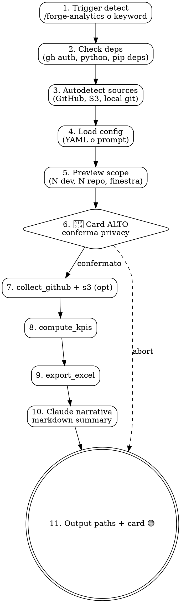

# Design Doc — `siae-dev-analytics`

**Data:** 2026-04-15
**Autore:** Lorenzo De Tomasi (con DevForge)
**Stato:** DRAFT — pending spec review
**Topic:** Skill DevForge per misurare velocità e qualità degli sviluppatori SIAE che usano Claude Code, produrre report ROI per management.

---

## 1. Contesto e Motivazione

### Problema

Non abbiamo evidenza oggettiva di quanto velocemente e quanto bene lavorano gli sviluppatori SIAE dopo l'introduzione di Claude Code + DevForge. Servono KPI riproducibili per:

- **ROI Claude Code:** dimostrare che DevForge rende i developer più veloci/buoni (obiettivo primario)
- **Reportistica management:** output consumabile da carlo.stoppani e stakeholder (obiettivo secondario)

### Vincoli dall'utente

| Vincolo | Dettaglio |
|---------|-----------|
| Stack implementazione | Python (script testabili, no bash-only) |
| Output | Excel (`.xlsx`) consumabile da management |
| Fonte dati | GitHub (ground truth) + telemetria DevForge se disponibile (auto-detect) |
| Finestra temporale | Custom via parametro |
| Privacy | Nominativi con gate 🔴 ALTO + flag `--anonymize` per report esterni |
| Filosofia | **AUTO-BEST:** zero scelte manuali, la skill rileva le fonti e tira il massimo |

### Perché una skill nuova

| Check | Esito | Motivo |
|-------|-------|--------|
| `bedrock-aws-cap` dashboard | ❌ | Traccia spesa Bedrock, non commit/PR/quality |
| Skill DevForge esistenti | ❌ | `siae-finops`, `siae-retrospective` non coprono cross-dev analytics |
| `gh` CLI + `jq` one-liner | ❌ | 11 KPI × N dev × M repo + Excel export → non è one-liner |
| QuickSight/Grafana esistenti | ❌ | Tabelle Athena `devforge_events` pianificate in PR-D ma non deployate |
| **Developer Analytics Dashboard** (iniziativa pianificata) | ✅ Complementare | Dashboard è cruscotto on-line; questa skill è analisi on-demand repo-per-repo — scopi diversi |

---

## 2. Framework ROI — Basato su Industry Research 2026

Design informato da tre framework industry-standard:

| Framework | Contributo |
|-----------|-----------|
| **DORA** | 4 delivery metrics (cycle time, lead time, deploy freq, change failure rate) |
| **SPACE** | Holistic (S/P/A/C/E) — prendiamo Performance + Efficiency |
| **DX AI Measurement** | Utilization + Impact + Cost — schema per AI tools specificamente |

### Findings che influenzano il design

| Finding | Fonte | Impatto design |
|---------|-------|----------------|
| 81% dev si sente più veloce, ma studi controllati mostrano 19% più lenti | Index.dev 2026 | **Zero self-reporting.** Solo metriche oggettive da Git/GitHub. |
| 15% commit AI introducono issue, 24% sopravvivono | Study marzo 2026 (304k commit) | **Quality metrics obbligatorie**, non opzionali. |
| ROI = $/accepted low-regression change (non $/seat) | Exceeds AI | **ROI Index pesa velocity × quality**, non conta PR grezzi. |
| Benchmark 2026: min 3 di 5 dimensioni (adoption, AI code share, velocity, quality, ROI) | Larridin | **11 KPI copre 4 dimensioni** (velocity, quality, ROI sintetico, design adoption). |

---

## 3. Architettura

```
┌──────────────────────────────────────────────────────────┐
│ Claude (SKILL.md orchestratore)                          │
│  - trigger detection → carica config (auto o prompt)     │
│  - gate 🔴 ALTO privacy (conferma pre-fetch nominativo)  │
│  - invoca run_analytics.py via Bash                      │
│  - post-process: genera narrativa markdown finale        │
└──────┬───────────────────────────────────────────────────┘
       │ subprocess
       ▼
┌──────────────────────────────────────────────────────────┐
│ Python Pipeline (skills/siae-dev-analytics/scripts/)     │
│                                                           │
│  run_analytics.py (entry point)                          │
│    ├─ autodetect_sources.py     → quali fonti disponibili│
│    ├─ collect_github.py         → gh graphql PR/commit   │
│    │                              (via subprocess.run,   │
│    │                              no pygithub — v. ADR-1)│
│    ├─ collect_s3_telemetry.py   → opz, se auto-detected  │
│    ├─ compute_kpis.py           → 11 KPI + z-score + ROI │
│    └─ export_excel.py           → .xlsx 4 sheet          │
└──────────────────────────────────────────────────────────┘
```

**Separation of concerns:**
- Claude orchestra, non fa matematica (elimina non-determinismo LLM sui numeri)
- Python è testabile con pytest, output riproducibile
- Ogni script è standalone, invocabile anche singolarmente per debug

### File layout

```
skills/siae-dev-analytics/
├── SKILL.md
├── reference/
│   ├── kpi-catalog.md              # formule KPI con esempi
│   ├── github-api-patterns.md      # query gh graphql ottimizzate
│   └── privacy-guidelines.md       # linee guida GDPR + SIAE
├── scripts/
│   ├── requirements.txt            # pandas, openpyxl, pyyaml, pydantic, boto3 (opt)
│   ├── autodetect_sources.py
│   ├── collect_github.py
│   ├── collect_s3_telemetry.py     # graceful degrade se creds mancanti
│   ├── compute_kpis.py
│   ├── export_excel.py
│   └── run_analytics.py            # CLI entry
├── template/
│   └── devforge-analytics.yml      # template config
└── tests/
    ├── fixtures/
    │   ├── github_api_response.json
    │   ├── commits_sample.json
    │   └── expected_kpis.csv
    ├── test_compute_kpis.py
    ├── test_export_excel.py
    ├── test_collect_github.py
    ├── test_autodetect.py
    └── test_integration.py

commands/
└── forge-analytics.md
```

---

## 4. Auto-Detection Sources (il cuore dell'AUTO-BEST)

### Strategia

```python
def autodetect() -> SourceReport:
    sources = SourceReport()

    # GitHub — obbligatorio, ground truth
    sources.github = check_gh_auth()  # must be True o abort

    # Telemetria DevForge su S3 — bonus
    sources.s3_devforge = probe_s3("siae-devforge-telemetry/devforge-logs/")
    sources.s3_blend = probe_s3("siae-devforge-telemetry/blend-usage/")

    # Git trailers locali (verified-by, design-by) — se repo clonato
    sources.local_git = check_local_clones()

    return sources
```

### Matrice gracefulness

| github | s3_devforge | s3_blend | Risultato |
|:------:|:-----------:|:--------:|-----------|
| ✅ | ✅ | ✅ | **FULL MODE:** tutti gli 11 KPI + AI ROI completo con cost_score reale |
| ✅ | ✅ | ❌ | **HYBRID:** KPI completi, ROI Index = velocity × quality (cost=1, noted) |
| ✅ | ❌ | ❌ | **GITHUB-ONLY:** 11/11 KPI (Q4 `verification_rate` best-effort da commit message trailer via `gh graphql`, accuracy minore se dev non usa footer `verified-by`), ROI = v × q |
| ❌ | * | * | **ABORT:** GitHub obbligatorio, messaggio chiaro all'utente |

Il report finale dichiara sempre in sheet **Data Sources** cosa è stato usato e cosa no, così il management sa cosa leggere.

---

## 5. KPI Catalog (11 metriche + 1 sintetica)

### Velocity (5 KPI — DORA + DX AI)

| ID | Nome | Formula | Source |
|----|------|---------|--------|
| V1 | `pr_cycle_time_p50` | `median(merged_at - opened_at)` in ore | GitHub PR |
| V2 | `lead_time_to_merge_p50` | `median(merged_at - first_commit_at)` in ore | GitHub commits + PR |
| V3 | `pr_throughput_weekly` | `count(merged_pr) / weeks_in_window` | GitHub PR |
| V4 | `time_to_first_review_p50` | `median(first_review_at - opened_at)` in ore | GitHub reviews |
| V5 | `deploy_frequency_monthly` | Team-level: `count(tags matching SIAE_TAG_REGEX) / months`. Per-dev: `count(tag dove PR merge author = dev) / months` | Git tags SIAE |

**V5 — Attribuzione tag a developer (chiarimento):**
- Tag di deploy in SIAE sono creati da CI/CD o lead, non dal dev singolo
- **Strategia attribuzione:** cerchiamo il tag, identifichiamo il commit taggato, risaliamo alla PR che ha mergiato quel commit in main, e attribuiamo il tag all'**autore della PR mergiata** (non al tagger)
- **SIAE_TAG_REGEX:** `^(COLLAUDO|CERTIFICAZIONE|PRODUZIONE)[-_/].+$` (case-insensitive), copre pattern `COLLAUDO-v1.2.3`, `produzione_20260415`, `CERTIFICAZIONE/1.2.3`
- **Fallback se PR non trovabile:** tag attribuito al last committer prima del tag (git blame-like)
- **Fallback team-only:** se una PR non è risolvibile, il tag conta per team ma non per dev → report esplicita "N/A" per quel dev su V5

Questa scelta è documentata in ADR-007.

### Quality (6 KPI)

| ID | Nome | Formula | Source |
|----|------|---------|--------|
| Q1 | `review_comments_p50` | `median(review_comments per PR)` | GitHub reviews |
| Q2 | `rework_ratio` | `force_pushes_after_first_review / total_pr`. Assunzione: force push dopo review = rework richiesto. Eccezione documentata: team squash-and-push workflow genera falsi positivi; fallback `commits_after_first_review / total_pr` usato se repo ha `.github/settings.yml` con `squash_merge=true` | GitHub events + repo settings |
| Q3 | `test_presence_rate` | `pr_with_test_files / total_pr` | GitHub diff (glob test pattern) |
| Q4 | `verification_rate` | `commits_with_trailer(verified-by:siae-verification) / total`. **Disponibilità per mode:** FULL/HYBRID usa S3 devforge-logs; GITHUB-ONLY estrae trailer direttamente da commit message via `gh graphql` (campo `message`), quindi Q4 è sempre calcolabile finché il trailer è nel messaggio del commit | Commit message trailer (gh graphql) o S3 |
| Q5 | `design_driven_rate` | `pr_linking_docs_plans / total_pr` | PR body regex |
| Q6 | `revert_rate` | `revert_commits / total_commits` | Git log |

### ROI Synthetic

```python
# Per ogni dev, calcola z-score rispetto al team
velocity_score = mean([z_score(dev, kpi) for kpi in V1..V5])
quality_score  = mean([z_score(dev, kpi) for kpi in Q1..Q6])

# Cost score (solo se s3_blend disponibile, altrimenti 1)
if s3_blend_available:
    cost_score = normalized_cost(dev_spend_eur / median_team_spend)
else:
    cost_score = 1.0

roi_index = (velocity_score * quality_score) / cost_score
```

**Guardrail:** se N dev < 3 in una finestra, z-score è instabile → report segnala "sample too small, scores unreliable" e mostra valori assoluti.

### Edge cases numerici

- `time` KPI: usa p50 (mediana) non mean → robusto a outlier
- `ratio` KPI: se denominatore = 0 → None, escluso da z-score con warning
- `z_score` con σ = 0 → score = 0 per tutti (team uniforme)
- Dev con < 5 commit → escluso di default (configurabile) — evita rumore statistico

---

## 6. Config Schema (`devforge-analytics.yml`)

```yaml
version: 1

scope:
  repos:                              # lista esplicita "owner/name"
    - itsiae/catalogo-service
    - itsiae/diritti-service
  teams: []                           # slug "itsiae/team-backend" — risolto via `gh api orgs/itsiae/teams/{slug}/repos`, unione con repos
  topics: []                          # "siae-microservice" — risolto via `gh search repos --topic siae-microservice --json nameWithOwner`, unione con repos

time_window:
  from: "2026-01-01"                  # ISO date, REQUIRED
  to: "today"                         # "today" o ISO date

developers:
  include: []                         # vuoto = tutti quelli trovati
  exclude:                            # bot e account di servizio
    - "dependabot[bot]"
    - "renovate[bot]"
    - "github-actions[bot]"

options:
  anonymize: false                    # true = hash SHA256(login)[:8]
  min_commits_threshold: 5            # escludi dev con meno commit
  parallel_fetch: 4                   # concorrenza gh graphql

output:
  format: xlsx                        # xlsx | csv | both
  path: ./devforge-analytics-report.xlsx
```

**Validazione:** Pydantic model con errori riga+colonna.
**Template:** committato in `skills/siae-dev-analytics/template/` e copiato dall'utente nel progetto target.
**Fallback:** se config mancante, Claude prompt interattivo (scope minimo: repos + window).

---

## 7. Privacy & Security

### Gate 🔴 ALTO obbligatorio

Ogni run nominativo passa per questa card **prima** di qualsiasi fetch:

```
| 🔴 ALTO (dati personali sviluppatori) — 🔨 DevForge · siae-dev-analytics |
|:---|
| ⚠️ OPERAZIONE CON DATI PERSONALI |
| 👥 Dev: <N> · 📅 Finestra: <from → to> · 📁 Repo: <N>   |
| ▼ Azione                                                |
| 1. Fetch dati GitHub nominativi + calcolo KPI          |
| 2. Output Excel con tabelle per-dev                    |
| 💡 Perché: ROI Claude Code + reportistica management   |
| 🚫 Se NO: Abort, nessun fetch, nessun file.            |
| 🔒 Alternativa: rerun con --anonymize (hash dev)       |
```

### Regole operative

| Regola | Rationale |
|--------|-----------|
| Nessun upload esterno | Dati restano su filesystem locale + Excel |
| `.cache/github/` auto in `.gitignore` | No leak credenziali/dati in repo |
| Excel header con "CONFIDENZIALE — dati personali SIAE" | Ricordare a chi apre il file |
| `--anonymize` = SHA256(login)[:8] | Permette report a stakeholder esterni senza esporre identità |
| Config con `developers.include` non committato | Hook dovrebbe warnare |
| Retention cache: 7gg default | Evita accumulo dati sensibili |

### GDPR-aware

- Base legale: legittimo interesse (valutazione ROI tool aziendale)
- Minimizzazione: solo dati già pubblici internamente (GitHub org privata)
- Scopo dichiarato: ROI Claude Code, management reporting
- No decisioni automatiche (la skill produce report, non valutazioni HR)

---

## 8. Flusso skill (SKILL.md)



---

## 9. Error Handling

| Errore | Gestione |
|--------|----------|
| `gh auth status` KO | ABORT, messaggio: "esegui `gh auth login`" |
| Python < 3.10 | ABORT, messaggio: "richiesto Python 3.10+" |
| `pip install` fallisce | Prompt card 🟡 MEDIO con alternative (venv, pipx) |
| Repo privato senza access | WARN, skip, continua con altri repo |
| Rate limit GitHub (primary) | Exponential backoff, cache evita re-fetch |
| Rate limit GitHub (secondary) | Sleep 60s, retry max 3 |
| Config YAML malformato | ABORT, errore riga+colonna da Pydantic |
| Finestra vuota (no PR in range) | Report "no data" con stats 0, no abort |
| Dev con < threshold commit | Escluso silenziosamente, loggato in summary |
| S3 creds mancanti | Graceful degrade a GITHUB-ONLY, noted in report |
| Excel file già aperto | Scrive `.xlsx` con suffisso timestamp |

---

## 10. Output Excel (4 sheet)

### Sheet 1 — `Summary`

- Metadata box: window, repos, dev count, generated_at, config_hash, **mode** (FULL/HYBRID/GITHUB-ONLY)
- Top 5 ROI Index con dev
- Bottom 5 ROI Index
- Scatter chart velocity_score × quality_score (quadranti)
- Histogram ROI distribution

### Sheet 2 — `Per Developer`

- Righe: dev (login o hash se `--anonymize`)
- Colonne: 11 KPI + velocity_score + quality_score + roi_index
- Conditional formatting su z-score (verde ≥ +1σ, giallo ±1σ, rosso ≤ -1σ)
- Freeze prima colonna, autofilter, tabella Excel nativa

### Sheet 3 — `Raw Data`

- Un row per PR/commit con denormalizzazione (dev, repo, cycle_time, comments, test_present, verification_trailer, ecc.)
- Filtri Excel nativi per pivot custom da parte dell'analista

### Sheet 4 — `Data Sources`

- **Quali fonti sono state usate** (GitHub ✅, S3 DevForge ✅/❌, S3 blend ✅/❌)
- Reason per ogni source mancante
- Lista KPI calcolati vs KPI skippati per mancanza source
- Timestamp fetch per source
- Rate limit consumato

---

## 11. Testing Strategy

### TDD first

Ogni formula KPI ha test con input deterministico → output atteso **prima** dell'implementazione.

### Fixture tree

```
tests/fixtures/
├── github_api_response.json        # mock gh graphql (5 PR, 3 dev)
├── commits_sample.json             # 50 commit cross-dev
├── expected_kpis.csv               # output atteso per quelle fixture
├── s3_devforge_logs.jsonl          # mock event logs
└── edge_cases/
    ├── single_dev.json             # 1 dev → z_score = 0
    ├── uniform_team.json           # σ = 0
    ├── empty_window.json           # 0 PR
    └── anonymize_check.json        # verifica no login leak
```

### Test obbligatori

**Logica KPI (11 test, uno per formula):**
- [ ] V1-V5 + Q1-Q6 con input deterministico → output esatto

**Edge cases numerici:**
- [ ] z_score con N=1 → 0, no crash
- [ ] z_score con σ=0 → 0, no div/0
- [ ] Finestra vuota → report "no data", no abort
- [ ] Dev con < threshold commit → escluso silenziosamente

**Error handling (11 scenari §9, uno test ciascuno):**
- [ ] `gh auth status` KO → ABORT con messaggio chiaro
- [ ] Python < 3.10 rilevato → ABORT
- [ ] `pip install` fallisce → prompt card 🟡
- [ ] Repo privato senza access → WARN, skip, altri repo continuano
- [ ] Rate limit primary → backoff + retry
- [ ] Rate limit secondary → sleep 60s, retry max 3
- [ ] Config YAML malformato → errore riga+colonna da Pydantic
- [ ] Finestra vuota → report "no data", no abort
- [ ] Dev < threshold → escluso, loggato
- [ ] S3 creds mancanti → graceful degrade GITHUB-ONLY
- [ ] Excel file già aperto → `.xlsx` con suffisso timestamp

**Privacy:**
- [ ] `--anonymize` → nessun login in output (grep test su tutti i sheet)
- [ ] `--anonymize` → stesso login → stesso hash (determinismo)

**Autodetect:**
- [ ] Autodetect con S3 KO → HYBRID mode attivo, report dichiara
- [ ] Autodetect con tutti i source KO tranne GitHub → GITHUB-ONLY mode
- [ ] Autodetect con tutti i source OK → FULL mode

**Output Excel:**
- [ ] File apribile con openpyxl, 4 sheet corretti
- [ ] Conditional formatting applicato alle colonne z-score
- [ ] Header "CONFIDENZIALE" presente
- [ ] Sheet "Data Sources" dichiara mode e fonti usate

**Integration:**
- [ ] Integration test → fixture → Excel con checksum riproducibile
- [ ] Second run stesso input → checksum identico (riproducibilità)

**Target coverage:** 85%+ su `compute_kpis.py`, 80%+ overall.
**CI:** pytest in `.github/workflows/test-dev-analytics.yml` (se esiste pattern DevForge per test skill).

---

## 12. Criteri di Accettazione

- [ ] AC01: Skill rileva trigger e carica config YAML o prompta interattivamente
- [ ] AC02: Gate 🔴 ALTO blocca sempre prima di fetch nominativo
- [ ] AC03: `autodetect_sources.py` identifica GitHub + S3 con graceful degrade
- [ ] AC04a-unit: test pytest mock verifica logica di caching — cold miss invoca subprocess, warm hit legge da `.cache/` senza subprocess (verifica con mock `subprocess.run`)
- [ ] AC04a-manual: acceptance test manuale su API live (non in CI) — cold cache < 180s per repo da 500 PR, warm cache < 10s — eseguito a mano in PR review, documentato come "benchmark reference" non come gate automatico
- [ ] AC05: `compute_kpis.py` calcola 11 KPI + z-score + ROI index per N dev
- [ ] AC06: Export Excel con 4 sheet (Summary, Per Developer, Raw Data, Data Sources)
- [ ] AC07: `--anonymize` sostituisce login con hash, grep test conferma zero leak
- [ ] AC08: Test pytest pass con coverage ≥ 85% su `compute_kpis.py`
- [ ] AC09: `test_integration.py` produce Excel riproducibile (checksum identico per input identico)
- [ ] AC10: Error handling testato per 11 scenari della §9 (uno test pytest per scenario) — elenco esplicito in §11
- [ ] AC11: SKILL.md con 10+ trigger keyword, esempio completo, card 🔴 template
- [ ] AC12: Command `/forge-analytics` con opzioni `--config`, `--anonymize`, `--format`
- [ ] AC13: `reference/kpi-catalog.md` documenta le 11 formule con esempi numerici
- [ ] AC14: `reference/privacy-guidelines.md` documenta GDPR-awareness e retention
- [ ] AC15: `reference/github-api-patterns.md` documenta le query `gh graphql` usate con esempi
- [ ] AC16: V5 `deploy_frequency_monthly` attribuisce deploy tag a dev con fallback chain documentata. Test pytest copre 3 scenari: (a) PR merge author trovata via `git log --merges`, (b) fallback a last committer se PR non risolvibile, (c) fallback team-only se nemmeno last committer determinabile
- [ ] AC17: `SIAE_TAG_REGEX` centralizzata in un unico punto (costante Python), usata sia da collect che da compute, testata contro 6 varianti: `COLLAUDO-v1.2.3`, `collaudo_20260415`, `CERTIFICAZIONE/1.2.3`, `PRODUZIONE-2026.04.15`, `collaudo-v1` (match), `v1.2.3-collaudo` (no match)

---

## 13. Stima Story Points

| Componente | SP-Umano | SP-Augmented |
|-----------|----------|--------------|
| SKILL.md + trigger + gate 🔴 | 2 | 1 |
| `autodetect_sources.py` + graceful degrade | 1 | 0.5 |
| `collect_github.py` + cache + rate limit | 3 | 1 |
| `collect_s3_telemetry.py` (opt-path) | 2 | 1 |
| `compute_kpis.py` (11 formule + z-score + ROI) | 3 | 1 |
| `export_excel.py` (4 sheet + chart + formatting) | 3 | 1 |
| Test pytest (fixtures + 20+ test + integration) | 3 | 1 |
| Reference docs (kpi-catalog, github-patterns, privacy) | 2 | 1 |
| `/forge-analytics` command | 1 | 0.5 |
| **TOTALE** | **20 SP-Umano** | **8 SP-Augmented** |

### Decomposizione per lotti

| Lotto | Contenuto | SP-Augmented | Parallelizzabile |
|-------|-----------|--------------|------------------|
| L1 | SKILL.md + scripts/{autodetect, collect_github} + tests base | 3 | No (base) |
| L2 | compute_kpis.py + tests KPI formule | 1.5 | Sì dopo L1 |
| L3 | export_excel.py + tests Excel | 1 | Sì dopo L2 |
| L4 | collect_s3_telemetry.py + integrazione | 1 | Sì dopo L1 |
| L5 | Reference docs + command | 1.5 | Sì in parallel con L2-L4 |

---

## 14. ADR — Architecture Decision Records

### ADR-001: Python invece di bash puro, `gh` CLI invece di `pygithub`
- **Decisione:** script Python per collect/compute/export. Per GitHub: subprocess verso `gh graphql` CLI, NON `pygithub`.
- **Rationale Python:** calcoli deterministici (pandas), testabilità (pytest), Excel nativo (openpyxl), dataset grandi
- **Rationale `gh` CLI su `pygithub`:**
  - Pattern esistente in DevForge (`siae-microservices-map` usa `gh`)
  - Auth gestita dall'utente con `gh auth login`, no token Python-managed
  - GraphQL batch queries più efficienti vs REST `pygithub`
  - Zero dipendenze pip aggiuntive oltre pandas/openpyxl
  - Comportamento uniforme tra skill DevForge
- **Alternative rifiutate:** bash+jq (non scalabile), LLM-only (non deterministico), `pygithub` REST (più call, token handling, divergenza dal pattern DevForge)

### ADR-002: Auto-detection senza flag
- **Decisione:** la skill rileva le fonti e usa il meglio disponibile, no scelta utente
- **Rationale:** richiesta esplicita utente "il meglio del meglio, non voglio pensarci"
- **Impatto:** report dichiara sempre le fonti usate (sheet Data Sources) per trasparenza

### ADR-003: z-score relativo al team, non baseline assoluto
- **Decisione:** tutti gli score sono relativi al campione corrente
- **Rationale:** baseline industry varia per stack/size, meglio confronto intra-team
- **Limitazione:** con N<3 dev, z-score instabile → warning + valori assoluti mostrati

### ADR-004: GitHub come ground truth, telemetria come bonus
- **Decisione:** GitHub obbligatorio, S3 telemetry opzionale
- **Rationale:** GitHub è stabile e sempre disponibile; telemetria DevForge dipende da PR-A/B/D non ancora mergiate
- **Evoluzione:** quando S3 ha dati reali, cost_score diventa meaningful, ROI Index completo

### ADR-005: Excel 4 sheet invece di dashboard web
- **Decisione:** output `.xlsx` consumabile offline
- **Rationale:** management usa Excel, non serve infra web, analyst può pivotare liberamente
- **Complementare:** non sostituisce Developer Analytics Dashboard pianificata (quella è on-line continua)

### ADR-006: Anonymize opt-in, default nominativo
- **Decisione:** default = nominativo (rapportistica interna), flag `--anonymize` per esterni
- **Rationale:** uso primario è interno (team lead + management), privacy tutelata da gate 🔴
- **GDPR:** legittimo interesse, scopo dichiarato, no decisioni HR automatiche

### ADR-007: Attribuzione V5 deploy_frequency via PR merge author
- **Decisione:** per `deploy_frequency_monthly` per-dev, attribuiamo il tag all'autore della PR mergiata che porta il commit taggato. Team-level è count(tags) / months senza attribuzione.
- **Rationale:** tag SIAE COLLAUDO/CERT/PROD sono creati da CI o lead, non dal dev. Il developer significativo è chi ha fatto merge della feature che poi è stata promossa.
- **Regex tag:** `^(COLLAUDO|CERTIFICAZIONE|PRODUZIONE)[-_/].+$` (case-insensitive)
- **Fallback:** se PR non risolvibile, tag attribuito a last committer; se nemmeno, tag conta solo per team
- **Limitazione nota:** V5 può risultare "N/A" per dev individuali in repo con hotfix diretti su main (nessuna PR) — report esplicita questa condizione

---

## 15. Out of Scope (YAGNI)

Cose esplicitamente NON incluse in v1:

- ❌ Dashboard web interattiva (separato: Developer Analytics Dashboard iniziativa)
- ❌ Integrazione JIRA (Story Points, ticket cycle time) — v2 se richiesto
- ❌ Integrazione Slack (notifiche, digest) — v2 se richiesto
- ❌ Trend analysis storico (confronto mese-su-mese automatico) — v2 se richiesto
- ❌ ML-based anomaly detection — v3
- ❌ Self-reporting dev (sondaggi) — deliberatamente escluso (perception gap study)
- ❌ Pricing Claude Code/Bedrock in real-time — v2 quando S3 blend pronto
- ❌ Upload automatico a QuickSight/Grafana — separato

---

## 16. Dipendenze e Rischi

### Dipendenze tecniche

| Dipendenza | Versione | Criticità |
|-----------|----------|-----------|
| `gh` CLI | ≥ 2.40 | Bloccante |
| Python | ≥ 3.10 | Bloccante |
| `pandas` | ≥ 2.0 | Alta |
| `openpyxl` | ≥ 3.1 | Alta |
| `pydantic` | ≥ 2.0 | Alta |
| `pyyaml` | ≥ 6.0 | Alta |
| `boto3` (opz) | ≥ 1.28 | Opzionale (solo S3) |

### Rischi identificati

| Rischio | Probabilità | Impatto | Mitigazione |
|---------|:-----------:|:-------:|-------------|
| Rate limit GitHub | Media | Medio | Cache locale + backoff + parallel_fetch tunable |
| Dev non riconosciuti cross-repo (alias email) | Alta | Medio | Normalizzazione GitHub login come chiave primaria |
| z-score instabile con N piccolo | Alta | Basso | Warning + valori assoluti fallback |
| Privacy leak in cache | Bassa | Alto | `.cache/` in `.gitignore`, retention 7gg |
| Excel corrotto con N>1000 dev | Bassa | Medio | openpyxl supporta 1M righe, test integration |
| S3 telemetry schema cambia | Media | Medio | Adapter layer in `collect_s3_telemetry.py` |

---

## 17. Riferimenti

### Industry research
- [DX AI Measurement Hub](https://getdx.com/blog/ai-measurement-hub/)
- [5 metrics in DX for measuring AI impact](https://getdx.com/blog/5-metrics-in-dx-to-measure-ai-impact/)
- [DORA, SPACE, DevEx comparison](https://getdx.com/guide/dora-space-devex/)
- [Developer Productivity Benchmarks 2026](https://larridin.com/developer-productivity-hub/developer-productivity-benchmarks-2026)
- [GitHub Copilot ROI Impact Analysis](https://blog.exceeds.ai/github-copilot-impact-analysis/)
- [METR 2025 AI Productivity Study (perception gap)](https://metr.org/blog/2025-07-10-early-2025-ai-experienced-os-dev-study/)

### SIAE context
- Memory: `project_developer_analytics_dashboard.md` — iniziativa complementare
- Memory: `project_telemetry_v2.md` — fonte S3 `devforge-logs/` schema v2
- Memory: `project_telemetry_zero_loss.md` — PR-D blend-usage S3

### DevForge precedents
- `skills/siae-jasper-from-pdf/` — pattern Python scripts + dependency install
- `skills/siae-microservices-map/` — pattern gh CLI data gathering
- `skills/siae-finops/` — pattern cost analysis + Excel output

---

**STATO:** Pending spec-reviewer automatico (Step 6b) + approvazione finale utente (Step 7).
**NEXT:** Lanciare subagent spec-reviewer con `design-reviewer-prompt.md`.
