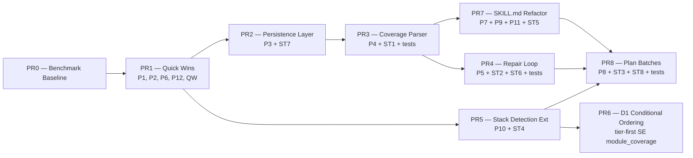

# Code Coverage Skill — Optimization Design

**Data**: 2026-05-09
**Author**: mario.mazzacuva@siae.it (DevForge)
**Status**: APPROVED (10-agent blind review consensus)
**Skill target**: `skills/code-coverage/`
**Branch flow**: `feat/code-coverage-optimization-*` → `main` (per `project_repo_branch_flow.md`)

---

## 1. Contesto

La skill `/code-coverage` è funzionante: raggiunge il floor di 70% coverage su repo MEDIUM/LARGE, ma il workflow attuale soffre di tre inefficienze quantificate:

- **Iterazioni eccessive**: ~13 approval gates runtime + 3-5 full coverage run per session + repair loop con rigenerazione full-file.
- **Token elevati**: duplicazioni cross-file (Vitest-first rule × 4 sedi, install commands × 3 sedi, mocking patterns × 11 template + ref), 7 reference file caricati sequenzialmente, output blocks emessi anche se vuoti.
- **Tempo wall-clock dominato dalle coverage run** (30s-5min/run × 3-5 run/session).

La review cieca a 10 agenti specialistici (workflow_efficiency, token_economy, iteration_loops, test_generation_strategy, coverage_measurement, prompt_engineering, error_recovery, context_management, autonomy_user_interaction, meta_architecture) ha prodotto, dopo 2 round (analisi parallela + voto formale), **12 fix con OVERALL_STANCE 4×APPROVE_PLAN + 6×APPROVE_WITH_MODIFICATIONS + 0 DISSENT**.

Vincoli non-negoziabili (auto-memory `feedback_code_coverage_quality_vs_speed.md`):
- Coverage floor ≥70% global / ≥80% P1 / ≥70% P2 / ≥60% P3
- Zero interazioni utente runtime
- Nessuna nuova dipendenza esterna

---

## 2. Architettura post-fix

### 2.1 Componenti modificati

**Semantica di "inline" applicata in PR7**: SKILL.md ospita SOLO entry-point + decision tree + checkpoint di gate. La logica di dettaglio delle 4 fasi inlined (phase-1/2/6/7, totale 761 LOC origine) è delegata a:
- `scripts/parse_coverage.py` (Phase 6 parsing logic)
- `scripts/categorize_failure.py` (Phase 7 categorization)
- `scripts/detect_stack.py` esteso (Phase 1 inventory)
- `assets/repair-strategies.json` (Phase 7 fix patterns)
- `assets/stack-matrix.json` (Phase 2 framework decision)

Target SKILL.md post-PR7: **≤220 LOC** (era ≤180 nella v1; corretto realisticamente per accomodare entry-points di 4 fasi senza forzare compressione 90%).

```
skills/code-coverage/
├── SKILL.md                          [REFACTOR maggiore: inline phase-1/2/6/7 entry-points only, ≤220 LOC target]
├── commands/code-coverage.md         [SIMPLIFY: pointer-only, ~15 LOC]
├── references/
│   ├── phase-1-discovery.md          [DELETE — inlined in SKILL.md]
│   ├── phase-2-strategy.md           [DELETE — inlined in SKILL.md]
│   ├── phase-3-sizing.md             [KEEP, condizionale LARGE/VERY_LARGE]
│   ├── phase-4-environment.md        [TRIM da 263 a ~80 LOC: solo runtime check + Blocking Handler]
│   ├── phase-5-generation.md         [TRIM da 350 a ~200 LOC: drop mocking patterns (in template), add few-shot end-to-end]
│   ├── phase-6-coverage.md           [DELETE — inlined in SKILL.md, parsing → script]
│   └── phase-7-repair.md             [DELETE — inlined in SKILL.md, categorize → script]
├── scripts/
│   ├── detect_stack.py               [EXTEND: emit test_infrastructure, pre_existing_coverage_pct, module_coverage, coverage_exclude]
│   ├── estimate_size.py              [EXTEND: --with-coverage flag, persist .code-coverage/size.json]
│   ├── validate_env.py               [FIX: real check_framework_installed (parse pom.xml/build.gradle/Cargo.toml/go.mod/pubspec.yaml), 30s timeout per JVM/Flutter]
│   ├── parse_coverage.py             [NEW: parse json-summary → typed JSON]
│   ├── categorize_failure.py         [NEW: regex map error → category + signature]
│   └── plan_batches.py               [NEW: file_list × module_coverage × priority-rules → ordered batch plan]
├── templates/
│   ├── vitest.template.ts            [FIX: rimuovere afterEach(restoreAllMocks) di default, multi-dep variants]
│   ├── vitest-lambda.template.ts     [SPLIT in vitest-lambda-handler + vitest-lambda-module]
│   └── ...altri template             [TRIM decorative headers, max 3 LOC di intestazione]
├── assets/
│   ├── stack-matrix.json             [SOURCE OF TRUTH: framework selection, coverage_command]
│   ├── priority-rules.json           [REMOVE coverage_target duplicate (lines 153-160)]
│   ├── install-snippets.json         [NEW: install commands per framework]
│   ├── repair-strategies.json        [NEW: error_pattern regex → category + fix_steps]
│   ├── few-shot-e2e.md               [NEW: T1 example (~80 LOC) caricato lazy in Phase 5]
│   └── anti-patterns.md              [NEW: 3 BAD/GOOD pairs, lazy load se Phase 5/7 fail ≥1]
```

### 2.2 Flusso runtime post-fix (happy path)

```
/code-coverage [path?]
  │
  ├─ INPUT MODE: cwd se no args; auto-clone se URL valido
  │
  ├─ Phase 1 — Discovery (INLINE in SKILL.md)
  │   ├─ python3 detect_stack.py <repo> > .code-coverage/stack.json
  │   ├─ python3 estimate_size.py <repo> --file-list --with-coverage > .code-coverage/size.json
  │   └─ python3 validate_env.py <repo> > .code-coverage/env.json
  │   (3 script in parallelo, JSON persistiti)
  │
  ├─ Pre-existing skip gate: if pre_existing_coverage_pct ≥ 70% → emit Block 8 + END
  │
  ├─ Phase 2 — Strategy (INLINE in SKILL.md)
  │   └─ Apply Vitest-first rule (Principle 4) + stack-matrix.json
  │
  ├─ Phase 3 — Sizing (REF, only if LARGE/VERY_LARGE)
  │   └─ python3 plan_batches.py > .code-coverage/batch-plan.json
  │
  ├─ Phase 4 — Environment (REF)
  │   └─ Auto-install via validate_env.py install_commands (NO approval gate)
  │
  ├─ Phase 5 — Generation (REF, ~200 LOC)
  │   ├─ Read template ONCE per (framework, session)
  │   ├─ Read few-shot-e2e.md ONCE
  │   ├─ Iterate batches from plan_batches.py output
  │   ├─ For each file: grep selective deps → fill template → pre-write placeholder gate → write
  │   └─ NO P1 Coverage Gate, NO P2 Early-Exit Checkpoint
  │
  ├─ Phase 6 — Coverage (INLINE)
  │   ├─ <framework> --coverage.reporter=json-summary > .code-coverage/coverage-summary.json
  │   └─ python3 parse_coverage.py > .code-coverage/coverage-report.json
  │
  ├─ Phase 6→7 Gate (INLINE)
  │   └─ Read coverage-report.json: if all thresholds met → SKIP Phase 7 → Block 8
  │
  ├─ Phase 7 — Repair (INLINE if ≤150 LOC, else REF)
  │   ├─ python3 categorize_failure.py < test-output > .code-coverage/failures.json
  │   ├─ Group by error_signature; if count≥2 OR ≥30% file → SYSTEMIC FIX (config-level)
  │   ├─ Else: Edit per-block (no rigenerazione full-file)
  │   ├─ Re-run failing tests WITHOUT --coverage; full --coverage UNA VOLTA a fine iter
  │   ├─ Progress guard: if Δglobal_coverage < 0.5pp AND Δfailing ≤ 0 → STOP
  │   ├─ Early-abort autonomo: if iter==1 AND global<30% AND P1<40% → 1 more iter, then BEST-EFFORT
  │   └─ Max 3 iter (existing cap)
  │
  └─ OUTPUT: 9 blocks (Block 4/6/9 conditional via programmatic check)
```

### 2.3 Stato persistito in `.code-coverage/`

| File | Producer | Consumer | TTL |
|------|----------|----------|-----|
| `stack.json` | Phase 1 detect_stack.py | Phase 2-7 | mtime > package.json |
| `size.json` | Phase 1 estimate_size.py --file-list | Phase 3, 5 (priority sort) | mtime > package.json |
| `env.json` | Phase 1 validate_env.py | Phase 4 | mtime > package.json |
| `batch-plan.json` | Phase 3 plan_batches.py | Phase 5 (resume) | session |
| `coverage-summary.json` | Phase 6 framework run | parse_coverage.py | session |
| `coverage-report.json` | Phase 6 parse_coverage.py | Phase 6→7 gate, Phase 7 | session |
| `failures.json` | Phase 7 categorize_failure.py | Phase 7 fix loop | per-iter |
| `decisions.log` | tutte le fasi | audit trail | session |
| `deferred_files.json` | Phase 5 (se P1 hit precoce) | Phase 6→7 gate (escludere da check) | session |

**Definizione "session"**: una singola invocazione `/code-coverage`. Re-invocazione = nuova session = invalidates tutto eccetto i 3 file `stack.json`/`size.json`/`env.json` che usano mtime check vs `package.json`.

### 2.4 Single Source of Truth

| Concept | Source authoritative | Consumer |
|---------|----------------------|----------|
| Vitest-first decision | SKILL.md Principle 4 | tutti |
| Framework selection | `assets/stack-matrix.json` | Phase 2 |
| Coverage command | `assets/stack-matrix.json` `coverage_command` | Phase 6 |
| Install commands | `assets/install-snippets.json` | Phase 4 (via validate_env.py) |
| Coverage thresholds | `assets/priority-rules.json` `min_coverage_pct` per level | tutte |
| Mocking patterns | `templates/<fw>.template.*` | Phase 5 |
| Error categorization | `assets/repair-strategies.json` | categorize_failure.py |
| Failure categories regex | `categorize_failure.py` impl | Phase 7 |

---

## 3. Decisioni di design (post-voto 10 agenti)

### 3.1 Fix con consenso UNANIME 10/10

| ID | Fix | Effort | Impatto |
|----|-----|--------|---------|
| **P1** | Rimuovere ~13 approval gates runtime | S (Quick Win) | -4/-6 round-trip utente |
| **P2** | Eliminare Phase 5 P1 Gate + P2 Checkpoint + Phase 4 Pre-Existing Pass condizionale | S (Quick Win) | -2/-3 full coverage run |
| **P3** | Persistenza `.code-coverage/*.json` + template caching ONCE/session | M | -1 tree walk + ~12K token |
| **P4** | `--coverage.reporter=json-summary` + nuovo `parse_coverage.py` | M | -10/-15% token Phase 6 |
| **P6** | Hard gate pre-write su `\{\{[A-Z_]+\}\}` | S (Quick Win) | -1 iter Phase 7 ricorrente |
| **P8** | Selective dependency export grep + template multi-dep variants | M | -60/-70% errori Cat 2+4 |
| **P10** | Allineare detect_stack.py output contract + check_framework_installed reali | L | priority sort funzionante + fail-fast deps |

### 3.2 Fix con consenso + modifiche integrate

| ID | Fix | Modifiche integrate | Voto |
|----|-----|---------------------|------|
| **P5** | Repair loop scoped + grouping | Soglia systemic candidate da `count≥3` a `count≥2 OR ≥30% file` (A1) | 9 ✅ + 1 🔧 |
| **P7** | Few-shot end-to-end | TIER CLASSIFICATION ridotta a 5 esempi (A2); ANTI-PATTERN GALLERY 3 pairs in `assets/anti-patterns.md` lazy-load se Phase 5/7 fail ≥1 (A1, A2, A8) | 7 ✅ + 3 🔧 |
| **P9** | Single source of truth | Mantenere 1 paragrafo rationale "perché questo mock" nei template (A4) | 9 ✅ + 1 🔧 |
| **P11** | Trim refs + inline executable phases | Inline phase-1/2/6/7 (NO phase-5: A1 minoritario); parse_coverage.py file separato (A5); inline condizionale ≤150 LOC (A7) | 6 ✅ + 4 🔧 |
| **P12** | OUTPUT blocks 4/6/9 condizionali | Condizionalità via check programmatico (file presence / JSON field empty), MAI prompt utente (A9) | 9 ✅ + 1 🔧 |

### 3.3 Disaccordi risolti

| ID | Disaccordo | Risoluzione | Voto |
|----|------------|-------------|------|
| **D1** | T-tier vs P-tier ordering | **Conditional**: tier-first SE `module_coverage` disponibile (P10), altrimenti P-tier fallback. Sintesi A4 che soddisfa entrambi i campi. | 6-4 split → conditional consensus |
| **D2** | Batch ceiling T1=5 vs T1=3 | **T1=3, T2=2** (era 5, 3). Maggioranza qualificata 8-2. A5/A8 documentano rischio "round-trip ammortizzati malamente" da rivedere in retrospettiva. | 8-2 |
| **D3** | Sub-skills decomposition | **NO split**. Maggioranza 9-1; A4 dissenso isolato su template/galleries (parzialmente coperto da P3+P11 lazy load). | 9-1 |
| **D4** | Inline ref vs separate files | **Pattern ibrido**: inline phase-1/2/6/7; phase-3/4/5 + asset statici come ref separati. Convergenza spontanea 10/10. | 10-0 |

---

## 4. Approccio di implementazione (Phased — Approccio C)

### 4.1 Sequenza PR (rispetta coupling tra fix)



### 4.2 PR breakdown

| PR | Scope | Fix IDs covered | Tests inclusi | SP (Augmented) |
|----|-------|-----------------|---------------|----------------|
| **PR0 — Benchmark Baseline** | Raccolta metriche pre-implementazione su 3 repo benchmark (SMALL/MEDIUM/LARGE); script `tools/benchmark-skill.sh` per re-misure ripetibili post-PR1...PR8 | (nessuno — è prerequisito) | bench script smoke test | 0.5 |
| **PR1 — Quick Wins** | Rimozione approval gates, INPUT MODE auto, drop Phase 5 P1 Gate + P2 Checkpoint + Phase 4 Pre-Existing Pass condizionale, OUTPUT blocks 4/6/9 conditional, hard gate placeholder pre-write, fix vitest.template.ts `restoreAllMocks`, autonomous early-abort, drop Quick Sizing Pass | **P1, P2, P6, P12** + QW1-QW10 | n/a (no nuovi script) | 1 |
| **PR2 — Persistence Layer** | Redirect JSON `.code-coverage/{stack,size,env,coverage-summary,coverage-report,failures,deferred_files,batch-plan,decisions.log}`, mtime-based invalidation vs `package.json`, template caching ONCE per (framework, session), aggiunta `.gitignore` rule `.code-coverage/` nel target repo | **P3** + ST7 | n/a (modifiche solo a wrapper Bash + SKILL.md instructions) | 1.5 |
| **PR3 — Coverage Parser** | `scripts/parse_coverage.py` (6+ framework: vitest, jest, pytest, jacoco, kover, go-test, cargo, dotnet); integrazione `--coverage.reporter=json-summary` come default; fallback `tail -n 400` con grep di sentinella tabella; aggiornamento Phase 6 reference | **P4** + ST1 | **parse_coverage.py: 4 test (vitest output / jest output / pytest output / malformed fallback)** + 70% coverage del nuovo script | 1.5 |
| **PR4 — Repair Loop Refactor** | `scripts/categorize_failure.py` (regex pattern → category 1-5 + signature normalize), normalize() regex deterministica, scoped Edit per blocco failing test (no rigenerazione full-file), error_signature grouping (`count≥2 OR ≥30% file`) → systemic fix config-level, progress guard `Δglobal_coverage < 0.5pp AND Δfailing ≤ 0` → STOP, autonomous early-abort iter1<30%, max 1 full-coverage/iter | **P5** + ST2 + ST6 | **categorize_failure.py: 5 test (uno per Cat 1-5) + 1 test su normalize()** + 70% coverage | 2 |
| **PR5 — Stack Detection Extension** | Estendere `detect_stack.py` per emettere `test_infrastructure`, `pre_existing_coverage_pct` (parse lcov.info/jacoco.xml/coverage.json), `module_coverage`, `coverage_exclude`; estendere `validate_env.py` `_check_framework_installed` con parse reali di pom.xml/build.gradle/Cargo.toml/go.mod/pubspec.yaml; timeout 30s per mvn/gradle/flutter (era 5s) | **P10** + ST4 | Test estensioni: 3 test su detect_stack output schema + 2 test su validate_env framework detection | 2 |
| **PR6 — Conditional Ordering** | D1 risolto: aggiornare `plan_batches.py` (verrà scritto in PR8) per applicare tier-first SE `module_coverage` non-empty, altrimenti P-tier fallback. Questa PR aggiorna SOLO la specifica di SKILL.md Phase 5 con la regola condizionale + decision tree | (nessun fix ID — risolve disaccordo D1) | n/a (logica andrà in plan_batches.py PR8) | 0.5 |
| **PR7 — SKILL.md Refactor** | Inline phase-1/2/6/7 entry-points (logic in script/asset), cancellare Detection File Inventory (phase-1 L9-93), cancellare phase-1/2/6/7 ref files, single source of truth (Vitest-first→SKILL.md, install→`assets/install-snippets.json`, coverage→stack-matrix.json `coverage_command`, mocking→template + 1 paragrafo rationale), few-shot end-to-end T1 (~80 LOC) in `assets/few-shot-e2e.md`, TIER CLASSIFICATION 5 esempi, `assets/anti-patterns.md` 3 BAD/GOOD pairs lazy-load | **P7, P9, P11** + ST5 | n/a (refactor markdown + asset) | 1.5 |
| **PR8 — Plan Batches + Template Fixes** | `scripts/plan_batches.py` (file_list × module_coverage × priority-rules → ordered batch plan con tier-first conditional da PR6), split `vitest-lambda.template.ts` in `vitest-lambda-handler.template.ts` + `vitest-lambda-module.template.ts` (rimuovere dual-section warning), template multi-dep variants (P8 selective dep grep + 3 varianti zero/two/default-export) | **P8** + ST3 + ST8 | **plan_batches.py: 2 test (con/senza module_coverage per testare D1 conditional)** + 70% coverage | 1 |
| **TOTALE** | | | **11 test totali ≥70% coverage sui nuovi script** | **11.5 SP Augmented (≈ 7-9 giorni effettivi)** |

### 4.3 Stima Story Points (doppia scala)

- **Umano**: 24 SP (3.5-4 settimane sviluppatore senior)
- **Augmented (DevForge backbone + AI assist)**: 11.5 SP (7-9 giorni effettivi)

**Rationale ricalibrazione vs v1 design**: spec-review ha rilevato sotto-stima su PR2/PR5/PR7 (cross-cutting deliverable) + assenza PR0 Benchmark Baseline + test allocati erroneamente a PR8 invece che alla PR di origine. La v2 redistribuisce test a PR3/PR4/PR8 (TDD) e aggiunge 0.5 SP a PR2/PR5/PR7 per riflettere effort reale.

---

## 5. Testing & Criteri di Accettazione

### 5.1 Testing strategy

La skill non ha test propri (gap noto, A10 OOS-6). I test dei nuovi script Python sono allocati alla PR che li introduce (TDD red-green per ogni nuovo artefatto):
- `scripts/parse_coverage.py` → **PR3**: 4 test (vitest / jest / pytest output formats + malformed fallback)
- `scripts/categorize_failure.py` → **PR4**: 5 test (uno per ogni Cat 1-5) + 1 test su `normalize()` regex deterministica
- `scripts/plan_batches.py` → **PR8**: 2 test (con/senza `module_coverage` per validare D1 conditional ordering)
- `scripts/detect_stack.py` (estensioni P10) → **PR5**: 3 test su nuovi campi output (test_infrastructure / module_coverage / pre_existing_coverage_pct)
- `scripts/validate_env.py` (check_framework_installed reali) → **PR5**: 2 test su parsing pom.xml/build.gradle real-world

Coverage target sui nuovi script: ≥70% (rispetta il floor della skill stessa — eat-your-own-dogfood).

**Nota**: il setup di un test framework completo per la skill (CI runner, fixture repo, golden output) resta out-of-scope (followup post-PR8) — qui si introducono solo test unitari sui singoli script.

### 5.2 Benchmark di regressione

Prima del merge di PR1, raccogliere baseline su 3 repo benchmark:
- **SMALL** (~10 file source): scegliere uno script Python esistente in `siae-dev-forge/scripts/`
- **MEDIUM** (~80 file): repo Vue.js o Node.js esistente
- **LARGE** (~300 file): repo monorepo o servizio Spring Boot

Per ogni benchmark misurare baseline e target post-PR8:

| Metrica | Baseline | Target post-PR8 |
|---------|----------|------------------|
| Round-trip utente per run | conta `[Y/n]` + ASK trigger | **0** |
| Numero full coverage run | conta esecuzioni `<framework> --coverage` | **1-2** |
| Iterazioni Phase 7 medie | media iter | **≤ 1.5** |
| Token totali per run | usage telemetry | **−30% / −50%** |
| Wall-clock totale per run | timestamp delta | **−40% / −60%** su MEDIUM |
| Reference file load per run | conta Read su `references/*.md` | **≤ 3** |
| Coverage finale global | parse_coverage output | **≥ 70%** (invariato) |
| Coverage finale P1 | parse_coverage output | **≥ 80%** (invariato) |
| Parsing failure rate | tail/JSON empty cases | **0%** |
| Stall detection accuracy | iter dove stesso signature ricorre | **≥ 95%** |
| Test placeholder leakage | grep `\{\{XXX\}\}` post-write | **0** |

### 5.3 Acceptance criteria (decisione GO/NO-GO)

**Hard criteria (FAIL il merge se violato)**:
- [ ] Coverage ≥70% global e ≥80% P1 mantenuto su 100% benchmark (NO regressione)
- [ ] Zero round-trip utente runtime su tutti i benchmark
- [ ] Nessuna nuova dipendenza esterna
- [ ] Nuovi script testati ≥70% coverage
- [ ] Spec-reviewer PASS su ogni PR
- [ ] Auto-memory `feedback_code_coverage_quality_vs_speed.md` rispettata in tutti i path

**Soft targets con policy go/no-go esplicita**:

| Target | Soglia accept | Soglia rework | Soglia FAIL |
|--------|---------------|---------------|-------------|
| Riduzione token totali (vs PR0 baseline) | ≥30% | 20-29% (accept con nota in retrospettiva) | <20% (rework PR3+PR7 prima di mergere PR8) |
| Riduzione wall-clock (vs PR0 baseline, repo MEDIUM) | ≥40% | 25-39% (accept + retrospettiva) | <25% (rework PR2+PR3 prima di chiudere) |
| Iterazioni Phase 7 medie | ≤1.5 | 1.6-2.0 (accept) | >2.0 (rework PR4) |
| Numero full coverage run/session | 1-2 | 3 (accept con doc) | >3 (rework PR2+PR3) |
| Reference file load/run | ≤3 | 4 (accept) | >4 (rework PR7) |

**Decisione finale**: dopo PR8, ri-eseguire `tools/benchmark-skill.sh` su 3 repo benchmark; confronto con baseline PR0; se anche un solo Hard criteria FAIL → rollback PR sospetta; se ≥2 Soft target in zona FAIL → escalate a retrospettiva pre-merge.

---

## 6. Rischi e mitigazioni

| Rischio | Probabilità | Impatto | Mitigazione |
|---------|-------------|---------|-------------|
| Regressione coverage P1 < 80% per cambio ordering D1 | MEDIA | ALTO | Test su 3 benchmark; fallback automatico a P-tier se module_coverage empty (hard gate in plan_batches.py) |
| Drift script Python ↔ markdown post-refactor P11 | BASSA | MEDIO | Spec-reviewer su ogni PR; CI lint che valida coerenza single source |
| `--coverage.reporter=json-summary` non disponibile per framework esotici | MEDIA | BASSO | Fallback `tail -n 400` con grep di tabella; documentato in parse_coverage.py |
| `T1=3` produce più round-trip di `T1=5` su repo grandi | BASSA | BASSO | Documentato come da rivedere; A/B test post-PR8 con 1 repo LARGE benchmark |
| Auto-install in PR1 modifica indesideratamente target repo | BASSA | ALTO | Scope restrittivo: solo `package.json devDependencies` o `requirements-dev.txt`; mai produzione; **snapshot lockfile pre-install (`cp package-lock.json .code-coverage/lockfile.bak`) + rollback automatico se install exit-code ≠ 0**; sempre log in `.code-coverage/install-log.txt` |
| **Drift "single source of truth" cross-asset post-P9** — chi modifica un mock pattern lo aggiorna in template ma non in `repair-strategies.json` o `install-snippets.json` | MEDIA | MEDIO | CI lint introduce check di consistenza: per ogni framework in stack-matrix.json deve esistere template + install-snippet + repair-strategy con stessa key; PR review checklist obbliga aggiornamento contestuale |
| **`.code-coverage/` non git-ignored nel target repo** — la persistence layer scrive nel target, può finire in commit involontari | ALTA | MEDIO | **PR2 include auto-aggiunta di `.code-coverage/` al `.gitignore` del target repo (idempotente: skip se già presente)**; documentato in SKILL.md Principle 1 |
| **Inline 4 phase in SKILL.md viola budget LOC** — refactor PR7 forza compressione irrealistica | MEDIA | BASSO | Target ricalibrato a ≤220 LOC (era ≤180) con semantica "entry-points only, dettagli in script/asset"; se PR7 supera 220 LOC → review per identificare logica da spostare in script |

---

## 7. Out of Scope (esplicito)

Per evitare scope creep, **non** sono parte di questo design:
- Sub-skills decomposition (D3 risolto: NO split)
- Test framework completo per la skill (CI runner + fixture repo + golden output) — gap A10 OOS-6, followup separato post-PR8
- Migrazione da Vitest-first ad altri default (Principle 4 invariato)
- Supporto per nuovi linguaggi (es. C++, Scala) oltre quelli già in stack-matrix.json
- Riscrittura templates per linguaggi non-JS/TS (toccati solo per trim header decorativi)
- Auto-tuning di T1=3 vs T1=5 a runtime (rimane statico in priority-rules.json)
- Integrazione con MCP sport-kg / KG SIAE (la skill è cross-stack, non SIAE-specific)
- **Modifica della logica INPUT MODE in `commands/code-coverage.md`** (resta invariata: argomento path/URL detect; il SIMPLIFY tocca solo i pointer "See SKILL.md — X")
- **Cambio del runtime degli script Python** (resta Python 3 standard library; vincolo "no nuove dipendenze esterne" preclude libreria di parsing JaCoCo XML, useremo regex)

---

## 8. Riferimenti

- Review consolidata 10-agenti: conversazione corrente (round 1 + round 2 voto formale)
- Auto-memory:
  - `feedback_code_coverage_quality_vs_speed.md` (vincoli autonomia + qualità)
  - `project_repo_branch_flow.md` (branch flow feat/* → main)
- File skill modificati: `skills/code-coverage/**`
- Stack matrix authoritative: `assets/stack-matrix.json`
- Convenzione design doc SIAE: `docs/plans/YYYY-MM-DD-<topic>-design.md`

---

## 9. Handoff

**REQUIRED SUB-SKILL**: `siae-writing-plans`

Prossimo step: invocare `siae-writing-plans` per generare `docs/plans/2026-05-09-code-coverage-optimization/` con overview + task-NN files (uno per ogni PR1-PR8).
