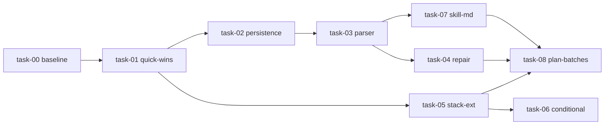

# Code Coverage Skill Optimization — Piano Implementativo

> **Per Claude:** REQUIRED SUB-SKILL: usa `siae-subagent-development` per implementare questo piano task per task, oppure `siae-executing-plans` in sessione separata.

**Goal:** Ridurre iterazioni / token / tempo della skill `code-coverage` di ≥30% / ≥30% / ≥40% mantenendo coverage ≥70% global e ≥80% P1, con zero interazioni utente runtime.

**Architettura:** Skill rimane single-process (no sub-skills) con pattern ibrido: `SKILL.md` ≤220 LOC contiene entry-points e decision tree delle 7 fasi inlinate, dettagli logica delegati a 6 script Python (3 esistenti estesi + 3 nuovi: `parse_coverage.py`, `categorize_failure.py`, `plan_batches.py`) e 4 asset JSON (esistenti + 2 nuovi: `install-snippets.json`, `repair-strategies.json`). Persistence layer in `.code-coverage/` per cross-phase state. Phase 6 usa `--coverage.reporter=json-summary` invece di `tail -n 100`. Repair loop scoped (Edit per blocco, no rigenerazione full-file) con grouping per `error_signature`.

**Stack:** Python 3 stdlib (script) · Markdown (skill defs) · JSON (assets) · Bash (orchestrazione)

**SP:** 11.5 SP Augmented (≈ 7-9 giorni effettivi) / 24 SP Umano (≈ 3.5-4 settimane)

**Design doc:** [/Users/mazzacuv/Git/siae-dev-forge/docs/plans/2026-05-09-code-coverage-optimization-design.md](../2026-05-09-code-coverage-optimization-design.md)

---

## Indice Task

| # | Task | File | SP | Fix IDs | Stato |
|---|------|------|----|---------|-------|
| 0 | Benchmark Baseline | `task-00-benchmark-baseline.md` | 0.5 | (prerequisito) | [DONE-PARTIAL] script+smoke; metriche [BLOCKED:USER-MANUAL] |
| 1 | Quick Wins | `task-01-quick-wins.md` | 1 | P1, P2, P6, P12 + QW1-QW10 | [DONE] |
| 2 | Persistence Layer | `task-02-persistence-layer.md` | 1.5 | P3 + ST7 | [DONE] |
| 3 | Coverage Parser | `task-03-coverage-parser.md` | 1.5 | P4 + ST1 | [DONE] |
| 4 | Repair Loop Refactor | `task-04-repair-loop-refactor.md` | 2 | P5 + ST2 + ST6 | [DONE] |
| 5 | Stack Detection Extension | `task-05-stack-detection-extension.md` | 2 | P10 + ST4 | [DONE] |
| 6 | Conditional Ordering | `task-06-conditional-ordering.md` | 0.5 | (D1 risolto) | [DONE] |
| 7 | SKILL.md Refactor | `task-07-skill-md-refactor.md` | 1.5 | P7 + P9 + P11 + ST5 | [DONE] |
| 8 | Plan Batches + Template Fixes | `task-08-plan-batches.md` | 1 | P8 + ST3 + ST8 | [DONE] |

## Dipendenze

- task-00 prerequisito di tutti (raccolta baseline metrics)
- task-01 (QW) prerequisito di task-02 e task-05 (semplifica file da modificare)
- task-02 (persistence) prerequisito di task-03 (.code-coverage/ scritto da parse_coverage.py)
- task-03 (parser) prerequisito di task-04 (repair legge coverage-report.json) e task-07 (refs cancellati assumono parser disponibile)
- task-05 (stack-ext) prerequisito di task-06 e task-08 (`module_coverage` deve esistere prima di tier-first ordering)
- task-08 ultima: chiude il piano integrando tutto (richiede task-04 + task-05 + task-07)

## Branch flow

Per ogni task: nuovo branch `feat/code-coverage-opt-<nome>` da `main`, PR diretta a `main` (per `project_repo_branch_flow.md`). Una PR per task. Spec-reviewer PASS richiesto prima del merge.

## Acceptance criteria globali (post task-08)

**Hard (FAIL → rollback)**:
- Coverage ≥70% global e ≥80% P1 invariato su tutti i 3 benchmark
- Zero round-trip utente runtime in tutti i 3 benchmark
- Nessuna nuova dipendenza esterna (solo Python 3 stdlib)
- Nuovi script ≥70% coverage interno
- Spec-reviewer PASS su ogni PR

**Soft (con policy go/no-go in design doc §5.3)**:
- Riduzione token ≥30% (FAIL <20%)
- Riduzione wall-clock ≥40% (FAIL <25%)
- Iter Phase 7 ≤1.5 (FAIL >2.0)
- Coverage runs/session: 1-2 (FAIL >3)
- Reference loads/run: ≤3 (FAIL >4)

## Anti-pattern bloccati

- Coverage gate intermedi extra (oltre Phase 6 + 1 Phase 7/iter)
- Approval gates runtime aggiuntivi
- Sub-skills decomposition (D3 risolto NO)
- Modifiche a `commands/code-coverage.md` oltre il SIMPLIFY pointer-only
- Aggiunta dipendenze pip / npm
