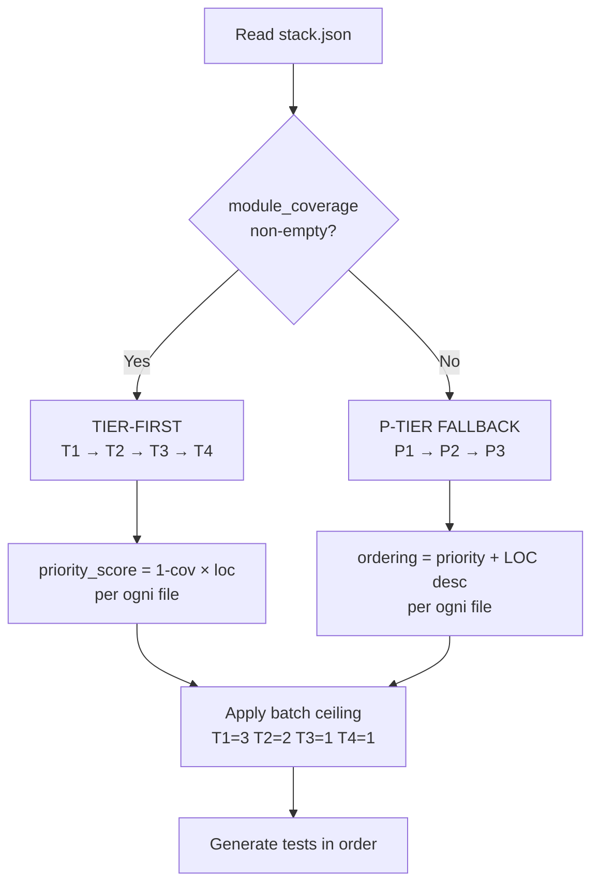

# Task 06 — Conditional Ordering (D1 risolto)

**Goal:** Documentare in SKILL.md e phase-5-generation.md la regola di ordering condizionale: tier-first (T1→T2→T3→T4) SE `module_coverage` è disponibile da `detect_stack.py` (P10), altrimenti P-tier first (P1→P2→P3) come fallback. Sintesi A4 del round 2 voto, risolve disaccordo D1 6-4.

**SP:** 0.5 (Augmented)
**Fix IDs covered:** (D1 risolto, no fix ID — è una decisione di design da documentare)
**Branch:** `feat/code-coverage-opt-conditional-ordering`
**Dipendenze:** task-05 (`module_coverage` ora effettivamente emesso da detect_stack.py)

---

## File coinvolti

**Modifica**:
- `skills/code-coverage/SKILL.md` (Phase 5 ordering rule)
- `skills/code-coverage/references/phase-5-generation.md` (decision tree completo)

---

## Step bite-sized

### Step 1 — Branch + verifica task-05 merged

```bash
git checkout main && git pull
git checkout -b feat/code-coverage-opt-conditional-ordering
test -f skills/code-coverage/scripts/tests/test_detect_stack_ext.py && echo "task-05 merged OK"

# Verifica che detect_stack.py emetta module_coverage realmente (smoke check)
python3 skills/code-coverage/scripts/detect_stack.py skills/code-coverage/scripts/tests/fixtures/repos/vue-app | grep -q '"module_coverage"' && echo "module_coverage emitted OK"
```

### Step 2 — SKILL.md: aggiorna Phase 5 ordering rule

In `skills/code-coverage/SKILL.md` Phase 5 (riga ~106), sostituisci:

```
**Processing order is mandatory:** process ALL P1 modules before starting P2; process ALL P2 modules before starting P3. Within each priority tier, sort files by composite priority score `(1 - current_coverage) × loc` descending — `current_coverage` from Phase 1 `module_coverage` output, `loc` from Phase 3 `file_list`. Never sacrifice P1 completeness for P2/P3 breadth.
```

Con:

```
**Processing order is conditional (D1 resolved)**:

```python
# Read coverage signal availability
import json
stack = json.loads(open(".code-coverage/stack.json").read())
has_module_coverage = bool(stack.get("module_coverage"))

if has_module_coverage:
    # TIER-FIRST ordering (T1 → T2 → T3 → T4)
    # Razionale: tier rappresenta testabilità (mock cost crescente),
    # ROI coverage-per-token massimo iniziando da T1 (pure logic).
    # Sicuro perché module_coverage permette priority_score reale per ogni file.
    sort_key = lambda f: (TIER_ORDER[f["tier"]], -f["priority_score"])
else:
    # P-TIER FALLBACK (P1 → P2 → P3)
    # Razionale: senza module_coverage il composite score è degenere
    # (current_coverage=0 forzato), tier-first rischia di lasciare P1 sotto soglia.
    # P-tier garantisce che P1 (business-critical) venga affrontato per primo.
    sort_key = lambda f: (PRIORITY_ORDER[f["priority"]], -f["loc"])

batch_plan = sorted(file_list, key=sort_key)
```

Within either ordering: process the entire current group before moving to the next. Never sacrifice P1 completeness for breadth (hard floor: P1 ≥ 80% finale).

`TIER_ORDER`: `{"T1": 0, "T2": 1, "T3": 2, "T4": 3}`
`PRIORITY_ORDER`: `{"P1": 0, "P2": 1, "P3": 2}`

L'implementazione concreta del sort è in `scripts/plan_batches.py` (PR8).
```

### Step 3 — `phase-5-generation.md`: aggiungi decision tree

Aggiungi nuova sezione "## Ordering Strategy" prima di "Pre-Generation Checklist":

```markdown
## Ordering Strategy (D1 conditional)



### Razionale della scelta condizionale

| Caso | Behavior | Motivo |
|------|----------|--------|
| `module_coverage` disponibile | TIER-FIRST | priority_score reale → ROI coverage-per-token maxed; T1 prima abbatte mock cost iniziale |
| `module_coverage` empty/missing | P-TIER | Senza segnale di coverage, tier-first rischia di lasciare P1 sotto 80% se hit globale avviene prima di toccare P1-T4 (handler business-critical) |

### Sicurezza floor P1 ≥ 80%

In ENTRAMBE le strategie, dopo ogni iterazione di Phase 5/6/7, se `min(P1 modules lines_pct) < 80%` → forza inclusione di file P1 sub-threshold a tier=T4 nelle prossime iterazioni, sopra qualsiasi ordering tier o priority. Questo è enforcing per priority-rules.json `min_coverage_pct: 80` per P1 (vedi Principle 5).

### Batch ceiling (D2 resolved 8-2)

| Tier | Files per call | Razionale |
|------|----------------|-----------|
| T1 (pure logic) | 3 (was 5) | Riduce blast radius su template error sistemico; evita quality drop on tail items |
| T2 (light deps) | 2 (was 3) | Stesso |
| T3 (heavy deps) | 1 | Mock setup complesso, batch=1 evita errori cascade |
| T4 (I/O handlers) | 1 | Massimo mock cost, isolato sempre |

A5 e A8 hanno documentato il rischio "round-trip non ammortizzati" da rivedere in retrospettiva post-PR8 con A/B test su repo LARGE.
```

### Step 4 — Aggiungi `ordering_constants` + rimuovi duplicato `coverage_target`

In `skills/code-coverage/assets/priority-rules.json`:

**(a)** Aggiungi sezione top-level `ordering_constants`:

```json
{
  "ordering_constants": {
    "tier_order": {"T1": 0, "T2": 1, "T3": 2, "T4": 3},
    "priority_order": {"P1": 0, "P2": 1, "P3": 2},
    "batch_ceiling_per_tier": {"T1": 3, "T2": 2, "T3": 1, "T4": 1}
  }
}
```

**(b)** Rimuovi il blocco duplicato `coverage_target` (righe 153-160 del file originale). Le soglie sono già autoritative come `min_coverage_pct` per ogni priority level (P1/P2/P3). Single source of truth per le soglie.

Verifica post-edit:
```bash
grep -c '"min_coverage_pct"' skills/code-coverage/assets/priority-rules.json
# Output atteso: 3 (uno per P1, P2, P3)
grep -c '"coverage_target"' skills/code-coverage/assets/priority-rules.json
# Output atteso: 0 (duplicato rimosso)
```

(Il resto del file rimane invariato.)

### Step 5 — Spec-reviewer

Lancia spec-reviewer focalizzandolo su:
1. La decision tree è chiara e implementabile?
2. Il caso edge "module_coverage empty per LARGE repo" è gestito (fallback P-tier)?
3. Il P1 floor enforcement post-iterazione è documentato senza ambiguità?

### Step 6 — Commit + PR

```bash
git add skills/code-coverage/SKILL.md \
        skills/code-coverage/references/phase-5-generation.md \
        skills/code-coverage/assets/priority-rules.json

git commit -m "feat(code-coverage): conditional ordering D1 + batch ceiling D2

D1 risolto (sintesi A4 voto round 2):
  IF module_coverage non-empty → TIER-FIRST (T1→T2→T3→T4)
  ELSE → P-TIER FALLBACK (P1→P2→P3)
  In entrambi: P1 ≥ 80% floor enforcing post-iterazione.

D2 risolto (8-2 voto round 2):
  T1=3 (era 5), T2=2 (era 3), T3=1, T4=1 invariati.

Constants in assets/priority-rules.json.ordering_constants
per consumo da plan_batches.py (PR8).

Refs design doc 2026-05-09-code-coverage-optimization-design.md PR6 + §3.3.

Co-Authored-By: SIAE DevForge"

git push -u origin feat/code-coverage-opt-conditional-ordering
gh pr create --title "feat(code-coverage): conditional ordering (D1, D2)" --body "$(cat <<'EOF'
## Summary
- Documentata regola conditional D1: tier-first SE module_coverage disponibile, altrimenti P-tier
- Batch ceiling D2: T1=3 (was 5), T2=2 (was 3)
- Constants in priority-rules.json.ordering_constants
- Decision tree mermaid in phase-5-generation.md

L'implementazione concreta del sort sarà in plan_batches.py (PR8).

Refs: docs/plans/2026-05-09-code-coverage-optimization-design.md PR6 + §3.3 D1/D2

## Test plan
- [ ] Decision tree review da reviewer
- [ ] Verifica edge case: P1-T4 sotto 80% post-iter forza inclusione
- [ ] Spec-reviewer PASS

Note: nessun test code-only in questa PR (è documentazione di decisione). Test concreto del sort in PR8.

Co-Authored-By: SIAE DevForge
EOF
)"
```

---

## Acceptance criteria

- [ ] SKILL.md Phase 5 contiene decision tree conditional con pseudo-code Python
- [ ] phase-5-generation.md contiene sezione "Ordering Strategy" con mermaid + razionale + batch ceiling table
- [ ] `assets/priority-rules.json` contiene `ordering_constants` con `tier_order`, `priority_order`, `batch_ceiling_per_tier`
- [ ] P1 floor enforcement (≥80%) documentato in entrambe le ordering strategies
- [ ] Coerenza con design doc §3.3 (D1, D2)
- [ ] Spec-reviewer PASS

## Note operative

- Questa PR è documentation-only: zero code modificato eseguibile
- L'implementazione concreta del sort è in PR8 `plan_batches.py`
- Task piccolo (0.5 SP) ma critico per consenso: senza questa documentazione, PR8 potrebbe implementare ordering errato
- Decision tree è autoritativo: se PR8 implementa diversamente, blocco merge
