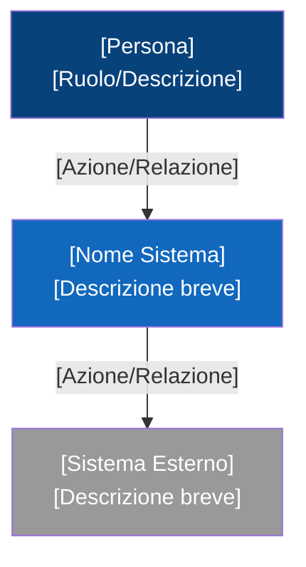
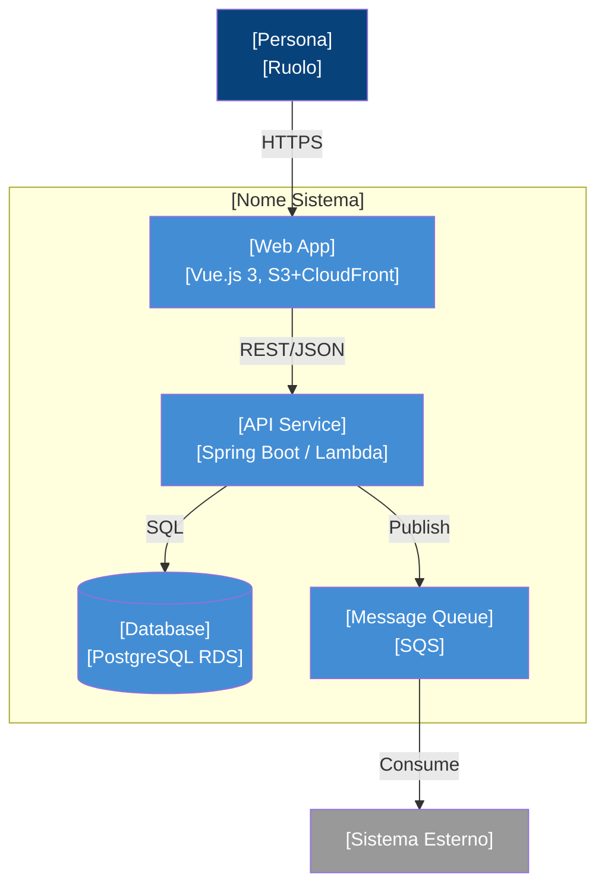
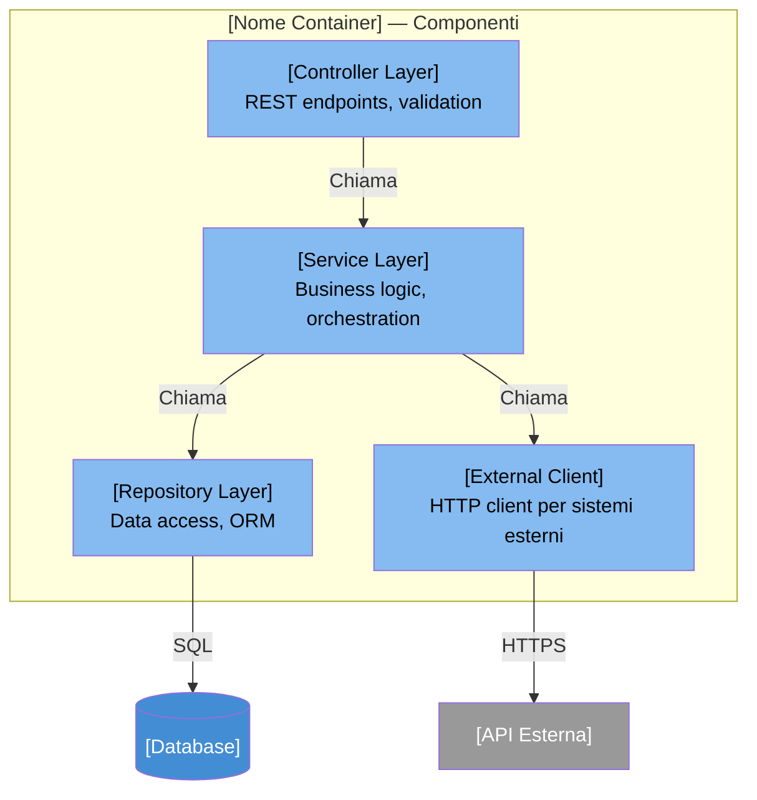
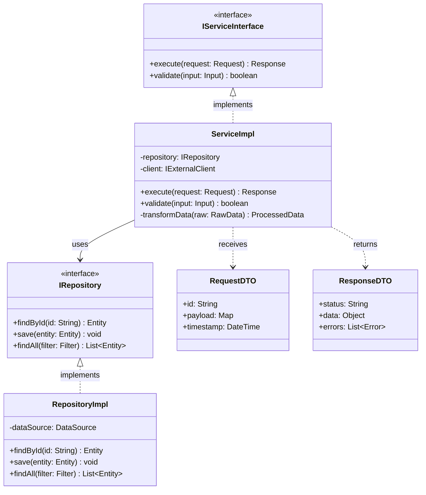

# C4 Diagram Templates — Mermaid

Template Mermaid per ciascun livello del modello C4.
Sostituire i placeholder `[...]` con i dati reali del progetto.

---

## Livello 1 — System Context

Mostra il sistema nel suo contesto: attori umani e sistemi esterni con cui interagisce.

### Legenda colori Context

| Colore   | Significato                |
|----------|----------------------------|
| `#08427b`| Persona / Attore            |
| `#1168bd`| Sistema in scope            |
| `#999999`| Sistema esterno (fuori scope)|

---

## Livello 2 — Container

Mostra i container (applicazioni, database, code unit deployabili) dentro il sistema.

### Legenda colori Container

| Colore   | Significato                |
|----------|----------------------------|
| `#08427b`| Persona / Attore            |
| `#438dd5`| Container dentro il sistema |
| `#999999`| Sistema esterno             |

---

## Livello 3 — Component

Mostra i componenti interni di un singolo container.

### Legenda colori Component

| Colore   | Significato                      |
|----------|-----------------------------------|
| `#85bbf0`| Componente dentro il container    |
| `#438dd5`| Altro container dello stesso sistema|
| `#999999`| Sistema/servizio esterno          |

---

## Livello 4 — Code

Mostra classi, interfacce e relazioni all'interno di un componente.
Usare class diagram Mermaid.

### Quando usare il Livello 4

- Documentazione tecnica approfondita
- Onboarding di nuovi sviluppatori su un modulo specifico
- Code review architetturale
- Identificazione di accoppiamento o violazioni di layering

> **Nota:** il Livello 4 non e' richiesto per ogni componente. Usarlo solo
> dove il design delle classi non e' ovvio dalla struttura del codice.

---

## Convenzioni generali

1. **Un diagramma per livello** — non mischiare livelli nello stesso grafico
2. **Titoli espliciti** — ogni nodo deve avere nome + tecnologia/ruolo
3. **Frecce etichettate** — indicare protocollo o tipo di relazione
4. **Colori consistenti** — usare la legenda del livello corrispondente
5. **Scope chiaro** — il livello N+1 e' lo zoom di un singolo elemento del livello N
