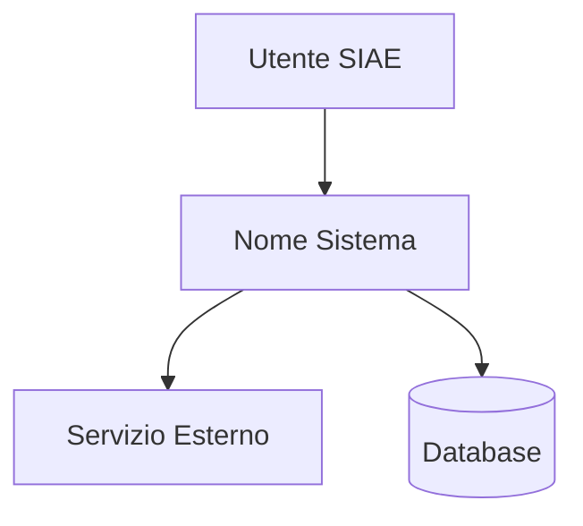

# HLD — [Nome Sistema/Servizio]

> **Versione**: 1.0
> **Data**: YYYY-MM-DD
> **Autore**: [nome]
> **Stato**: Draft / In Review / Approvato

---

## 1. Contesto e Obiettivi
[Perche' esiste questo sistema. Quale problema risolve.]

## 2. Stakeholder
| Ruolo | Nome/Team | Interesse |
|-------|-----------|-----------|

## 3. Architettura — C4 Livello 1 (Context)
[Diagramma Mermaid: il sistema e le sue interazioni esterne]

## 4. Architettura — C4 Livello 2 (Container)
[Diagramma Mermaid: i container del sistema]

## 5. Decisioni Architetturali
| # | Decisione | Motivazione | Alternative Scartate |
|---|-----------|-------------|---------------------|

## 6. Requisiti Non Funzionali
| NFR | Target | Come si misura |
|-----|--------|----------------|
| Performance | < 200ms p95 | CloudWatch latency |
| Availability | 99.9% | CloudWatch uptime |
| Scalability | 1000 req/s | Load test |

## 7. Sicurezza
[Autenticazione, autorizzazione, encryption, PII handling]

## 8. Infrastruttura
[AWS services, ambienti, deployment strategy]

## 9. Rischi e Mitigazioni
| Rischio | Probabilita' | Impatto | Mitigazione |
|---------|-------------|---------|-------------|

## 10. Dipendenze
[Sistemi esterni, team, timeline]
