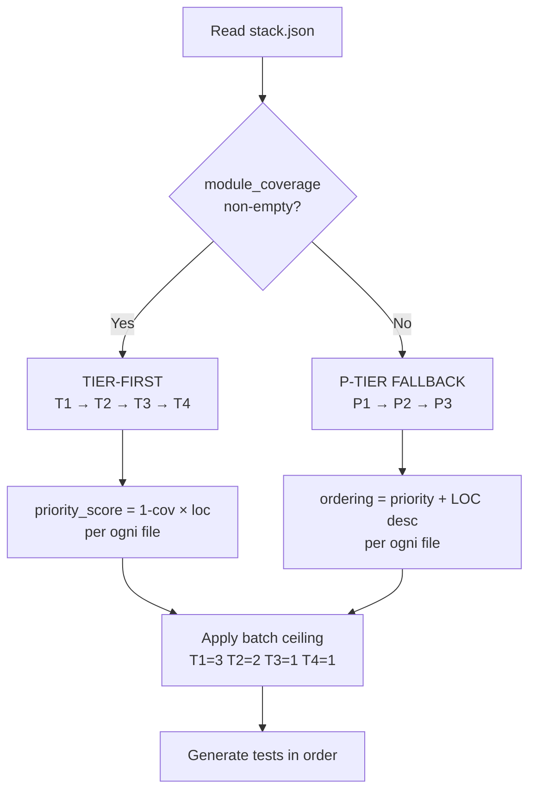

# Phase 5 — Test Generation

## Purpose
Generate deterministic, enterprise-grade unit tests for each target module.
Tests follow the AAA pattern, cover happy path + edge cases + negative path,
and use idiomatic mocking for the selected framework.

---

## Testability Classification

Before generating any test, classify each target file by testability tier. Within a priority level (P1/P2/P3), process **T1 before T2 before T3 before T4**.

| Tier | Criteria | Mock Setup Cost | Coverage ROI |
|------|----------|-----------------|--------------|
| T1 — Pure Logic | No external imports, no I/O, no framework components — pure functions only | None | Highest |
| T2 — Injectable Services | Class/function with typed dependencies injected via constructor/parameters | Low (`vi.mock` per dep) | High |
| T3 — Framework Components | React/Vue/Angular/Svelte components, hooks, context providers | Medium (jsdom + `render`) | Medium |
| T4 — I/O Handlers | Lambda handlers, DB repositories, HTTP clients, queue consumers | High (AWS mocks, DB fakes) | Low |

**Stop rule:** if the 70% global target is reached before exhausting T3/T4 files, STOP generation. Report remaining T3/T4 files as "deferred — target already met" in Block 9.

---

## Batch Generation Rule

When the next N files in the queue share all three preconditions, generate their tests in a single LLM call:
- (a) Same testing framework target
- (b) Similar export shape: ≤ 3 public functions OR one class with ≤ 5 methods each
- (c) No shared mutable state between siblings

Batch ceilings by tier:
- **T1**: up to 5 files per call
- **T2**: up to 3 files per call
- **T3**: 1 file per call (always)
- **T4**: 1 file per call (always)

**Anti-pattern:** Do NOT batch files with divergent error handling patterns or different mocking requirements — quality degradation on tail items of the batch outweighs the iteration savings.

---

## Template caching policy

Per ogni framework selezionato (es. `vitest`, `pytest`, `junit5`):
1. **PRIMO batch**: leggi `skills/code-coverage/templates/<framework>.template.*` UNA volta. Salva contenuto in variabile di sessione `_TEMPLATE_<FRAMEWORK>` (es. `_TEMPLATE_VITEST`).
2. **BATCH SUCCESSIVI** nella stessa session: NON ri-leggere il template file. Riusa la variabile cached.
3. Cache invalidata solo da nuova invocazione skill.

Razionale: per MEDIUM repo con 10 batch, ri-lettura template = ~3-9 KB × 10 = ~30-90 KB di token sprecati.

---

## Ordering Strategy (D1 conditional)



### Razionale della scelta condizionale

| Caso | Behavior | Motivo |
|------|----------|--------|
| `module_coverage` disponibile | TIER-FIRST | priority_score reale → ROI coverage-per-token maxed; T1 prima abbatte mock cost iniziale |
| `module_coverage` empty/missing | P-TIER | Senza segnale di coverage, tier-first rischia di lasciare P1 sotto 80% se hit globale avviene prima di toccare P1-T4 (handler business-critical) |

### Sicurezza floor P1 ≥ 80%

In ENTRAMBE le strategie, dopo ogni iterazione di Phase 5/6/7, se `min(P1 modules lines_pct) < 80%` → forza inclusione di file P1 sub-threshold a tier=T4 nelle prossime iterazioni, sopra qualsiasi ordering tier o priority. Enforcing per `priority-rules.json` `min_coverage_pct: 80` per P1 (Principle 5).

### Batch ceiling (D2 resolved 8-2)

| Tier | Files per call | Razionale |
|------|----------------|-----------|
| T1 (pure logic) | 3 (was 5) | Riduce blast radius su template error sistemico; evita quality drop on tail items |
| T2 (light deps) | 2 (was 3) | Stesso |
| T3 (heavy deps) | 1 | Mock setup complesso, batch=1 evita errori cascade |
| T4 (I/O handlers) | 1 | Massimo mock cost, isolato sempre |

A5 e A8 hanno documentato il rischio "round-trip non ammortizzati" da rivedere in retrospettiva post-PR8 con A/B test su repo LARGE.

---

## Pre-Generation Checklist

Before writing any test file:
1. Apply skip patterns from `assets/priority-rules.json` — skip matching files.
2. Apply P1/P2/P3 classification — process P1 first, then P2, then P3.
   **Composite priority score within each tier:** sort files by `priority_score = (1 - current_coverage) × loc` descending. `current_coverage` and `loc` come from `module_coverage` and `file_list` produced in Phase 1 → Phase 3. Files with no existing coverage data use `current_coverage = 0`. This ordering maximises coverage gain per token spent.
3. Read each source file being tested — extract: exported functions/classes, dependencies/imports, async patterns, error types thrown.
   **Selective read rule:** For files with LOC > 150, first run:
   ```bash
   grep -n "^export\|^class\|^function\|throw new" <file>
   ```
   to extract public API and error patterns. Read the full file only if grep reveals complex patterns (multiple classes, private state affecting public behavior, non-trivial control flow). For files ≤ 150 LOC, read in full.
3b. **For each dependency: run grep deterministico** (P8):

    ```bash
    grep -nE "^export (default|const|function|class|interface|type)|module\.exports" <dep_path>
    ```

    Output → determina `mock_shape`:
    - `export default` only → `vi.mock(path, () => ({ default: vi.fn() }))`
    - `export const/function/class` only → `vi.mock(path, () => ({ funcName: vi.fn() }))`
    - both → `vi.mock(path, () => ({ default: vi.fn(), funcName: vi.fn() }))`
    - `module.exports = ...` (CJS) → `vi.mock(path, () => ({ default: vi.fn() }))`

    Cache result per `(dep_path, session)` per evitare re-grep su batch successivi.

3c. Apply template variant from `templates/<framework>.template.*` based on dep count:
    - 0 deps (T1 pure logic) → use `VARIANT_NO_DEPS`, delete other variants
    - 1 dep → use `VARIANT_SINGLE_DEP`
    - 2 deps → use `VARIANT_TWO_DEPS`
    - 3+ deps → use `VARIANT_MULTI_DEPS`
    Never cast a default export as a named-export cast — produces `ReferenceError` at runtime.
4. Persisti la lista files in `.code-coverage/generation-plan.txt` per traceability.
5. **Hard gate placeholder check** (P6): per ogni file da scrivere, esegui `bash skills/code-coverage/lib/placeholder-check.sh <file>`. Se exit-code ≠ 0 → fail loudly, NON scrivere il file, log in `.code-coverage/decisions.log`.
6. Procedi con write autonomamente. Mai prompt utente runtime.

---

## AAA Pattern — Mandatory Structure

Every test block MUST follow Arrange / Act / Assert with explicit comments:

```
// Arrange — set up inputs, mocks, expected values
// Act     — call the function or method under test
// Assert  — verify the output or side effects
```

Never combine Arrange + Act in the same line without comments.
Never assert inside the Arrange block.

---

## Coverage Requirements Per Module

Each public function or method in the target module requires:

| Test Case | Description |
|-----------|-------------|
| Happy path | Valid, expected input → correct output |
| Edge case 1 | Boundary value (empty array, zero, null with default, max length) |
| Edge case 2 | Concurrent/async concern OR unexpected but valid input type |
| Negative path | Invalid input → expected error thrown or rejection |

For functions with multiple branches (if/switch), add one test per branch
that represents a distinct business rule.

---

## Mocking patterns

Mocking patterns sono nei template files (`skills/code-coverage/templates/<framework>.template.*`). Ogni template include 1 paragrafo di rationale "perché questo mock" all'inizio. Il template è caricato ONCE per (framework, session).

Default mock cleanup: `vi.clearAllMocks()` in `beforeEach`. Aggiungi `vi.restoreAllMocks()` in `afterEach` SOLO se il test usa `vi.spyOn()`.

Per Lambda/AWS SDK: usa `aws-sdk-client-mock`. Template separati: `templates/vitest-lambda-handler.template.ts` per i Lambda handler, `templates/vitest-lambda-module.template.ts` per i moduli interni (services/utils).

---


## Lambda-Specific Mocking (Vitest)

When generating tests for AWS Lambda handlers, mock all AWS SDK clients
and event sources. **Never make real AWS API calls.**

```typescript
import { mockClient } from 'aws-sdk-client-mock'
import { DynamoDBDocumentClient, GetCommand } from '@aws-sdk/lib-dynamodb'

const ddbMock = mockClient(DynamoDBDocumentClient)

beforeEach(() => { ddbMock.reset() })

it('should handle APIGatewayProxyEvent', async () => {
  // Arrange
  ddbMock.on(GetCommand).resolves({ Item: { id: '1', name: 'test' } })
  const event: APIGatewayProxyEvent = {
    httpMethod: 'GET',
    path: '/resource/1',
    pathParameters: { id: '1' },
    headers: { 'Content-Type': 'application/json' },
    multiValueHeaders: {},
    queryStringParameters: null,
    multiValueQueryStringParameters: null,
    body: null,
    isBase64Encoded: false,
    resource: '/resource/{id}',
    stageVariables: null,
    requestContext: {
      accountId: '123456789012',
      apiId: 'test-api',
      httpMethod: 'GET',
      identity: { sourceIp: '127.0.0.1' } as any,
      path: '/resource/1',
      protocol: 'HTTP/1.1',
      requestId: 'test-request-id',
      requestTimeEpoch: Date.now(),
      resourceId: 'test-resource',
      resourcePath: '/resource/{id}',
      stage: 'test',
    },
  }

  // Act
  const result = await handler(event, {} as Context)

  // Assert
  expect(result.statusCode).toBe(200)
  expect(JSON.parse(result.body)).toMatchObject({ id: '1' })
})
```

### Event Mock Templates
```typescript
// SQS
const sqsEvent: SQSEvent = {
  Records: [{ body: JSON.stringify({ key: 'value' }), messageId: '1', ... }]
}

// SNS
const snsEvent: SNSEvent = {
  Records: [{ Sns: { Message: JSON.stringify({ key: 'value' }), ... } }]
}

// EventBridge
const eventBridgeEvent: EventBridgeEvent<'detail-type', { key: string }> = {
  source: 'my.source', 'detail-type': 'MyEvent',
  detail: { key: 'value' }, ...
}
```

---

## Naming Convention

Test files must follow the convention of the target stack:

| Stack | Convention | Example |
|-------|-----------|---------|
| Vitest / Jest | `<module>.test.ts` | `payment.service.test.ts` |
| pytest | `test_<module>.py` | `test_payment_service.py` |
| JUnit 5 | `<Class>Test.java` | `PaymentServiceTest.java` |
| MockK (Kotlin) | `<Class>Test.kt` | `PaymentServiceTest.kt` |
| Go | `<file>_test.go` | `payment_service_test.go` |
| Rust | Module `tests` block in same file or `tests/<module>.rs` |
| C# | `<Class>Tests.cs` | `PaymentServiceTests.cs` |
| Flutter | `<widget>_test.dart` | `payment_screen_test.dart` |

Test files are placed in:
- JS/TS: use `<module>.test.ts` co-located with the source file **by default**.
  Exception: check once at the **workspace root** for an `__tests__/` directory:
  ```bash
  find <workspace_root> -maxdepth 3 -type d -name "__tests__" | head -1
  ```
  If the output is non-empty, use the `__tests__/` pattern for the entire workspace. Apply one pattern per workspace — never mix co-location and `__tests__/` within the same workspace.
- Python: in `tests/` directory mirroring source structure
- Java: in `src/test/java/<package>/` mirroring `src/main/java/<package>/`.
  Package derivation rule: strip the `src/main/java/` prefix from the source path, replace `/` with `.`, drop the filename. Example: `src/main/java/com/siae/service/PaymentService.java` → package `com.siae.service` → test at `src/test/java/com/siae/service/PaymentServiceTest.java`.
- Kotlin: in `src/test/kotlin/<package>/` mirroring `src/main/kotlin/<package>/`. Apply the same package derivation rule as Java but strip `src/main/kotlin/` prefix.
- Go: same package directory as source
- Rust: use inline `#[cfg(test)] mod tests { use super::*; ... }` for unit tests that need access to private or `pub(crate)` items. Use a separate `tests/<module>.rs` file only for integration tests that exercise the public API.
- Flutter/Dart: in `test/` directory at the package root, mirroring the `lib/` structure. Example: `lib/services/payment_service.dart` → `test/services/payment_service_test.dart`.
