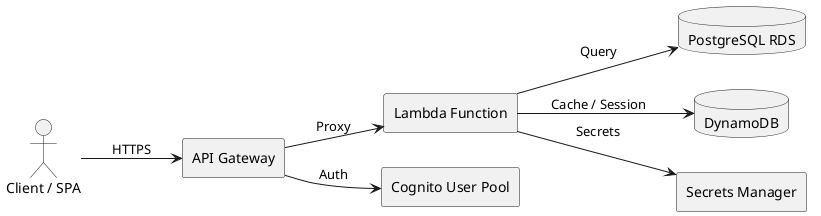
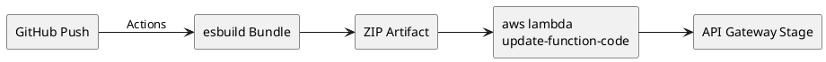
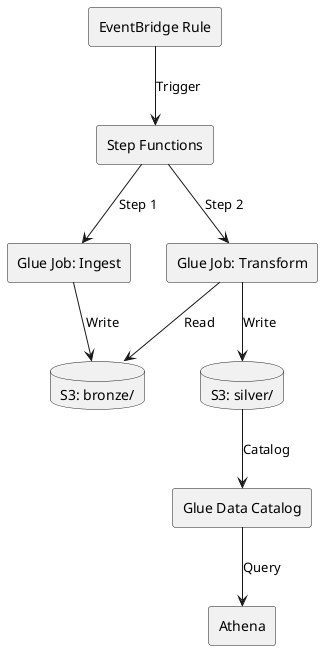
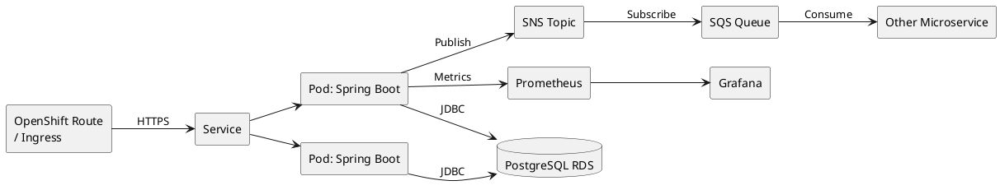
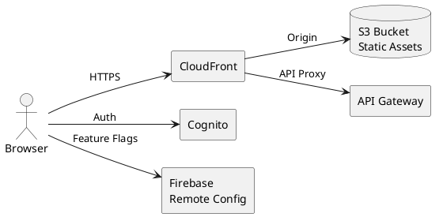
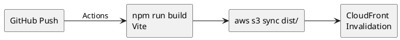

```plantuml
@startuml OpenShift_Deploy
skinparam defaultFontName Arial
skinparam shadowing false
skinparam componentStyle rectangle
left to right direction

rectangle "GitHub Push" as GH
rectangle "Maven Build + Test" as Maven
rectangle "Docker Build" as Docker
rectangle "Container Registry" as Registry
rectangle "Helm Upgrade" as Helm
rectangle "OpenShift Cluster" as OCP

GH --> Maven : Actions
Maven --> Docker
Docker --> Registry
Registry --> Helm
Helm --> OCP
@enduml
```

# AWS Architecture Patterns — SIAE

Pattern architetturali AWS dettagliati con diagrammi PlantUML.
Estratti dai repository reali dell'organizzazione `itsiae`.

---

## 1. Lambda + API Gateway

Pattern per API serverless (TypeScript/Node.js).

### Architettura



### Componenti

| Componente       | Ruolo                                              |
|------------------|----------------------------------------------------|
| API Gateway      | Endpoint HTTPS, throttling, request validation     |
| Lambda           | Business logic (Express.js + serverless-http)      |
| Cognito          | Autenticazione OAuth2/OIDC, JWT validation         |
| PostgreSQL (RDS) | Persistenza relazionale (Drizzle ORM)              |
| DynamoDB         | Dati chiave-valore, sessioni, cache applicativa    |
| Secrets Manager  | Credenziali DB, API key, rotazione automatica      |

### Flusso di deploy



---

## 2. Glue ETL Pipeline

Pattern per pipeline dati con architettura Medallion.

### Architettura



### Componenti

| Componente       | Ruolo                                              |
|------------------|----------------------------------------------------|
| EventBridge      | Trigger schedulato (cron) o event-driven            |
| Step Functions   | Orchestrazione sequenziale con retry e error handling|
| Glue Job         | Trasformazione PySpark (Glue 4.0, Python 3.11)    |
| S3 bronze/       | Dati grezzi, formato originale o Parquet            |
| S3 silver/       | Dati puliti, validati, deduplicated, Parquet        |
| Glue Data Catalog| Metadati tabelle, schema, partizioni               |
| Athena           | Query SQL ad-hoc su dati S3 via Catalog             |

### Struttura S3

```
s3://siae-datalake-{env}/
  bronze/
    {source}/{entity}/{year}/{month}/{day}/
      data-{timestamp}.parquet
  silver/
    {domain}/{entity}/
      data.parquet  (partitioned by date)
```

---

## 3. OpenShift Microservice

Pattern per microservizi Java su OpenShift.

### Architettura



### Componenti

| Componente       | Ruolo                                              |
|------------------|----------------------------------------------------|
| OpenShift Route  | Ingress HTTPS, TLS termination                     |
| Service          | Load balancing interno tra pod                      |
| Pod (Spring Boot)| Business logic, REST API, JPA/Hibernate            |
| PostgreSQL (RDS) | Persistenza relazionale                             |
| SNS + SQS        | Comunicazione asincrona tra microservizi            |
| Prometheus       | Raccolta metriche (Micrometer exporter)            |
| Grafana          | Dashboard e alerting                                |

### Flusso di deploy



---

## 4. S3 + CloudFront SPA

Pattern per applicazioni frontend Vue.js.

### Architettura



### Componenti

| Componente         | Ruolo                                            |
|--------------------|--------------------------------------------------|
| CloudFront         | CDN, HTTPS, caching, SPA routing (error pages)  |
| S3                 | Hosting statico (HTML, JS, CSS, assets)          |
| Cognito            | Autenticazione utenti, JWT tokens                |
| API Gateway        | Backend API (proxied via CloudFront path pattern)|
| Firebase RC        | Feature flags e configurazione runtime           |

### CloudFront Configuration

```
Behaviors:
  /api/*    -> API Gateway origin (no cache)
  /*        -> S3 origin (cache 1 year for hashed assets)

Error Pages:
  403 -> /index.html (200) — SPA client-side routing
  404 -> /index.html (200) — SPA client-side routing
```

### Flusso di deploy


