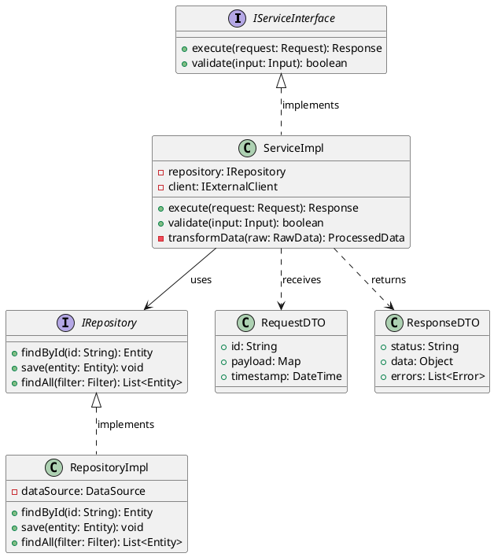

# C4 Diagram Templates — PlantUML

Template PlantUML per ciascun livello del modello C4.
Sostituire i placeholder `[...]` con i dati reali del progetto.

---

## Livello 1 — System Context

Mostra il sistema nel suo contesto: attori umani e sistemi esterni con cui interagisce.

```plantuml
@startuml C4_Context
!include <C4_Context>

Person(user, "[Persona]", "[Ruolo/Descrizione]")
System(system, "[Nome Sistema]", "[Descrizione breve]")
System_Ext(extSystem, "[Sistema Esterno]", "[Descrizione breve]")

Rel(user, system, "[Azione/Relazione]")
Rel(system, extSystem, "[Azione/Relazione]")
@enduml
```

### Legenda colori Context

| Elemento         | Significato                |
|------------------|----------------------------|
| Person (blue)    | Persona / Attore            |
| System (blue)    | Sistema in scope            |
| System_Ext (gray)| Sistema esterno (fuori scope)|

---

## Livello 2 — Container

Mostra i container (applicazioni, database, code unit deployabili) dentro il sistema.

```plantuml
@startuml C4_Container
!include <C4_Container>

Person(user, "[Persona]", "[Ruolo]")

System_Boundary(system, "[Nome Sistema]") {
    Container(webApp, "[Web App]", "Vue.js 3, S3+CloudFront", "SPA frontend")
    Container(api, "[API Service]", "Spring Boot / Lambda", "REST API")
    ContainerDb(db, "[Database]", "PostgreSQL RDS", "Persistenza dati")
    Container(queue, "[Message Queue]", "SQS", "Messaggistica asincrona")
}

System_Ext(extSystem, "[Sistema Esterno]", "")

Rel(user, webApp, "Usa", "HTTPS")
Rel(webApp, api, "Chiama", "REST/JSON")
Rel(api, db, "Legge/Scrive", "SQL")
Rel(api, queue, "Pubblica", "SQS")
Rel(queue, extSystem, "Consuma", "SQS")
@enduml
```

### Legenda colori Container

| Elemento           | Significato                |
|--------------------|----------------------------|
| Person (blue)      | Persona / Attore            |
| Container (blue)   | Container dentro il sistema |
| System_Ext (gray)  | Sistema esterno             |

---

## Livello 3 — Component

Mostra i componenti interni di un singolo container.

```plantuml
@startuml C4_Component
!include <C4_Component>
!include <C4_Container>

Container_Boundary(container, "[Nome Container] — Componenti") {
    Component(controller, "[Controller Layer]", "", "REST endpoints, validation")
    Component(service, "[Service Layer]", "", "Business logic, orchestration")
    Component(repository, "[Repository Layer]", "", "Data access, ORM")
    Component(client, "[External Client]", "", "HTTP client per sistemi esterni")
}

ContainerDb(db, "[Database]", "PostgreSQL")
System_Ext(extApi, "[API Esterna]", "")

Rel(controller, service, "Chiama")
Rel(service, repository, "Chiama")
Rel(service, client, "Chiama")
Rel(repository, db, "SQL")
Rel(client, extApi, "HTTPS")
@enduml
```

### Legenda colori Component

| Elemento            | Significato                      |
|---------------------|-----------------------------------|
| Component (light)   | Componente dentro il container    |
| Container (blue)    | Altro container dello stesso sistema|
| System_Ext (gray)   | Sistema/servizio esterno          |

---

## Livello 4 — Code

Mostra classi, interfacce e relazioni all'interno di un componente.
Usare class diagram PlantUML.



### Quando usare il Livello 4

- Documentazione tecnica approfondita
- Onboarding di nuovi sviluppatori su un modulo specifico
- Code review architetturale
- Identificazione di accoppiamento o violazioni di layering

> **Nota:** il Livello 4 non e' richiesto per ogni componente. Usarlo solo
> dove il design delle classi non e' ovvio dalla struttura del codice.

---

## Convenzioni generali

1. **Un diagramma per livello** — non mischiare livelli nello stesso grafico
2. **Titoli espliciti** — ogni nodo deve avere nome + tecnologia/ruolo
3. **Frecce etichettate** — indicare protocollo o tipo di relazione
4. **Colori consistenti** — usare la legenda del livello corrispondente
5. **Scope chiaro** — il livello N+1 e' lo zoom di un singolo elemento del livello N
