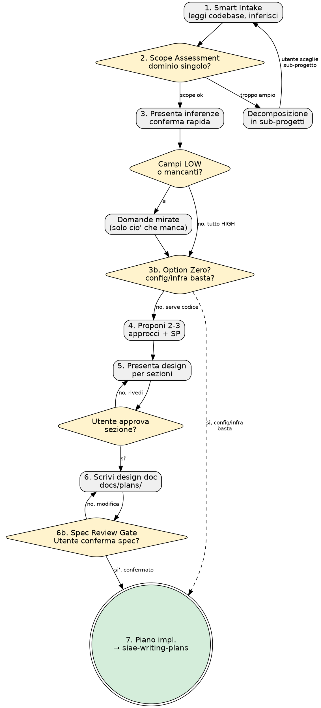

# SIAE Brainstorming — Da Idea a Design Validato

```
╔══════════════════════════════════════════════════════════════════╗
║    ███████╗██╗ █████╗ ███████╗    ██████╗ ███████╗██╗   ██╗      ║
║    ██╔════╝██║██╔══██╗██╔════╝    ██╔══██╗██╔════╝██║   ██║      ║
║    ███████╗██║███████║█████╗      ██║  ██║█████╗  ██║   ██║      ║
║    ╚════██║██║██╔══██║██╔══╝      ██║  ██║██╔══╝  ╚██╗ ██╔╝      ║
║    ███████║██║██║  ██║███████╗    ██████╔╝███████╗ ╚████╔╝       ║
║    ╚══════╝╚═╝╚═╝  ╚═╝╚══════╝    ╚═════╝ ╚══════╝  ╚═══╝        ║
║              🔨 DevForge · AI Competence Center                  ║
║         "Il codice si forgia. Il developer cresce."              ║
╚══════════════════════════════════════════════════════════════════╝
```

## LA LEGGE DI FERRO

```
NESSUNA IMPLEMENTAZIONE SENZA DESIGN APPROVATO DALL'UTENTE
```

> **Tipo:** Rigid | **Fase SDLC:** 2. Design

---

## HARD-GATE

<EXTREMELY-IMPORTANT>
NON invocare skill di implementazione, scrivere codice, o creare scaffold FINCHE'
non hai presentato il design e l'utente lo ha approvato. Questo si applica a OGNI
progetto, indipendentemente dalla semplicita' percepita.

Stai per scrivere codice, creare file, o invocare siae-tdd/siae-code-standards?
Hai completato TUTTI e 7 i punti della checklist brainstorming?
- NO → FERMATI. Torna al punto mancante. Nessun codice senza design approvato.
- SI → Procedi con siae-writing-plans.

Conseguenze documentate dello skip:
- 73% dei rework in SIAE derivano da design mancante o incompleto
- "So gia' cosa fare" → assunzioni non esaminate → codice da riscrivere
- Ogni ora risparmiata saltando il brainstorming costa 3-5 ore di rework
</EXTREMELY-IMPORTANT>

---

> 📊 **Dai repo itsiae:** I task implementati senza design doc impiegano in media 1.7x piu' tempo per mancanza di allineamento.
> Fonte: analisi su 816 repository GitHub itsiae (60 Java, 44 HCL, 23 Python, 22 TypeScript).

## Anti-Pattern: "Questo e' troppo semplice per un design"

Ogni progetto passa per questo processo. Una todo list, una utility a singola
funzione, una modifica di configurazione — tutto. I progetti "semplici" sono
quelli dove le assunzioni non esaminate causano il maggior spreco di lavoro.
Il design puo' essere breve (poche frasi per progetti davvero semplici), ma
DEVI presentarlo e ottenere l'approvazione.

---

## Scaling — Adatta la Profondita', MAI il Processo

GATE: Prima di iniziare la checklist, valuta la complessita' del task.

| Complessita' | Segnali | Profondita' |
|-------------|---------|-------------|
| **Bassa** | Config change, typo, rename, bump versione, fix isolato, modifica < 3 file | Ogni step e' breve (poche frasi). Il design doc puo' essere 10-15 righe. Ma TUTTI i 7 step vanno eseguiti e il piano con subtask va SEMPRE prodotto. |
| **Media** | CRUD, refactoring, ottimizzazione, bug fix multi-file | Step completi con dettaglio moderato. Design doc 30-60 righe. Piano con subtask obbligatorio. |
| **Alta** | Feature nuova, cross-module, integrazione, migrazione | Checklist completa a 7 punti con massimo dettaglio. Piano con subtask obbligatorio. |

<EXTREMELY-IMPORTANT>
ZERO ECCEZIONI. Il processo a 7 step si esegue SEMPRE, per OGNI task.
La complessita' determina la PROFONDITA' di ogni step, non se lo step si esegue.
Un config change ha un brainstorming di 2 minuti. Un refactoring di 10 minuti.
Ma entrambi passano per tutti e 7 gli step e producono un piano con subtask.

NON saltare step. NON abbreviare il processo. NON decidere autonomamente che
un task e' "troppo semplice" per il brainstorming completo.
Il piano con subtask (siae-writing-plans) e' SEMPRE l'output finale.
</EXTREMELY-IMPORTANT>

---

## Checklist — 7 Punti Obbligatori

DEVI creare un task per ciascuno di questi punti e completarli in ordine:

### 1. Smart Intake — Inferisci il contesto dal codebase

**NON chiedere cio' che il codice sa gia'.** Leggi prima, chiedi dopo.

### Context-First Rule

Prima di leggere file, eseguire comandi, o fare domande all'utente,
verifica se l'informazione e' gia' presente nella conversazione corrente
(messaggi precedenti, output di tool, skill gia' invocate).
Non chiedere cio' che e' gia' stato detto. Non rileggere cio' che e' gia' stato letto.

**Fonti da leggere (in ordine):**

| # | Fonte | Tool | Cosa cercare |
|---|-------|------|-------------|
| 1 | `CLAUDE.md` del progetto | Read | Stack, factory, regole operative |
| 2 | Package manifest (`pom.xml`, `package.json`, `requirements.txt`, `terragrunt.hcl`) | Read | Dipendenze, framework, versioni |
| 3 | Struttura directory (`src/`, `lib/`, `skills/`, `commands/`) | Glob | Pattern architetturale, moduli |
| 4 | `git log --oneline -10` | Bash | Lavoro recente, contesto attuale |
| 5 | `docs/plans/` | Glob + Read | Design doc precedenti, decisioni |
| 6 | Auto-memory (`~/.claude/projects/<project>/memory/`) | Read MEMORY.md | Lezioni apprese, feedback, contesto cross-sessione |
| 7 | JIRA (se MCP disponibile) | MCP Atlassian | Ticket correlati |

**Campi da inferire:**

| Campo | Esempio |
|-------|---------|
| Stack | Java/Spring Boot, Vue.js 3, Python/PySpark, HCL/Terraform |
| Pattern architetturale | Microservizio REST, Lambda serverless, ETL Medallion |
| Test framework | JUnit 5, Vitest, pytest |
| Build tool | Maven, Vite, esbuild |
| Naming convention | camelCase, snake_case, PascalCase |
| Dipendenze chiave | MapStruct, Drizzle ORM, PySpark |

**Ogni inferenza ha:**
- **Confidence:** HIGH (>= 90%), MEDIUM (60-89%), LOW (< 60%)
- **Fonte:** `file:riga` (citation rule)

Esempio:
```
Stack:     Java/Spring Boot  [HIGH]  pom.xml:5 — spring-boot-starter-parent
Pattern:   REST microservice [HIGH]  src/main/java/it/siae/catalogo/controller/:* — 3 controller
Test fw:   JUnit 5           [HIGH]  pom.xml:42 — junit-jupiter 5.9.3
Deploy:    ECS               [MEDIUM] .github/workflows/deploy.yml:15 — ecs-deploy action
```

### 2. Scope Assessment — Valuta se decomporre

Prima di procedere alle domande di dettaglio, valuta lo scope della richiesta.

**Test:** il task descrive un unico dominio coeso, o piu' sottosistemi indipendenti?

**Segnali di scope troppo ampio:**
- 3+ domini diversi nella stessa richiesta
- Componenti che potrebbero vivere come progetti/repo separati
- Stack diversi per parti diverse (es. "frontend Vue + pipeline Glue + IaC Terraform")
- Piu' team/factory coinvolti

**Se scope troppo ampio:**

```
SCOPE ASSESSMENT: DECOMPOSIZIONE NECESSARIA

La richiesta copre N sottosistemi indipendenti:
1. [sottosistema A] — [breve descrizione]
2. [sottosistema B] — [breve descrizione]
3. [sottosistema C] — [breve descrizione]

Ogni sottosistema merita il suo ciclo spec → plan → implementation.
Quale vuoi affrontare per primo?
```

Dopo la scelta dell'utente, procedi con il brainstorming normale per quel
sotto-progetto. Gli altri restano nel backlog.

**Se scope ok:** procedi a Step 3 (Presenta inferenze).

### 3. Presenta inferenze + domande mirate

**Presenta le inferenze in tabella compatta per conferma rapida:**

```
CONTESTO INFERITO:
──────────────────
Stack:       Java/Spring Boot      [HIGH]   pom.xml:5
Pattern:     REST microservice     [HIGH]   src/.../controller/:*
Test fw:     JUnit 5               [HIGH]   pom.xml:42
Deploy:      ECS                   [MEDIUM] .github/workflows/deploy.yml:15
Naming:      camelCase             [HIGH]   src/.../CatalogoService.java

Confermi? (si / correggi specifici)
```

**Regole:**
- L'utente conferma in blocco o corregge singoli campi
- Domande esplicite SOLO per: confidence LOW, campi non inferiti, scopo del task
- Una domanda alla volta per i campi mancanti
- Preferisci domande a scelta multipla quando possibile
- Focus residuo su: **scopo del task**, vincoli, criteri di successo

**Se tutto e' HIGH e l'utente conferma**, procedi direttamente a Step 4 (Approcci).
Questo elimina le 5-10 domande ripetitive sui dati gia' nel codice.

### 3b. Option Zero Gate

Prima di proporre soluzioni che richiedono codice, verifica se il problema
si risolve con una modifica di configurazione, infrastruttura, o processo.

**Checklist Option Zero:**

| # | Verifica | Esempio SIAE |
|---|----------|-------------|
| 1 | AWS Parameter Store / SSM | Cambiare un valore in parameter store risolve? |
| 2 | Terraform variables / tfvars | Basta un tfvar diverso per ambiente? |
| 3 | Feature flag esistente | C'e' gia' un flag che abilita/disabilita questo? |
| 4 | Environment variable | Una env var risolve senza toccare codice? |
| 5 | Ticket DevOps / infra | Basta chiedere al team DevOps un cambio infra? |
| 6 | Servizio/libreria esistente | Un altro repo SIAE fa gia' questo? Riusalo. |
| 7 | Config applicativa | application.yml, .env, config file risolvono? |

**Se Option Zero si applica:**

Presenta la soluzione config/infra, chiedi conferma. Anche le soluzioni config/infra
passano per il design doc (breve) e producono un piano con subtask.
Il piano puo' avere un singolo subtask ("modifica config X"), ma va scritto.

Emetti checkpoint:
```
[BRAINSTORM:OPTION-ZERO] Soluzione senza codice identificata
  Tipo: {config/infra/processo}
  Azione: {descrizione}
  Piano: SI (anche per config change)
```

**Se Option Zero non si applica:**

Documenta brevemente perche' ("Verificato: non esiste parameter store per X,
il comportamento richiede logica nuova") e procedi a Step 4.

### 4. Proponi 2-3 approcci con trade-off e raccomandazione

- Presenta le opzioni in modo conversazionale
- Ogni approccio include: descrizione, pro, contro, complessita' stimata
- Guida con la tua raccomandazione e spiega perche'
- Includi stima Story Points per ogni approccio (doppia scala: SP-Umano / SP-Augmented)

### 5. Presenta design per sezioni, approvazione dopo ciascuna

- Scala ogni sezione in base alla complessita': poche frasi se lineare, fino a 200-300 parole se articolato
- Chiedi dopo ogni sezione se e' corretto finora
- Copri: architettura, componenti, flusso dati, gestione errori, testing
- Sii pronto a tornare indietro e chiarire

### 6. Scrivi design doc in `docs/plans/YYYY-MM-DD-<topic>-design.md`

Costruisci la card come MARKDOWN TABLE direttamente nella risposta testuale.

| 🟡 MEDIO (reversibile) — 🔨 DevForge · siae-brainstorming |
|:---|
| 📝 Topic: `<topic del design>` · ✅ Design approvato: `Si` |
| **▼ Azione** |
| 1. ✏️ Azione: Scrittura design doc → `docs/plans/YYYY-MM-DD-<topic>-design.md` |
| 💡 Perche': Scrittura design doc dopo approvazione utente |
| 🚫 Se NO: Non scrivere il file senza approvazione esplicita del design |

- Salva il design validato nel file
- Includi: contesto, decisioni, trade-off scelti, stima SP, criteri di accettazione
- Committa il documento con la card 🟡 MEDIO:

| 🟡 MEDIO (reversibile) — 🔨 DevForge · siae-brainstorming |
|:---|
| 📝 Topic: `<topic del design>` |
| **▼ Azione** |
| 1. 📌 Azione: `git commit` design doc → `docs/plans/YYYY-MM-DD-<topic>-design.md` |
| 💡 Perche': Registra il design approvato nella history del repository |
| 🚫 Se NO: Il file esiste ma non è committato — invisibile in git history |

### 6b. Spec Review Gate

Prima di procedere al piano implementativo, presenta all'utente il design doc
completo e chiedi conferma esplicita:

```
Il design doc e' stato scritto. Prima di passare al piano implementativo,
rileggi il documento e conferma:

- I requisiti sono completi? Non manca nulla?
- I criteri di accettazione coprono tutti i casi?
- Le decisioni architetturali sono corrette?
- Le stime SP sono realistiche?
- La spec e' focalizzata su un singolo dominio? Non copre troppi sottosistemi?

Se tutto e' corretto, procedo con siae-writing-plans.
Se qualcosa non torna, dimmi cosa modificare.
```

NON invocare siae-writing-plans senza conferma esplicita a questo gate.
Se l'utente chiede modifiche, aggiorna il design doc e ripresenta il gate.

### 7. REQUIRED: Transizione al piano implementativo

Design approvato? Il design doc e' committato? L'utente ha confermato il Spec Review Gate?

```
REQUIRED SUB-SKILL: siae-writing-plans
```

Invoca `siae-writing-plans` per trasformare il design in un piano implementativo
bite-sized con path esatti, codice completo e comandi con output atteso.

`siae-writing-plans` gestisce:
- Decomposizione in task indipendenti
- Template per ogni step (TDD: test → run → impl → run → commit)
- Execution handoff: subagent (questa sessione) o sessione separata

NON scrivere il piano direttamente in questa skill. Delega a `siae-writing-plans`.

---

## Output Strutturato Obbligatorio — Checkpoint

<EXTREMELY-IMPORTANT>
Per OGNI step del brainstorming, DEVI emettere il checkpoint strutturato corrispondente.
Non parafrasare. Non omettere campi. Questo rende il processo tracciabile e deterministico.
</EXTREMELY-IMPORTANT>

**Dopo Smart Intake (Step 1):**
```
[BRAINSTORM:INTAKE] Analisi completata
  Stack: {linguaggio/framework rilevato}
  Pattern: {architettura rilevata}
  Confidence: {HIGH/MEDIUM/LOW per ogni inferenza}
  File analizzati: {N file letti}
  Lacune: {cosa manca, cosa ha confidence LOW}
```

**Dopo Scope Assessment (Step 2):**
```
[BRAINSTORM:SCOPE] Valutazione complessita'
  Livello: {Banale/Basso/Medio/Alto}
  Dominio: {singolo/multiplo}
  Decomposizione: {necessaria SI/NO}
  Rischi: {lista rischi identificati}
```

**Dopo Option Zero Gate (Step 3b):**
```
[BRAINSTORM:OPTION-ZERO] Valutazione senza codice
  Applicabile: {SI/NO}
  Se SI — Tipo: {config/infra/processo}
  Se NO — Motivo: {perche' serve codice}
```

**Dopo Design (Step 5):**
```
[BRAINSTORM:DESIGN] Design doc prodotto
  File: {path design doc}
  Approcci valutati: {N}
  Approccio scelto: {nome}
  ADR: {decisioni chiave}
  SP: {N SP-Umano / M SP-Augmented}
```

**Spec Review Gate (Step 6):**
```
[BRAINSTORM:GATE] Review checkpoint
  Requisiti completi: {SI/NO}
  Criteri accettazione: {N criteri}
  Stime realistiche: {SI/NO}
  Dominio focalizzato: {SI/NO}
  DECISIONE: {PROCEDI / MODIFICA NECESSARIA}
```

---

## Flusso del Processo



---

## Integrazione SIAE / JIRA

Se MCP Atlassian e' disponibile:

### Ricerca ticket correlati

All'inizio del brainstorming, cerca ticket JIRA esistenti che potrebbero essere
correlati. Usa query JQL come:
- `project = <KEY> AND summary ~ "<keyword>" ORDER BY updated DESC`
- `project = <KEY> AND labels IN ("<label>") AND status != Done`

### Stima Story Points — Doppia Scala

Proponi una stima SP per il design finale usando la scala Fibonacci.
Stima SEMPRE entrambe le colonne: **SP-Umano** (developer senza AI) e **SP-Augmented** (developer + Claude Code).

| SP | SP-Umano (senza AI) | SP-Augmented (dev + Claude Code) |
|----|---------------------|----------------------------------|
| 1  | Triviale — poche ore, zero rischio | Config change, typo fix, rename |
| 2  | Semplice — meno di un giorno, rischio minimo | CRUD endpoint, test unitario, modifica IaC isolata |
| 3  | Moderato — 1-2 giorni, qualche incognita | Feature con 2-3 componenti, migrazione dati semplice |
| 5  | Significativo — 2-4 giorni, complessita' media | Feature cross-module, pipeline ETL, integrazione API esterna |
| 8  | Complesso — una settimana, rischio alto | Nuovo microservizio, refactoring architetturale, sistema event-driven |
| 13 | Molto complesso — oltre una settimana, molte incognite | Migrazione sistema, nuovo dominio, redesign completo |

**Guida alla conversione per tipo di complessita':**

| Tipo di task | Accelerazione AI | Motivo |
|-------------|-----------------|--------|
| Boilerplate, CRUD, scaffold, config | ~5-10x | L'AI genera codice ripetitivo quasi istantaneamente |
| Test unitari, refactoring meccanico | ~3-5x | Pattern recognition + generazione automatica |
| Feature con logica chiara e spec definite | ~2-3x | TDD accelerato, review automatizzata |
| Integrazione API/sistemi esterni | ~1.5-2x | Collo di bottiglia: accesso ai sistemi, auth, contratti |
| Logica di business ambigua, regole di dominio | ~1-1.5x | Il collo di bottiglia e' capire il dominio, non codificare |
| Debug produzione, incident response | ~1-1.5x | Dipende da osservabilita' e accesso ai log |
| Migrazione dati con validazione manuale | ~1.5-2x | Serve verifica umana sui dati trasformati |

**Come stimare:** identifica il tipo dominante del task, applica il moltiplicatore, arrotonda al Fibonacci piu' vicino.

**Esempio 1:** CRUD REST con 3 endpoint + test + IaC
- Tipo dominante: boilerplate + feature con spec chiare
- SP-Umano: **5** → accelerazione ~3x → SP-Augmented: **2**

**Esempio 2:** Refactoring auth middleware per compliance
- Tipo dominante: logica di business ambigua (requisiti legali)
- SP-Umano: **8** → accelerazione ~1.5x → SP-Augmented: **5**

Nella stima finale, presenta SEMPRE entrambi i valori:
```
Story Points: 5 SP-Umano / 3 SP-Augmented
```

### Output strutturato per ticket JIRA

Alla fine del design, produci un blocco strutturato pronto per la creazione ticket:

```
JIRA TICKET OUTPUT
──────────────────
Tipo:        Story / Task / Bug
Sommario:    [titolo conciso]
Descrizione: [da design doc]
Story Points: [stima]
Labels:      [label suggerite]
Acceptance Criteria:
  - [ ] [criterio 1]
  - [ ] [criterio 2]
  - [ ] [criterio N]
```

Se l'utente conferma, mostra la pre-flight card e poi crea il ticket con `createJiraIssue`:

| 🔴 ALTO (difficile da annullare) — 🔨 DevForge · siae-brainstorming |
|:---|
| **⚠️ OPERAZIONE DIFFICILE DA ANNULLARE** |
| 🎫 Ticket: `<Tipo> — <Sommario>` · 🌍 Project: `<JIRA project key>` |
| **▼ Azione** |
| 1. 📤 Azione: Creazione ticket JIRA via MCP Atlassian |
| 💡 Perche': Il ticket viene creato nel sistema JIRA del team — visibile a tutti |
| 🚫 Se NO: Il ticket non viene creato — il lavoro resta non tracciato in JIRA |

---

## Il Processo nel Dettaglio

**Smart Intake — Inferisci prima:**
- Leggi CLAUDE.md, manifest, struttura directory, git log, docs/plans/
- Inferisci stack, pattern, test framework, build tool, naming, dipendenze
- Ogni inferenza con confidence level (HIGH/MEDIUM/LOW) e citazione file:riga

**Conferma e domande mirate:**
- Presenta le inferenze in tabella compatta per conferma rapida
- Domande solo per: confidence LOW, campi non inferiti, scopo del task
- Se tutto HIGH e l'utente conferma, procedi direttamente agli approcci

**Esplorare gli approcci:**
- Proponi 2-3 approcci diversi con trade-off
- Presenta le opzioni con la tua raccomandazione e motivazione
- Guida con l'opzione raccomandata e spiega perche'

**Presentare il design:**
- Presenta il design sezione per sezione
- Chiedi approvazione dopo ogni sezione
- Copri: architettura, componenti, flusso dati, gestione errori, testing
- Torna indietro e chiarisci se qualcosa non e' chiaro

---

## Principi Chiave

- **Una domanda alla volta** — Non sovraccaricare con domande multiple
- **Scelta multipla preferita** — Piu' facile rispondere di domande aperte
- **YAGNI senza pieta'** — Rimuovi feature non necessarie da ogni design
- **Esplora alternative** — Proponi sempre 2-3 approcci prima di decidere
- **Validazione incrementale** — Presenta il design, ottieni approvazione, poi avanza
- **Flessibilita'** — Torna indietro e chiarisci quando qualcosa non torna

---

## Stato Terminale

```
Output del brainstorming:
  1. Design doc approvato con piano implementativo (docs/plans/)
  2. Piano con header REQUIRED SUB-SKILL embedded
  3. Scelta esecuzione offerta: subagent (questa sessione) o sessione separata

NON invocare siae-tdd, siae-code-standards, o altre skill di implementazione
senza aver prima offerto la scelta di esecuzione.
```

L'implementazione inizia SOLO dopo aver creato il feature branch via `siae-git-workflow`.

---

## Limiti Operativi

| Vincolo | Limite | Se superato |
|---------|--------|-------------|
| Tentativi max per step | 2 | Fermati. Chiedi all'utente prima di riprovare. |
| Step totali del brainstorming | 7 | Se ne servono di piu', il task e' troppo grande. Decomponi. |
| Output max per analisi | 300 righe | Sintetizza. L'utente non legge wall-of-text. |

---

## Tabella Anti-Razionalizzazione

| Pensiero | Realta' |
|----------|---------|
| "E' semplice, so gia' cosa fare" | Le cose semplici nascondono assunzioni. Il design le rivela. |
| "Il design lo faccio nella testa" | I design mentali non vengono revisionati. Scrivili. |
| "Non serve JIRA per questo" | Senza ticket, il lavoro e' invisibile al team. |
| "Iniziamo a codare e vediamo" | Codare senza design e' debug prematuro. |
| "Ho gia' fatto qualcosa di simile" | Il contesto e' diverso. Il design adatta la soluzione. |
| "Il design blocca la velocita'" | Il refactoring da design mancato blocca di piu'. |
| "L'utente approva dopo" | L'approvazione post-hoc non e' approvazione. |
| "Ho letto il pom.xml, basta cosi'" | Un file non basta. Smart Intake legge manifest, struttura, log, e docs/plans/ prima di procedere. |
| "Mettiamo tutto in un'unica spec, e' piu' veloce" | Spec ampie producono piani ingestibili. Decomponi. |
| "Serve per forza codice nuovo" | Nel 30% dei casi, una config change basta. Verifica Option Zero prima. |
| "E' solo refactoring, stessi input/output" | Il refactoring cambia struttura. Il design documenta cosa cambia e perche'. |
| "E' solo un bug fix, non serve brainstorming" | Un bug fix senza design = fix a tentativi. Il brainstorming identifica root cause. |
| "Ho gia' analizzato i punti col utente" | L'analisi informale non e' un design doc. Formalizza e produci il piano. |
| "Sono solo config/typo/rename" | Anche un config change ha un piano: 1 subtask, 2 minuti. Non saltare. |

## Classificazione Rischio Operazioni

| Operazione | Livello | Card |
|-----------|---------|------|
| Esplorazione contesto e JIRA | 🟢 Sicuro | No |
| Domande chiarificatrici | 🟢 Sicuro | No |
| Proposta approcci con trade-off | 🟢 Sicuro | No |
| Presentazione design per sezioni | 🟢 Sicuro | No |
| Scrittura design doc in docs/plans/ | 🟢 Sicuro | No |
| Git commit design doc | 🟡 Medio | Si |
| Creazione ticket JIRA | 🔴 Alto | Si |

---

## Permission Denied Handling

**Step 1 (Esplora contesto):** se Bash non disponibile per `git log`, usa `Glob("docs/plans/")` e `Read` sui design doc esistenti come contesto alternativo. I commit recenti non sono accessibili senza Bash — procedi con il contesto disponibile dai file.

**Se Write viene negato (Step 5):**
1. Presenta il design doc completo come output testuale formattato in chat
2. Indica il path suggerito: `docs/plans/YYYY-MM-DD-<topic>-design.md`
3. L'utente puo' copiare il contenuto manualmente
4. Procedi a Step 6 (transizione) normalmente

**Se Bash (git commit) viene negato (Step 5):**
1. Il file e' stato scritto ma non committato
2. Informa: "Design doc salvato. Esegui: `git add docs/plans/<file> && git commit -m 'docs: add design for <topic>'`"
3. Procedi a Step 6 normalmente

**Fasi completabili senza permessi:** Step 1-4 (conversazione), Step 6 (transizione)
**Fasi che richiedono permessi:** Step 5 (Write per design doc, Bash per git commit)

Il valore primario della skill (design validato tramite dialogo) si preserva sempre.
Step 1-4 funzionano senza alcun permesso. Step 5-6 degradano a output testuale.
