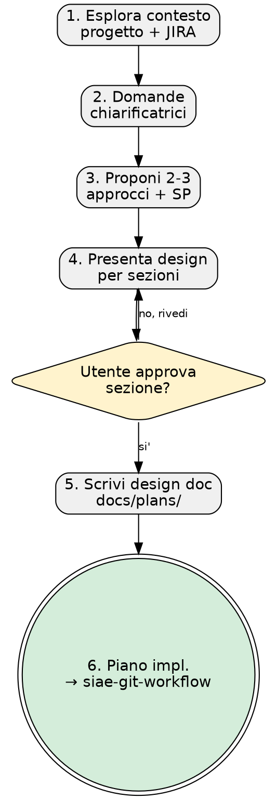

# SIAE Brainstorming — Da Idea a Design Validato

```
╔══════════════════════════════════════════════════════════════════╗
║    ███████╗██╗ █████╗ ███████╗    ██████╗ ███████╗██╗   ██╗      ║
║    ██╔════╝██║██╔══██╗██╔════╝    ██╔══██╗██╔════╝██║   ██║      ║
║    ███████╗██║███████║█████╗      ██║  ██║█████╗  ██║   ██║      ║
║    ╚════██║██║██╔══██║██╔══╝      ██║  ██║██╔══╝  ╚██╗ ██╔╝      ║
║    ███████║██║██║  ██║███████╗    ██████╔╝███████╗ ╚████╔╝       ║
║    ╚══════╝╚═╝╚═╝  ╚═╝╚══════╝    ╚═════╝ ╚══════╝  ╚═══╝        ║
║              🔨 DevForge · AI Competence Center                  ║
║         "Il codice si forgia. Il developer cresce."              ║
╚══════════════════════════════════════════════════════════════════╝
```

---

## HARD-GATE

<HARD-GATE>
NON invocare skill di implementazione, scrivere codice, o creare scaffold FINCHE'
non hai presentato il design e l'utente lo ha approvato. Questo si applica a OGNI
progetto, indipendentemente dalla semplicita' percepita.
</HARD-GATE>

---

## Anti-Pattern: "Questo e' troppo semplice per un design"

Ogni progetto passa per questo processo. Una todo list, una utility a singola
funzione, una modifica di configurazione — tutto. I progetti "semplici" sono
quelli dove le assunzioni non esaminate causano il maggior spreco di lavoro.
Il design puo' essere breve (poche frasi per progetti davvero semplici), ma
DEVI presentarlo e ottenere l'approvazione.

---

## Checklist — 6 Punti Obbligatori

DEVI creare un task per ciascuno di questi punti e completarli in ordine:

### 1. Esplora contesto progetto

- Controlla file, doc, commit recenti
- Se MCP Atlassian e' disponibile: cerca ticket JIRA correlati con `searchJiraIssuesUsingJql`
- Identifica vincoli tecnici, dipendenze, e decisioni architetturali esistenti
- Leggi eventuali design doc precedenti in `docs/plans/`

### 2. Domande chiarificatrici

- Una domanda alla volta — non sovraccaricare l'utente
- Preferisci domande a scelta multipla quando possibile
- Se un argomento richiede approfondimento, spezzalo in piu' domande
- Focus su: scopo, vincoli, criteri di successo, utenti target

### 3. Proponi 2-3 approcci con trade-off e raccomandazione

- Presenta le opzioni in modo conversazionale
- Ogni approccio include: descrizione, pro, contro, complessita' stimata
- Guida con la tua raccomandazione e spiega perche'
- Includi stima Story Points per ogni approccio (scala: 1, 2, 3, 5, 8, 13)

### 4. Presenta design per sezioni, approvazione dopo ciascuna

- Scala ogni sezione in base alla complessita': poche frasi se lineare, fino a 200-300 parole se articolato
- Chiedi dopo ogni sezione se e' corretto finora
- Copri: architettura, componenti, flusso dati, gestione errori, testing
- Sii pronto a tornare indietro e chiarire

### 5. Scrivi design doc in `docs/plans/YYYY-MM-DD-<topic>-design.md`

- Salva il design validato nel file
- Includi: contesto, decisioni, trade-off scelti, stima SP, criteri di accettazione
- Committa il documento

### 6. REQUIRED: Transizione al piano implementativo

- Includi nel design doc (step 5) una sezione **Piano Implementativo** con step atomici
- Il prossimo passo nella catena SDLC e' `siae-git-workflow` per creare il feature branch
- NON invocare skill di implementazione direttamente. Segui la catena: brainstorming → git-workflow → implementazione

---

## Flusso del Processo



---

## Integrazione SIAE / JIRA

Se MCP Atlassian e' disponibile:

### Ricerca ticket correlati

All'inizio del brainstorming, cerca ticket JIRA esistenti che potrebbero essere
correlati. Usa query JQL come:
- `project = <KEY> AND summary ~ "<keyword>" ORDER BY updated DESC`
- `project = <KEY> AND labels IN ("<label>") AND status != Done`

### Stima Story Points

Proponi una stima SP per il design finale usando la scala Fibonacci:

| SP | Significato |
|----|-------------|
| 1  | Triviale — poche ore, zero rischio |
| 2  | Semplice — meno di un giorno, rischio minimo |
| 3  | Moderato — 1-2 giorni, qualche incognita |
| 5  | Significativo — 2-4 giorni, complessita' media |
| 8  | Complesso — una settimana, rischio alto |
| 13 | Molto complesso — oltre una settimana, molte incognite |

### Output strutturato per ticket JIRA

Alla fine del design, produci un blocco strutturato pronto per la creazione ticket:

```
JIRA TICKET OUTPUT
──────────────────
Tipo:        Story / Task / Bug
Sommario:    [titolo conciso]
Descrizione: [da design doc]
Story Points: [stima]
Labels:      [label suggerite]
Acceptance Criteria:
  - [ ] [criterio 1]
  - [ ] [criterio 2]
  - [ ] [criterio N]
```

Se l'utente conferma, crea il ticket con `createJiraIssue`.

---

## Il Processo nel Dettaglio

**Comprendere l'idea:**
- Controlla lo stato attuale del progetto (file, doc, commit recenti)
- Fai domande una alla volta per raffinare l'idea
- Preferisci domande a scelta multipla, ma le domande aperte vanno bene
- Focus: scopo, vincoli, criteri di successo

**Esplorare gli approcci:**
- Proponi 2-3 approcci diversi con trade-off
- Presenta le opzioni con la tua raccomandazione e motivazione
- Guida con l'opzione raccomandata e spiega perche'

**Presentare il design:**
- Presenta il design sezione per sezione
- Chiedi approvazione dopo ogni sezione
- Copri: architettura, componenti, flusso dati, gestione errori, testing
- Torna indietro e chiarisci se qualcosa non e' chiaro

---

## Principi Chiave

- **Una domanda alla volta** — Non sovraccaricare con domande multiple
- **Scelta multipla preferita** — Piu' facile rispondere di domande aperte
- **YAGNI senza pieta'** — Rimuovi feature non necessarie da ogni design
- **Esplora alternative** — Proponi sempre 2-3 approcci prima di decidere
- **Validazione incrementale** — Presenta il design, ottieni approvazione, poi avanza
- **Flessibilita'** — Torna indietro e chiarisci quando qualcosa non torna

---

## Stato Terminale

```
Dopo il brainstorming, il prossimo passo nella catena SDLC e' SEMPRE siae-git-workflow.
NON invocare siae-tdd, siae-code-standards, o altre skill di implementazione direttamente.
```

Il brainstorming produce un design doc approvato con piano implementativo incluso.
L'implementazione inizia SOLO dopo aver creato il feature branch via `siae-git-workflow`.
