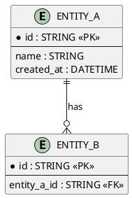
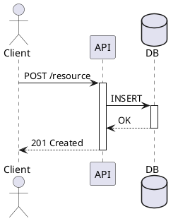

# LLD — [Nome Componente/Feature]

> **HLD di riferimento**: [link]
> **Data**: YYYY-MM-DD
> **Autore**: [nome]

---

## 1. Scope
[Cosa copre questo LLD]

## 2. Data Model
[Entita', relazioni, schema DB]

## 3. API Contract
[Endpoint, request/response, status codes]

## 4. Sequence Diagram — Flusso Principale

## 5. Error Handling
| Scenario | HTTP Code | Messaggio | Azione |
|----------|-----------|-----------|--------|

## 6. Configurazione
[Environment variables, feature flags, external config]

## 7. Test Plan
| Tipo | Cosa testa | Framework |
|------|-----------|-----------|
| Unit | Business logic | JUnit5/vitest/pytest |
| Integration | API + DB | TestContainers/supertest |
| E2E | Flusso completo | Playwright/Cypress |
