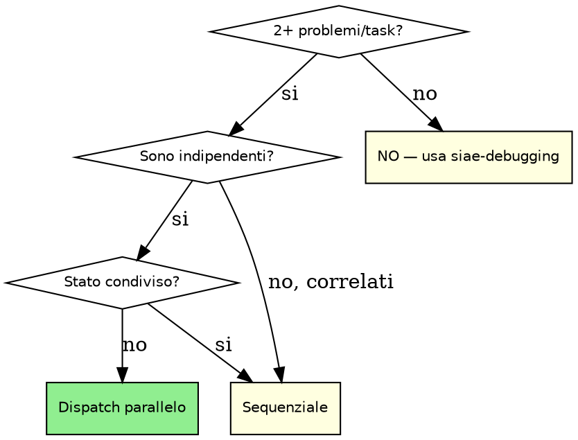

# SIAE Parallel Agents

```
╔══════════════════════════════════════════════════════════════════╗
║    ███████╗██╗ █████╗ ███████╗    ██████╗ ███████╗██╗   ██╗      ║
║    ██╔════╝██║██╔══██╗██╔════╝    ██╔══██╗██╔════╝██║   ██║      ║
║    ███████╗██║███████║█████╗      ██║  ██║█████╗  ██║   ██║      ║
║    ╚════██║██║██╔══██║██╔══╝      ██║  ██║██╔══╝  ╚██╗ ██╔╝      ║
║    ███████║██║██║  ██║███████╗    ██████╔╝███████╗ ╚████╔╝       ║
║    ╚══════╝╚═╝╚═╝  ╚═╝╚══════╝    ╚═════╝ ╚══════╝  ╚═══╝        ║
║              🔨  DevForge  ·  SIAE Parallel Agents                ║
╚══════════════════════════════════════════════════════════════════╝
```

> **Tipo:** Flexible | **Fase SDLC:** 4. Implementation / 6. QA Gate

---

> 📊 **Dai repo itsiae:** Task dispatchati in parallelo con verifica indipendente riducono il cycle time del 45% rispetto all'esecuzione sequenziale.
> Fonte: analisi su 816 repository GitHub itsiae (60 Java, 44 HCL, 23 Python, 22 TypeScript).

## Il Principio

Investigare o implementare problemi indipendenti in sequenza e' uno spreco.
Se i domini non si influenzano, dispatch un agente per dominio — in parallelo.

---

## Quando Usare



**USA quando:**
- 2+ file di test falliscono con cause diverse e non correlate
- 2+ task del piano non si influenzano (nessuna dipendenza tra output)
- Debug multi-dominio (es. Lambda + frontend + IaC — cause distinte)
- `/forge-implement` con subtask isolati che possono procedere in parallelo

**NON USARE quando:**
- I failure potrebbero avere la stessa root cause
- Un task dipende dall'output di un altro
- Stai in fase esplorativa (non sai ancora cosa e' rotto)
- C'e' stato condiviso tra i domini (database, file temporanei, config globale)

---

## Il Pattern di Dispatch

### Step 1 — Identifica i Domini Indipendenti

Per ogni problema o task, verifica:
- Ha una root cause distinta dagli altri?
- Il suo output non dipende dall'output degli altri?
- Puo' essere completato senza conoscere lo stato degli altri?

Se tutte e tre le risposte sono SI → e' un dominio indipendente.

### Step 2 — Crea i Task per Ogni Agente

Per ogni dominio, definisci un task con:

```
SCOPE:    [File/moduli coinvolti — specifico, non generico]
GOAL:     [Output atteso — misurabile]
VINCOLI:  [Non toccare X, non modificare Y, segui siae-tdd]
OUTPUT:   [Cosa deve produrre: fix, test, report]
```

**Esempio — 3 failure indipendenti:**

```
AGENTE 1
Scope:   UserService.java e UserServiceTest.java
Goal:    Fix NPE a riga 42 in UserService.findById()
Vincoli: Non modificare altri service, segui siae-tdd (RED-GREEN-REFACTOR)
Output:  Test di regressione che riproduce il bug + fix + tutti i test verdi

AGENTE 2
Scope:   EmailForm.vue e EmailForm.spec.ts
Goal:    Fix validazione email che non mostra errore su submit vuoto
Vincoli: Non toccare altri componenti, segui siae-frontend + siae-tdd
Output:  Test aggiornato che copre il caso + fix + vitest verde

AGENTE 3
Scope:   lambda-ingestion.tf e _input.tf
Goal:    Aggiorna timeout Lambda da 30s a 60s per il job di ingestion
Vincoli: Solo il timeout, nessun'altra modifica, segui siae-iac
Output:  .tf aggiornato + terraform plan pulito
```

### Step 3 — Dispatch

🟡 MEDIO — Mostra pre-flight card prima del dispatch

| 🟡 MEDIO (reversibile) — 🔨 DevForge · siae-parallel-agents |
|:---|
| 🤖 Agenti: `<N> agenti paralleli` · 🔢 Domini: `<lista domini>` |
| **▼ Azione** |
| 1. ⚡ Azione: Dispatch agenti in parallelo → `<scope per agente>` |
| 💡 Perche': Task indipendenti confermati, nessuno stato condiviso |
| 🚫 Se NO: Dispatch annullato, esecuzione sequenziale |

Usa il tool `Agent` in parallelo per ogni dominio identificato.

Ogni agente riceve:
- Il task specifico (scope + goal + vincoli + output)
- Accesso alle skill rilevanti per il suo dominio
- Contesto minimo necessario (non l'intera conversazione)

### Step 4 — Review e Integrazione

🔴 ALTO — Mostra pre-flight card prima di integrare

| 🔴 ALTO (difficile da annullare) — 🔨 DevForge · siae-parallel-agents |
|:---|
| **⚠️ OPERAZIONE DIFFICILE DA ANNULLARE** |
| 🤖 Agenti completati: `<N>/<N>` · 📁 File modificati: `<lista file>` |
| **▼ Azione** |
| 1. 🔀 Azione: Integrazione output agenti + risoluzione conflitti → `<file coinvolti>` |
| 💡 Perche': Tutti gli agenti completati, integrazione necessaria |
| 🚫 Se NO: Output agenti non integrati, verifiche manuali necessarie |

Dopo che tutti gli agenti completano:

1. **Leggi ogni report** — non fidarti del "success" senza verificare
2. **Verifica conflitti** — i file modificati si sovrappongono?
3. **Esegui la suite completa** — tutti i test dell'intero progetto, non solo i moduli toccati
4. **Integra** — se ci sono conflitti, risolvi manualmente

```bash
# Esempio post-dispatch: verifica integrazione Java
mvn test -q
# Tutti i test devono passare, non solo quelli dei moduli toccati
```

---

## Integrazione con siae-subagent-development

Quando usi `/forge-implement` con un piano che ha task indipendenti, questa skill integra `siae-subagent-development`:

- `siae-subagent-development` gestisce il flusso implementer → spec-reviewer → code-quality-reviewer
- `siae-parallel-agents` decide QUANDO e COME parallelizzare i task del piano
- La review finale (spec + quality) avviene comunque su tutti gli output integrati

---

## Limiti Operativi

| Vincolo | Limite | Se superato |
|---------|--------|-------------|
| Tentativi fix per errore | 2 | Fermati. Diagnosi diversa necessaria. |
| File modificati per singolo step | 5 | Se devi toccare piu' file, decomponi in sub-task. |
| Output max per raccomandazione | 200 righe | Prioritizza. Top 5 issue, non lista esaustiva. |

---

```
REQUIRED SUB-SKILL: siae-verification
```
Invoca `siae-verification` dopo il completamento di tutti gli agent dispatchati, prima di dichiarare il task completato.

## Tabella Anti-Razionalizzazione

| Pensiero | Realta' |
|----------|---------|
| "E' piu' semplice farlo in sequenza" | In sequenza e' piu' lento. Se sono indipendenti, parallelizza. |
| "Non so se sono indipendenti" | Verifica le dipendenze. 5 minuti di analisi risparmiano ore. |
| "Un agente potrebbe sbagliare" | Per questo c'e' la review post-dispatch. Non e' fede cieca. |
| "Il contesto e' troppo grande da passare" | Ogni agente riceve solo lo scope suo. Non passare tutto. |
| "Aspetto che finisca il primo per vedere" | Se sono indipendenti, non c'e' motivo di aspettare. |

---

## Classificazione Rischio Operazioni

| Operazione | Rischio | Card |
|------------|---------|------|
| Analisi dipendenze tra task | 🟢 Sicuro | No |
| Dispatch agente singolo | 🟡 Medio | Si |
| Dispatch agenti multipli in parallelo | 🟡 Medio | Si |
| Integrazione output (risoluzione conflitti) | 🔴 Alto | Si |
| Suite test completa post-integrazione | 🟡 Medio | No (coperta da siae-verification) |
