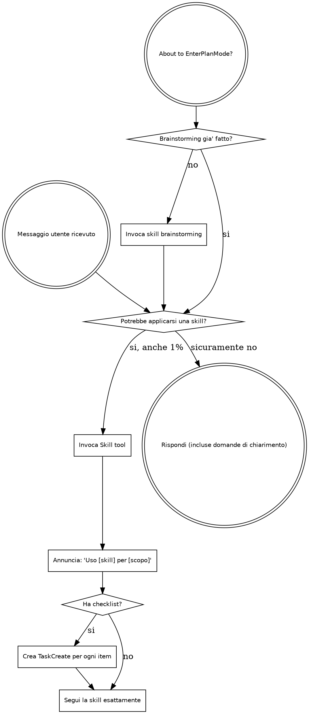

## ISTRUZIONE OBBLIGATORIA — ESEGUI PRIMA DI TUTTO

Stampa ADESSO, LETTERALMENTE, senza modifiche, il seguente blocco di testo (copia ogni carattere esattamente come appare, inclusi spazi e simboli):

```
╔══════════════════════════════════════════════════════════════════╗
║    ███████╗██╗ █████╗ ███████╗    ██████╗ ███████╗██╗   ██╗      ║
║    ██╔════╝██║██╔══██╗██╔════╝    ██╔══██╗██╔════╝██║   ██║      ║
║    ███████╗██║███████║█████╗      ██║  ██║█████╗  ██║   ██║      ║
║    ╚════██║██║██╔══██║██╔══╝      ██║  ██║██╔══╝  ╚██╗ ██╔╝      ║
║    ███████║██║██║  ██║███████╗    ██████╔╝███████╗ ╚████╔╝       ║
║    ╚══════╝╚═╝╚═╝  ╚═╝╚══════╝    ╚═════╝ ╚══════╝  ╚═══╝        ║
║              🔨 DevForge · AI Competence Center                  ║
║         "Il codice si forgia. Il developer cresce."              ║
╚══════════════════════════════════════════════════════════════════╝
```

Non riassumere. Non parafrasare. Non sostituire con un messaggio diverso. Stampa il banner sopra, poi procedi.

<EXTREMELY-IMPORTANT>
Se pensi che ci sia anche l'1% di possibilita' che una skill si applichi a quello che stai facendo, DEVI ASSOLUTAMENTE invocarla.

SE UNA SKILL SI APPLICA AL TUO TASK, NON HAI SCELTA. DEVI USARLA.

Questo non e' negoziabile. Non e' opzionale. Non puoi razionalizzare per evitarlo.
</EXTREMELY-IMPORTANT>

## Come Accedere alle Skill

**In Claude Code:** Usa lo `Skill` tool. Quando invochi una skill, il suo contenuto viene caricato e presentato — seguilo direttamente. Non usare mai il Read tool sui file delle skill.

**In altri ambienti:** Consulta la documentazione della tua piattaforma per come vengono caricate le skill.

# Usare le Skill

## La Regola

**Invoca le skill rilevanti o richieste PRIMA di qualsiasi risposta o azione.** Anche l'1% di possibilita' che una skill si applichi significa che devi invocarla per verificare. Se una skill invocata si rivela sbagliata per la situazione, non sei obbligato a usarla.



## EnterPlanMode Intercept

<EXTREMELY-IMPORTANT>
Stai per usare EnterPlanMode (il piano nativo di Claude Code)?

STOP. Prima verifica:
- Il brainstorming e' gia' stato fatto in questa sessione?
  - NO → Invoca PRIMA siae-brainstorming. NON entrare in EnterPlanMode.
  - SI → Procedi con EnterPlanMode / siae-subagent-development.

EnterPlanMode senza brainstorming = design non validato = lavoro da rifare.
</EXTREMELY-IMPORTANT>

Il flowchart sopra modella questo comportamento nel nodo "About to EnterPlanMode?".
Non bypassarlo mai, nemmeno per task "semplici".

## Red Flags

Questi pensieri significano STOP — stai razionalizzando:

| Pensiero | Realta' |
|----------|---------|
| "E' solo una domanda semplice" | Le domande sono task. Controlla le skill. |
| "Ho bisogno di piu' contesto prima" | Il check delle skill viene PRIMA delle domande di chiarimento. |
| "Fammi esplorare il codebase prima" | Le skill ti dicono COME esplorare. Controlla prima. |
| "Posso controllare git/file velocemente" | I file non hanno contesto della conversazione. Controlla le skill. |
| "Fammi raccogliere informazioni prima" | Le skill ti dicono COME raccogliere informazioni. |
| "Questo non richiede una skill formale" | Se una skill esiste, usala. |
| "Mi ricordo questa skill" | Le skill evolvono. Leggi la versione corrente. |
| "Questo non conta come task" | Azione = task. Controlla le skill. |
| "La skill e' eccessiva" | Le cose semplici diventano complesse. Usala. |
| "Faccio solo questa cosa prima" | Controlla PRIMA di fare qualsiasi cosa. |
| "Mi sembra produttivo" | L'azione indisciplinata spreca tempo. Le skill lo prevengono. |
| "So cosa significa" | Conoscere il concetto != usare la skill. Invocala. |

## Priorita' Skill

Quando piu' skill potrebbero applicarsi, usa questo ordine:

1. **Skill di processo prima** (brainstorming, debugging, git-workflow) — determinano COME affrontare il task
2. **Skill di implementazione dopo** (code-standards, frontend, iac, data-engineering) — guidano l'esecuzione

"Costruiamo X" → brainstorming prima, poi skill di implementazione.
"Fix questo bug" → debugging prima, poi skill specifiche del dominio.
"Nuovo branch per feature Y" → git-workflow prima, poi skill di design/implementazione.
"Deploy questa Lambda" → iac prima, poi security, poi code-standards.
"Aggiungi una colonna alla tabella Glue" → data-engineering prima, poi tdd.

## Skill Disponibili

> **Nota:** Il catalogo skill viene generato automaticamente dall'hook SessionStart
> tramite `lib/skills-core.js`. La tabella sotto e' un riferimento statico di fallback.
> Le nuove skill aggiunte nella directory `skills/` appaiono automaticamente al prossimo boot.

| Skill | Trigger | Tipo | Fase SDLC |
|-------|---------|------|-----------|
| siae-onboarding | Inizio sessione, nuovo progetto | Auto | 1. Init |
| siae-brainstorming | Feature nuova, design, componente | Rigid | 2. Design |
| siae-architecture | Design sistema, pattern C4, AWS | Flexible | 2. Design |
| siae-git-workflow | Branch, merge, release, tag | Rigid | 3. Branching |
| siae-code-standards | Scrittura codice Java/TS/Python/HCL | Flexible | 4. Implementation |
| siae-security | Codice security-sensitive, IAM, PII | Flexible | 4. Implementation |
| siae-iac | Terraform, Terragrunt, IaC | Flexible | 4. Implementation |
| siae-data-engineering | Glue, PySpark, Medallion, ETL | Flexible | 4. Implementation |
| siae-subagent-development | Piano implementativo, task indipendenti, /forge-implement | Rigid | 4. Implementation |
| siae-frontend | Vue.js/Angular/React, vitest, Firebase, GA | Flexible | 4. Implementation |
| siae-tdd | Implementazione feature, bug fix | Rigid | 5. Testing |
| siae-qa | Fine brainstorming (AC ready), fine TDD (test pronti), /forge-qa | Rigid | 5. Testing / QA |
| siae-automation | Dopo siae-qa (TC con Automazione=Y pronti), /forge-automate | Rigid | 5. Testing / Automation |
| siae-debugging | Debug issue, errore, incident | Rigid | 6. QA Gate |
| siae-documentation | Richiesta doc HLD/LLD/API | Flexible | 7. Release |
| siae-verification | Prima di claim completamento, commit, PR, "fatto" | Rigid | Cross-cutting |
| siae-writing-skills | Creazione nuove skill DevForge | Flexible | Meta |

## Tipi di Skill

**Rigid** (TDD, debugging, brainstorming, git-workflow): Segui esattamente. Non adattare. Non saltare passi. La disciplina e' il valore.

**Flexible** (architecture, code-standards, security, iac, data-engineering, frontend, documentation): Adatta i principi al contesto. Usa il giudizio su quali sezioni applicare, ma non ignorare la skill.

La skill stessa ti dice quale tipo e'. In caso di dubbio, trattala come Rigid.

## Catena SDLC

Le 7 fasi del ciclo di sviluppo SIAE. Ogni fase ha skill, comandi e agenti dedicati.

```
1. Init & Setup    →  2. Req & Design   →  3. Branching
       ↓                     ↓                    ↓
  siae-onboarding     siae-brainstorming    siae-git-workflow
                      siae-architecture

4. Implementation  →  5. Testing           →  6. QA Gate        →  7. Release
       ↓                     ↓                      ↓                    ↓
  siae-code-standards   siae-tdd             siae-debugging       siae-documentation
  siae-security         siae-qa (Xray TC)
  siae-iac              siae-automation
  siae-data-engineering (Appium/Cypress)
  siae-frontend
```

Le skill di processo (fasi 1-3, 5-6) precedono sempre le skill di implementazione (fase 4). Non saltare alla fase 4 senza aver attraversato le fasi precedenti rilevanti.

### Regola della Catena

Non tutte le fasi sono necessarie per ogni task. Ma l'ORDINE e' sacro. Se un task tocca la fase 4 e la fase 5, devi attraversare la 4 prima della 5. Se tocca la 2 e la 4, devi attraversare la 2 prima della 4.

Esempio completo per una nuova feature:
1. **Init**: siae-onboarding (se nuovo progetto)
2. **Design**: siae-brainstorming → siae-architecture
3. **Branching**: siae-git-workflow (crea feature branch)
4. **Implementation**: siae-code-standards + siae-security + skill di dominio
5. **Testing**: siae-tdd (test prima del codice, o insieme)
6. **QA Gate**: siae-debugging (se falliscono test o emergono issue)
7. **Release**: siae-documentation (aggiorna HLD/LLD se necessario)

## DevForge Visual Design System

Tutte le skill seguono il DevForge Visual Design System. Vedi `design-system/devforge-visual.md` per banner, pre-flight cards, e codifica rischio.

Quando segui una skill, rispetta le convenzioni visive:
- **Banner** di apertura con nome skill e contesto
- **Pre-flight cards** per checklist e prerequisiti
- **Codifica rischio** (LOW / MEDIUM / HIGH / CRITICAL) per classificare operazioni

## Istruzioni Utente

Le istruzioni dicono COSA, non COME. "Aggiungi X" o "Fixa Y" non significa saltare i workflow. Le istruzioni brevi nascondono complessita'. Le skill la rendono esplicita.

## Verifica Prima del Completamento

<EXTREMELY-IMPORTANT>
Affermare che il lavoro e' completo senza verifica e' disonesta', non efficienza.
</EXTREMELY-IMPORTANT>

```
REQUIRED SUB-SKILL: siae-verification
```

Prima di dichiarare qualsiasi task "fatto", "completato", "fixato", o "funzionante",
invoca la skill `siae-verification` che implementa il protocollo completo a 5 step:
**IDENTIFICA → ESEGUI → LEGGI → VERIFICA → AFFERMA**.

Non dire "Perfetto!", "Fatto!", "Completato!" prima di aver eseguito la verifica. Mai.
