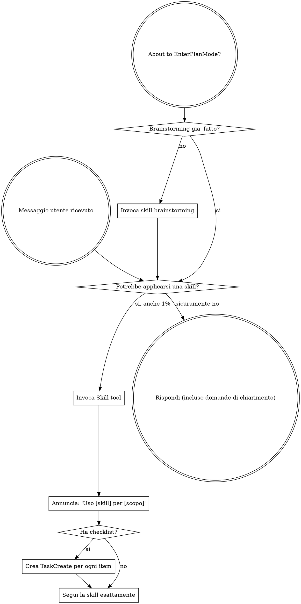

## SUBAGENT-STOP — Gate Check

<SUBAGENT-STOP>
Sei un subagent (implementer, spec-reviewer, code-quality-reviewer, o altro)?

SE SI: FERMATI QUI. Non leggere oltre. Non applicare la regola dell'1%.
Il tuo scope e' definito dal prompt del tuo orchestratore, non da questa skill.
Le skill permesse sono SOLO quelle nella tua allowlist.

Segnali che sei un subagent:
- Il tuo prompt inizia con "Sei un implementer/reviewer/..."
- Hai un task specifico assegnato
- Hai una sezione SUBAGENT-STOP nel tuo prompt

SE NO (sei il main agent): Procedi normalmente.
</SUBAGENT-STOP>

## ISTRUZIONE OBBLIGATORIA — ESEGUI PRIMA DI TUTTO

Stampa ADESSO, LETTERALMENTE, senza modifiche, il seguente blocco di testo (copia ogni carattere esattamente come appare, inclusi spazi e simboli):

```
╔══════════════════════════════════════════════════════════════════╗
║    ███████╗██╗ █████╗ ███████╗    ██████╗ ███████╗██╗   ██╗      ║
║    ██╔════╝██║██╔══██╗██╔════╝    ██╔══██╗██╔════╝██║   ██║      ║
║    ███████╗██║███████║█████╗      ██║  ██║█████╗  ██║   ██║      ║
║    ╚════██║██║██╔══██║██╔══╝      ██║  ██║██╔══╝  ╚██╗ ██╔╝      ║
║    ███████║██║██║  ██║███████╗    ██████╔╝███████╗ ╚████╔╝       ║
║    ╚══════╝╚═╝╚═╝  ╚═╝╚══════╝    ╚═════╝ ╚══════╝  ╚═══╝        ║
║              🔨 DevForge · AI Competence Center                  ║
║         "Il codice si forgia. Il developer cresce."              ║
╚══════════════════════════════════════════════════════════════════╝
```

> **Tipo:** Meta | **Fase SDLC:** Cross-cutting

Non riassumere. Non parafrasare. Non sostituire con un messaggio diverso. Stampa il banner sopra, poi procedi.

Subito dopo il banner, stampa su una riga separata il messaggio di stato versione.
Questo messaggio si trova nel testo di questa sessione, PRIMA del blocco "Below is the full content".
Cerca la riga che inizia con "✅ DevForge" oppure "🔄 Aggiornamento" oppure "DevForge v" e stampala esattamente.
Se non trovi nessuna di queste righe, non stampare nulla.

<EXTREMELY-IMPORTANT>
Se pensi che ci sia anche l'1% di possibilita' che una skill si applichi a quello che stai facendo, DEVI ASSOLUTAMENTE invocarla.

SE UNA SKILL SI APPLICA AL TUO TASK, NON HAI SCELTA. DEVI USARLA.

Questo non e' negoziabile. Non e' opzionale. Non puoi razionalizzare per evitarlo.

**OBBLIGO CATALOGO:** Per OGNI messaggio utente, DEVI scansionare il Dynamic Skill Catalog in fondo a questo documento. Leggi la colonna **INVOCA SE l'utente menziona** di ogni riga e confrontala col messaggio utente. Se trovi un match anche parziale, invoca la skill corrispondente PRIMA di rispondere. Non saltare mai la scansione del catalogo.
</EXTREMELY-IMPORTANT>

> 📊 **Dai repo itsiae:** L'adozione di skill sale dal 33% al 72% quando il loader le presenta automaticamente al SessionStart.
> Fonte: analisi su 816 repository GitHub itsiae (60 Java, 44 HCL, 23 Python, 22 TypeScript).

## Come Accedere alle Skill

**In Claude Code:** Usa lo `Skill` tool. Quando invochi una skill, il suo contenuto viene caricato e presentato — seguilo direttamente. Non usare mai il Read tool sui file delle skill.

**In altri ambienti:** Consulta la documentazione della tua piattaforma per come vengono caricate le skill.

# Usare le Skill

## La Regola

**Invoca le skill rilevanti o richieste PRIMA di qualsiasi risposta o azione.** Anche l'1% di possibilita' che una skill si applichi significa che devi invocarla per verificare. Se una skill invocata si rivela sbagliata per la situazione, non sei obbligato a usarla.



## Git Operations Intercept

<EXTREMELY-IMPORTANT>
Stai per eseguire QUALSIASI operazione git (`git checkout -b`, `git commit`, `git push`, `git merge`, `git tag`, `gh pr create`)?

STOP. Prima verifica:
- Hai invocato `siae-git-workflow` in questa sessione?
  - NO → Invoca PRIMA siae-git-workflow. NON eseguire il comando git.
  - SI → Procedi seguendo le regole gia' caricate.

Stai per aprire una PR o dichiarare un branch "pronto"?
- Hai invocato `siae-finishing-branch` in questa sessione?
  - NO → Invoca PRIMA siae-finishing-branch. NON aprire la PR.
  - SI → Procedi seguendo il processo a 6 step gia' caricato.

**Ogni operazione git senza la skill caricata = branch naming sbagliato, commit non-conventional, push senza pre-flight, PR senza review.**

Nessuna operazione git e' "troppo semplice" per la skill. Un singolo `git commit` sbagliato inquina la history per sempre.
</EXTREMELY-IMPORTANT>

---

## EnterPlanMode Intercept

<EXTREMELY-IMPORTANT>
Stai per usare EnterPlanMode (il piano nativo di Claude Code)?

STOP. Prima verifica:
- Il brainstorming e' gia' stato fatto in questa sessione?
  - NO → Invoca PRIMA siae-brainstorming. NON entrare in EnterPlanMode.
  - SI → Procedi con EnterPlanMode / siae-subagent-development.

EnterPlanMode senza brainstorming = design non validato = lavoro da rifare.
</EXTREMELY-IMPORTANT>

Il flowchart sopra modella questo comportamento nel nodo "About to EnterPlanMode?".
Non bypassarlo mai, nemmeno per task "semplici".

## Limiti Operativi

| Vincolo | Limite | Se superato |
|---------|--------|-------------|
| Skill invocate per singolo messaggio utente | 3 | Se ne servono di piu', il messaggio e' troppo ampio. Chiedi di decomporre. |
| Output max per skill check | 100 righe | Il loader deve essere veloce e trasparente. |

---

## Formato Diagrammi — Regola Inviolabile

<EXTREMELY-IMPORTANT>
OGNI diagramma generato da DevForge DEVE usare sintassi PlantUML (@startuml/@enduml).
MAI generare Mermaid (```mermaid). MAI generare ASCII art per diagrammi architetturali.
Questo vale SEMPRE: con o senza skill invocata, per qualsiasi output visivo
(architettura, flussi, ER, sequence, C4, deployment, class diagram).

Eccezione: i flowchart di processo interni alle skill (```dot / Graphviz) sono accettati
per rappresentare flussi decisionali del plugin stesso — non sono output utente.

Template C4 PlantUML: skills/siae-architecture/reference/c4-template.md
</EXTREMELY-IMPORTANT>

---

## Red Flags

Questi pensieri significano STOP — stai razionalizzando:

| Pensiero | Realta' |
|----------|---------|
| "E' solo una domanda semplice" | Le domande sono task. Controlla le skill. |
| "Ho bisogno di piu' contesto prima" | Il check delle skill viene PRIMA delle domande di chiarimento. |
| "Fammi esplorare il codebase prima" | Le skill ti dicono COME esplorare. Controlla prima. |
| "Posso controllare git/file velocemente" | I file non hanno contesto della conversazione. Controlla le skill. |
| "Fammi raccogliere informazioni prima" | Le skill ti dicono COME raccogliere informazioni. |
| "Questo non richiede una skill formale" | Se una skill esiste, usala. |
| "Mi ricordo questa skill" | Le skill evolvono. Leggi la versione corrente. |
| "Questo non conta come task" | Azione = task. Controlla le skill. |
| "La skill e' eccessiva" | Le cose semplici diventano complesse. Usala. |
| "Faccio solo questa cosa prima" | Controlla PRIMA di fare qualsiasi cosa. |
| "Mi sembra produttivo" | L'azione indisciplinata spreca tempo. Le skill lo prevengono. |
| "So cosa significa" | Conoscere il concetto != usare la skill. Invocala. |
| "E' solo un commit/push veloce" | Ogni commit senza siae-git-workflow = naming sbagliato, no pre-flight. |
| "Creo il branch e poi carico la skill" | Il branch naming si decide PRIMA di `git checkout -b`. Carica la skill. |
| "La PR e' banale, non serve finishing-branch" | Anche 1 file cambiato merita test verdi e diff review. Sempre. |
| "Pusho e poi sistemo" | Dopo il push non sistemi. La history e' pubblica. |

## Priorita' Skill

Quando piu' skill potrebbero applicarsi, usa questo ordine:

1. **Skill di processo prima** (brainstorming, debugging, git-workflow) — determinano COME affrontare il task
2. **Skill di implementazione dopo** (code-standards, frontend, iac, data-engineering) — guidano l'esecuzione

**Eccezione — skill specializzate con keyword esplicite:**
Se la query contiene keyword esplicite di una skill specializzata, quella skill ha priorita' ANCHE su brainstorming. Invoca ENTRAMBE se necessario (la specializzata prima, brainstorming dopo se serve design):

- "C4 model", "HLD", "bounded context", "CQRS", "microservizi vs monolite" → invoca `siae-architecture` (puo' invocare anche brainstorming dopo)
- "Playwright", "Cypress", "test E2E", "CI/CD pipeline", "GitHub Actions" → invoca `siae-automation`
- "Robot Framework", ".robot", ".resource", "AppiumLibrary", "pabot", "test mobile RF", "porting Android iOS test", "UIAutomator2", "XCUITest", "adb dump", "NoSuchElementException Appium", "SessionNotCreatedException", "BrowserStack mobile test", "Wait And Click", "debug test Appium" → invoca `siae-robot-framework`
- "Glue job", "PySpark", "ETL", "Medallion", "pipeline ingestion" → invoca `siae-data-engineering`
- "Terraform", "terragrunt", "VPC", "ECS", "Lambda" → invoca `siae-iac`
- "Flutter", "Dart", "Riverpod", "ObjectBox", "Get_it", "Amplify", "app mobile", "widget Flutter" → invoca `siae-flutter`

"Costruiamo X" → brainstorming prima, poi skill di implementazione.
"Fix questo bug" → debugging prima, poi skill specifiche del dominio.
"Valutiamo CQRS vs CRUD" → architecture (keyword esplicita).

**Disambiguazione skill (quando piu' skill matchano):**

- Query su blind review, review cieca, audit spec, spec vs codice → `siae-blind-review` (NON code-reviewer)
- Query su retrospettiva, lezioni apprese, cosa ho imparato, fine sessione → `siae-retrospective` (NON brainstorming)
- Query su Flutter, Dart, Riverpod, ObjectBox, Get_it, Amplify Cognito, Dio, app mobile → `siae-flutter` (NON brainstorming, NON siae-frontend)
- Query su .robot, .resource, Robot Framework, AppiumLibrary, pabot, porting test Android/iOS, UIAutomator2, XCUITest, NoSuchElementException Appium, SessionNotCreatedException, adb dump, BrowserStack mobile → `siae-robot-framework` (NON siae-automation, NON siae-debugging)
- Query su Xray report + test .robot, Test Execution risultati RF → `siae-automation` (NON siae-robot-framework)
- Query su "automatizza test RF su CI/CD GitHub Actions" → `siae-robot-framework` per il codice RF + `siae-automation` per la pipeline CI; la pipeline RF su CI è un gap noto del ciclo DevForge (vedi nota J7-T5)

## Rule Priority — Quando le Skill Confliggono

Quando due skill danno istruzioni contrastanti, segui questa gerarchia
(la piu' alta vince):

| Priorita' | Skill | Perche' |
|-----------|-------|---------|
| 1 (max) | **siae-verification** | La verifica non si salta MAI. Nessuna skill puo' bypassarla. |
| 2 | **siae-tdd** | Il test prima del codice protegge da regressioni. Solo verification lo supera. |
| 3 | **siae-git-workflow** | Il naming e i commit errati inquinano la history per sempre. |
| 4 | **siae-security** | Un pattern insicuro vince sempre su uno "pulito". Mai compromettere sicurezza per eleganza. |
| 5 | **siae-debugging** | Root cause prima di qualsiasi fix. |
| 6 | **siae-brainstorming** | Il design prima dell'implementazione. |
| 7 (min) | Tutte le altre | code-standards, frontend, iac, data-engineering, documentation |

**Esempio concreto:** L'utente dice "salta i test, fai in fretta."
- User override vince su skill? Si', per la Gerarchia Istruzioni (CLAUDE.md > skill).
- MA verification (priorita' 1) e' NON NEGOZIABILE — non si salta nemmeno su richiesta.
- TDD (priorita' 2) si puo' elidere SOLO con conferma esplicita dell'utente E motivazione.

**Regola:** Le skill di priorita' 1-2 sono non-negoziabili.
Le skill di priorita' 3-4 (git-workflow, security) sono elidibili solo con conferma esplicita e motivazione.
Le skill di priorita' 5-7 possono essere elise con conferma utente esplicita.

## Skill Dependency Map

Come le skill si collegano nel ciclo SDLC. Segui le frecce per sapere
quale skill invocare dopo.

```dot
digraph skill_deps {
    rankdir=LR;
    node [shape=box, style="rounded,filled", fontname="Helvetica", fontsize=10];

    // Entry points (verde)
    onboarding [label="siae-onboarding", fillcolor="#d4edda"];
    debugging [label="siae-debugging", fillcolor="#d4edda"];
    git_wf [label="siae-git-workflow", fillcolor="#d4edda"];

    // Design chain (giallo)
    brainstorming [label="siae-brainstorming", fillcolor="#fff3cd"];
    writing_plans [label="siae-writing-plans", fillcolor="#fff3cd"];
    architecture [label="siae-architecture", fillcolor="#cce5ff"];

    // Implementation chain (grigio)
    git_worktrees [label="siae-git-worktrees", fillcolor="#f0f0f0"];
    subagent_dev [label="siae-subagent-dev", fillcolor="#f0f0f0"];
    tdd [label="siae-tdd", fillcolor="#f0f0f0"];
    code_standards [label="siae-code-standards", fillcolor="#cce5ff"];
    frontend [label="siae-frontend", fillcolor="#cce5ff"];
    flutter [label="siae-flutter", fillcolor="#cce5ff"];
    iac [label="siae-iac", fillcolor="#cce5ff"];
    data_eng [label="siae-data-engineering", fillcolor="#cce5ff"];

    // Verification chain (rosso)
    verification [label="siae-verification", fillcolor="#f8d7da"];
    finishing [label="siae-finishing-branch", fillcolor="#f8d7da"];
    blind_review [label="siae-blind-review", fillcolor="#f8d7da"];
    retrospective [label="siae-retrospective", fillcolor="#f8d7da"];

    // Sequential chains
    onboarding -> brainstorming [label="nuovo task"];
    brainstorming -> writing_plans [label="design approvato", style=bold, color=red];
    brainstorming -> architecture [label="keyword architettura", style=dashed];
    writing_plans -> git_worktrees [label="piano pronto"];
    git_worktrees -> subagent_dev [label="worktree creato"];
    subagent_dev -> tdd [label="per ogni task"];

    // Stack-specific skills
    tdd -> code_standards [style=dashed];
    tdd -> frontend [label="se frontend web", style=dashed];
    tdd -> flutter [label="se Flutter", style=dashed];
    tdd -> iac [label="se IaC", style=dashed];
    tdd -> data_eng [label="se ETL", style=dashed];

    // Completion chain
    tdd -> verification [label="task fatto", style=bold, color=red];
    verification -> finishing [label="branch pronto"];
    finishing -> blind_review [label="Step 4c\nREQUIRED", style=bold, color=red];
    blind_review -> git_wf [label="PASS → PR"];

    // retrospective e' invocata da stop-gate, non dal flusso sequenziale
    finishing -> retrospective [label="fine sessione", style=dashed];

    // Debugging entry
    debugging -> tdd [label="fix via TDD"];
}
```



**Legenda:**
- Verde: entry point | Giallo: design chain | Grigio: implementation chain
- Blu: skill flessibili (stack-specific) | Rosso: verification chain
- Frecce rosse bold: REQUIRED SUB-SKILL (transizioni obbligatorie)
- Frecce tratteggiate: opzionali in base al contesto

**Nota:** Questo grafo mostra solo le skill con dipendenze esplicite nel flusso SDLC principale.
Le skill non mostrate (documentation, finops, create-skill, microservices-map, ...) sono
invocabili on-demand in qualsiasi fase senza vincoli di sequenza.

## Gerarchia Istruzioni

Quando istruzioni provenienti da fonti diverse sono in conflitto, segui questa
gerarchia (la piu' alta vince):

| Priorita' | Fonte | Esempio |
|-----------|-------|---------|
| 1 (max) | `CLAUDE.md` del progetto | "Git flow obbligatorio su siae-dev-forge" |
| 2 | `CLAUDE.md` dell'utente (~/.claude/) | Preferenze personali |
| 3 | Skill del plugin (invocata) | Regole di siae-tdd, siae-code-standards |
| 4 | Agent prompt (subagent) | Istruzioni nel prompt del subagent |
| 5 (min) | Contesto ereditato dal parent | Skill caricate ma non nella allowlist |

**Regola:** se una skill dice X e CLAUDE.md dice Y, segui CLAUDE.md.
Se un agent prompt dice X e la skill invocata dice Y, segui la skill.
Il contesto parent e' sempre la fonte meno autorevole.

## Tipi di Skill

**Rigid** (TDD, debugging, brainstorming, git-workflow): Segui esattamente. Non adattare. Non saltare passi. La disciplina e' il valore.

**Flexible** (architecture, code-standards, security, iac, data-engineering, frontend, documentation): Adatta i principi al contesto. Usa il giudizio su quali sezioni applicare, ma non ignorare la skill.

La skill stessa ti dice quale tipo e'. In caso di dubbio, trattala come Rigid.

## Catena SDLC

7 fasi: Init → Design → Branching → Implementation → Testing → QA Gate → Release.
L'ordine e' sacro. Non saltare fasi. Il catalogo skill mostra quale skill si applica a ogni fase.

| Skill | Trigger / quando usarla | Tipo | Fase SDLC |
|-------|------------------------|------|-----------|
| siae-nr-test-flows | no-regression test flows, NRT suite, /forge-flows, repo Vue/React/Angular/Ionic/Flutter, team QA deve mappare flussi per regressione | Flexible | 5. Testing / QA |
| siae-robot-framework | file .robot, .resource, AppiumLibrary, pabot, test mobile Appium, UIAutomator2, XCUITest, NoSuchElementException Appium, SessionNotCreatedException, adb dump, BrowserStack mobile, porting Android↔iOS test RF, debug test Appium | Rigid | 5. Testing / 4. Implementation |
| siae-bug-hunter | bug proattivo, caccia ai bug, /forge-bugs, trova bug nel codice, bug latenti, analisi statica bug, cosa è già rotto, scansione bug, bug prima di produzione, pattern anti, codice rotto | Rigid | 6. QA Gate |
| siae-blind-review | "blind review", "review cieca", "audit spec", "verifica spec vs codice", "review senza diff", /forge-blind-review | Rigid | 6. QA Gate |
| siae-retrospective | fine sessione, lezioni apprese, cosa ho imparato, retrospettiva, salva per la prossima volta, /forge-retro, stop-gate hook | Rigid | Cross-cutting |

## DevForge Visual Design System

Tutte le skill seguono il DevForge Visual Design System. Vedi `design-system/devforge-visual.md` per banner, pre-flight cards, e codifica rischio.

Quando segui una skill, rispetta le convenzioni visive:
- **Banner** di apertura con nome skill e contesto
- **Pre-flight cards** per checklist e prerequisiti
- **Codifica rischio** (LOW / MEDIUM / HIGH / CRITICAL) per classificare operazioni

## Istruzioni Utente

Le istruzioni dicono COSA, non COME. "Aggiungi X" o "Fixa Y" non significa saltare i workflow.

## Verifica Prima del Completamento

<EXTREMELY-IMPORTANT>
Affermare che il lavoro e' completo senza verifica e' disonesta', non efficienza.
</EXTREMELY-IMPORTANT>

```
REQUIRED SUB-SKILL: siae-verification
```

Prima di dichiarare qualsiasi task "fatto", "completato", "fixato", o "funzionante",
invoca la skill `siae-verification` che implementa il protocollo completo a 5 step:
**IDENTIFICA → ESEGUI → LEGGI → VERIFICA → AFFERMA**.

Non dire "Perfetto!", "Fatto!", "Completato!" prima di aver eseguito la verifica. Mai.
